# Claude Certified Architect - Foundations (CCA-F)

## OpsMind AI SRE Copilot: Architecture, Exam Domains, Production Scenarios, and Practice Guide

> Prepared from the current OpsMind repository and the CCA-F blueprint already represented in this project. This is original study material, not an official exam dump.

---

## 1. Read this first: five domains, four exam scenarios

The wording is easy to confuse:

- The blueprint represented by this repository has **five scored knowledge domains**.
- The exam presents **four scenario sets**, selected from a pool of six scenario families.
- Therefore, studying only four knowledge domains would omit Domain 5, worth 15% in the blueprint used by the existing project material.

| Domain | Weight | What the exam tests |
|---|---:|---|
| 1. Agentic Architecture and Orchestration | 27% | Agent loops, decomposition, coordination, state, hooks, safe autonomy |
| 2. Tool Design and MCP Integration | 18% | Tool contracts, tool choice, MCP, errors, permissions, transports |
| 3. Claude Code Configuration and Workflows | 20% | `CLAUDE.md`, scoped rules, planning, skills, hooks, CI/CD |
| 4. Prompt Engineering and Structured Output | 20% | Precise prompts, examples, schemas, validation, review, batching |
| 5. Context Management and Reliability | 15% | Context selection, provenance, retries, fallback, evaluation, escalation |

The official Anthropic announcement describes CCA-F as a technical certification for solution architects who build production applications with Claude. Exam logistics and product syntax can change, so confirm them in Anthropic Partner Academy before booking.

### How to use this guide

For each domain:

1. Learn the decision rule, not only the definition.
2. Trace the concept into OpsMind code.
3. Explain the diagram aloud without reading the text.
4. Answer: "Why is this safer or more reliable in production?"
5. Complete the questions before checking the answer key.

---

## 2. OpsMind project in one page

OpsMind is an enterprise AIOps/SRE platform. It detects or receives incidents, gathers evidence, uses an LLM to synthesize root cause and remediation, exposes operational capabilities through MCP, and controls persistent actions through application policy and approval.

### 2.1 Layered system architecture

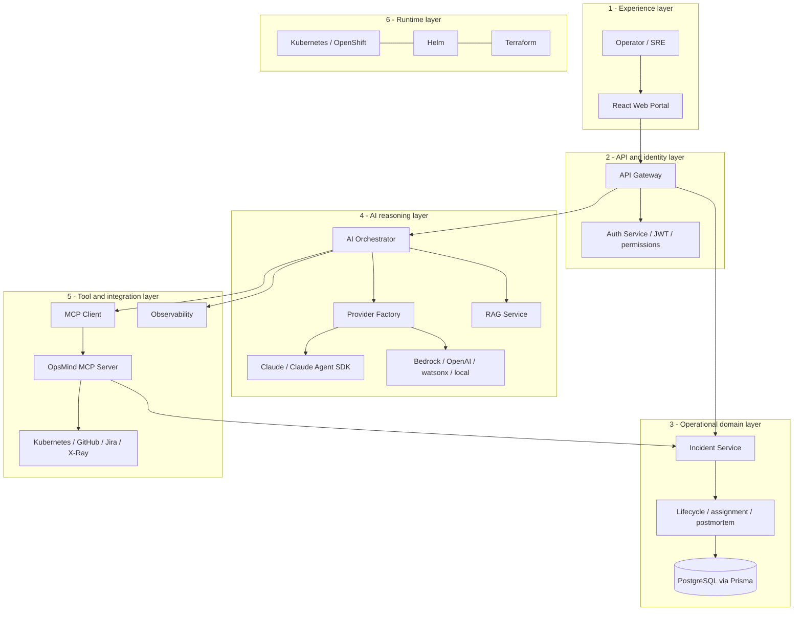

#### Code behind this diagram

The diagram is assembled from real runtime entry points. The root scripts show that the portal, incident service, AI orchestrator, and MCP server are separate processes:

```json
{
  "scripts": {
    "incident:start": "npm --prefix services/incident-service run start",
    "ai:start": "npm --prefix services/ai-orchestrator run start",
    "mcp:start": "npm --prefix services/mcp-server run start:http",
    "web:build": "npm --prefix apps/web-portal run build"
  }
}
```

Used in: `package.json`. The API Gateway is the edge layer, the Incident Service owns incident state, and the AI Orchestrator connects reasoning providers to MCP/RAG/observability. Deployment definitions are under `docker-compose.yml`, `infrastructure/kubernetes`, `helm`, and `infrastructure/terraform`.

### 2.2 Logical agents versus deployed services

The folders under `agents/` make responsibilities readable. They do **not** represent five separately deployed autonomous services. Runtime orchestration lives mainly in `services/ai-orchestrator`, `services/mcp-server`, `services/incident-service`, and `services/integrations-service`.

| Logical responsibility | Purpose | Main runtime mapping |
|---|---|---|
| Anomaly Agent | Detect abnormal signals and associate them with services/incidents | `observabilityService.ts`, `autoIncidentService.ts` |
| Kubernetes Agent | Inspect pods, deployments, namespaces, and events | `integrations-service/src/kubernetes/k8sClient.ts` |
| Log Analysis Agent | Turn raw logs into structured findings | `analyzeIncidentService.ts`, incident-to-orchestrator integration |
| RCA Agent | Separate facts from hypotheses and synthesize likely cause | `aiCopilotService.ts` and LLM providers |
| Remediation Agent | Recommend mitigation, rollback, validation, and prevention | knowledge base, lifecycle, automation service |

### 2.3 Golden incident flow

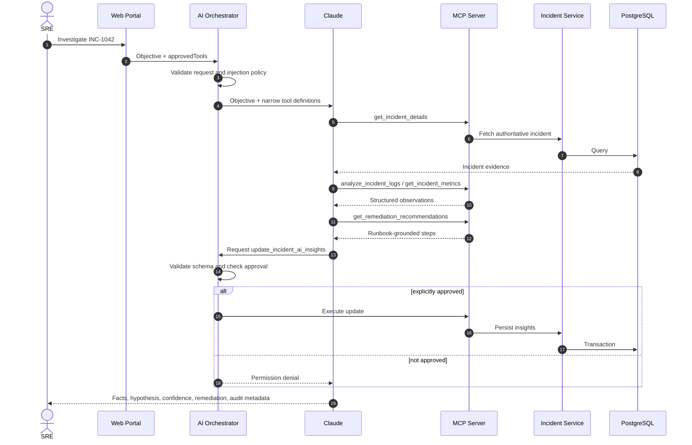

#### Code behind this sequence

The controller receives the incident, objective, and the caller's explicit write approvals:

```ts
const approvedTools = new Set<string>(
  Array.isArray(req.body?.approvedTools)
    ? req.body.approvedTools.filter(
        (value: unknown): value is string => typeof value === "string",
      )
    : [],
);

const result = await automateIncident(
  incidentNumber,
  objective,
  approvedTools,
);
```

Used in: `services/ai-orchestrator/src/controllers/agentController.ts`. The set is passed to the automation service. Reads can proceed, but the persistence tool is approved only when its exact name is present:

```ts
return provider.callWithTools(systemPrompt, objective, incidentTools, {
  maxIterations: 8,
  maxTokens: 4096,
  approve: async ({ tool }) => approvedTools.has(tool),
});
```

Used in: `services/ai-orchestrator/src/services/opsIncidentAutomationService.ts`. This implements the sequence diagram's approval branch and bounds the loop.

The key architectural idea is: **the model reasons; application code governs; services own authoritative state.**

---

# Domain 1 - Agentic Architecture and Orchestration (27%)

## 3.1 Core mental model

An agent is not simply a chatbot. It is a host-controlled loop in which the model can choose an action, the host validates and executes it, and the result is returned to the model until completion.

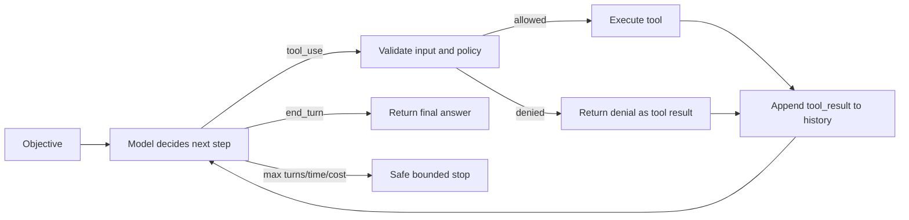

#### Code behind the agent loop

OpsMind constructs narrow tools with a strict object schema and an executor that routes through MCP:

```ts
function mcpTool(name, description, properties, required, requiresApproval = false) {
  return {
    name,
    description,
    inputSchema: {
      type: "object",
      properties,
      required,
      additionalProperties: false,
    },
    requiresApproval,
    execute: async (input) => {
      const response = await callMcpTool(name, input);
      return { transport: response.transport, data: response.data };
    },
  };
}
```

Used in: `services/ai-orchestrator/src/services/opsIncidentAutomationService.ts`. `ClaudeProvider.callWithTools()` then repeatedly sends conversation history, validates requested inputs, executes or denies tools, appends tool results, and exits on the response's stop condition or the iteration limit.

The host must preserve the assistant tool request and matching tool result in conversation history. It must inspect the API termination signal rather than guess that the workflow has ended.

## 3.2 Deterministic workflow versus agentic loop

| Choose | When | OpsMind example |
|---|---|---|
| Deterministic workflow | Steps are known, order is fixed, regulatory behavior must be predictable | Validate incident -> save -> notify |
| Agentic loop | Evidence determines the next investigation action | Claude chooses whether logs, metrics, Kubernetes state, or a runbook is needed next |
| Hybrid | Reasoning is flexible but mutations are deterministic | Claude proposes remediation; code checks approval and performs the update |

**Exam rule:** use the lightest architecture that satisfies uncertainty and risk. A fixed sequence does not need an agent. A consequential action should not depend on prompt compliance alone.

## 3.3 Decomposition and coordinator pattern

Split work when skills, permissions, data sources, latency, evaluation criteria, or failure domains materially differ. Keep work together when the tasks are tightly coupled and the handoff would lose more context than specialization gains.

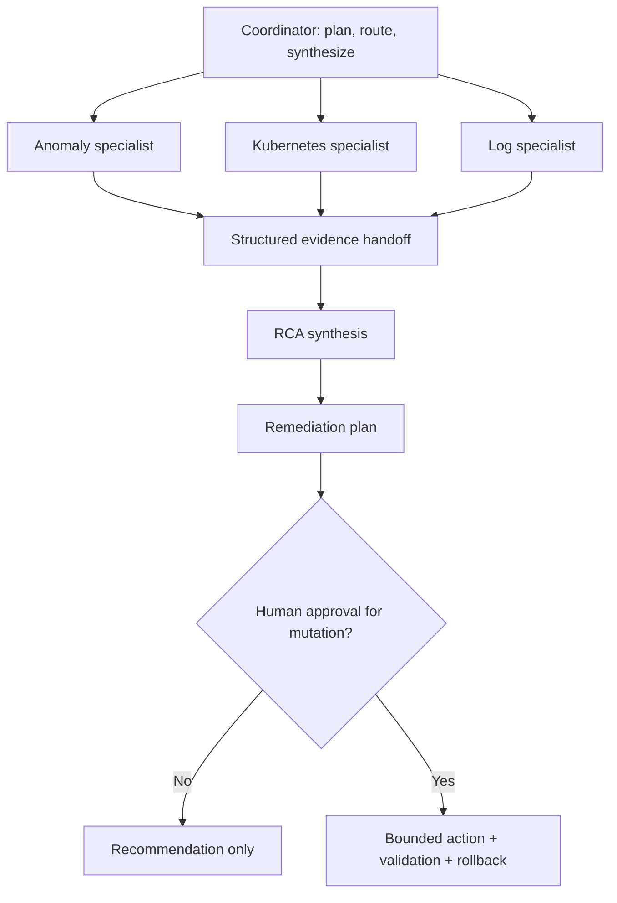

#### Code behind coordinator and specialists

The Claude Agent SDK configuration defines specialists with purpose-specific, read-only tools:

```ts
function defaultSubagents(): Record<string, AgentDefinition> {
  return {
    "sre-investigator": {
      description: "Investigates incidents using read-only code and configuration access.",
      prompt: "Analyze evidence, cite exact files and observations, and never change repository state.",
      tools: ["Read", "Glob", "Grep"],
      model: "sonnet",
    },
    "test-reviewer": {
      description: "Reviews test coverage and proposes deterministic tests.",
      tools: ["Read", "Glob", "Grep"],
      model: "haiku",
    },
  };
}
```

Used in: `services/ai-orchestrator/src/services/claudeAgentSdkService.ts`. This is a concrete least-privilege specialist design: specialists inspect and return evidence; the parent run owns the final result and permission decision.

A good handoff contains:

- Objective and incident identifier
- Relevant facts with source and timestamp
- Constraints and permissions
- Required output schema
- Work already completed
- Unresolved uncertainty

The coordinator owns task boundaries, deduplication, conflict resolution, synthesis, and completion criteria. Giving every specialist the entire transcript increases token cost, contamination, and duplicated work.

## 3.4 Prompt guidance versus code enforcement

| Mechanism | Appropriate use | Not sufficient for |
|---|---|---|
| System prompt | Role, tone, investigation procedure, quality criteria | Guaranteed authorization or spend limits |
| Tool schema | Required arguments, types, enums | User identity or business authorization by itself |
| Pre-tool policy/hook | Permission, prerequisites, allow-lists, redaction | Semantic reasoning |
| Post-tool hook | Normalize output, audit, redact, update state | Deciding business intent alone |
| Human approval | High-impact, irreversible, ambiguous actions | Every harmless read operation |

OpsMind demonstrates this in `agentController.ts`, which converts `approvedTools` into a set, and `opsIncidentAutomationService.ts`, which approves a requested mutation only when its tool name is present. The Claude Agent SDK path also bounds turns and budget.

## 3.5 Sessions and durable state

- **Resume**: same objective and valid context; risk is stale assumptions.
- **Fork**: test an alternative from a known checkpoint; risk is divergent branches.
- **Restart**: clean independent review or contaminated context; risk is loss of useful state.

Do not treat the model transcript as the system of record. Persist task ID, incident ID, evidence references, completed steps, approvals, side effects, artifacts, and pending work outside the model.

## 3.6 Production scenario: checkout latency

**Situation:** p95 latency rises to 4.8 seconds after a deployment. Logs show connection pool timeouts; Kubernetes shows healthy pod count but rising restarts.

**Best architecture:**

1. Coordinator identifies independent evidence branches.
2. Log and Kubernetes reads run in parallel.
3. RCA receives scoped, sourced outputs.
4. Remediation proposes rollback plus validation criteria.
5. Deployment rollback requires explicit approval.
6. Host records the action, validates p95/error recovery, and stops or escalates.

**Why exam distractors fail:** one giant prompt floods context; letting specialists mutate production violates least privilege; fixed two-tool execution may stop before collecting decisive evidence; unlimited looping risks cost and repeated side effects.

## 3.7 Domain 1 recall

- Model decides; host enforces.
- Use `stop_reason`/completion state and enforce maximum turns, time, cost, and retries.
- Parallelize only independent branches.
- Coordinator owns synthesis.
- Store durable state outside the context window.
- Require deterministic gates for production mutations.

---

# Domain 2 - Tool Design and MCP Integration (18%)

## 4.1 A tool is a contract for model selection

Claude sees the name, description, and input schema when deciding whether and how to use a tool. Ambiguous tools create ambiguous behavior.

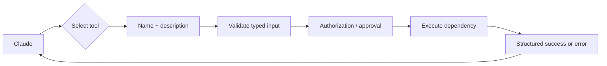

#### Code behind tool validation and authorization

The persistence tool explicitly marks approval as required:

```ts
mcpTool(
  "update_incident_ai_insights",
  "Persist approved root cause, remediation, and preventive actions.",
  {
    incident_number: { type: "string" },
    root_cause: { type: "string" },
    remediation: { type: "string" },
    preventive_actions: { type: "string" },
  },
  ["incident_number", "root_cause", "remediation", "preventive_actions"],
  true,
);
```

Used in: `services/ai-orchestrator/src/services/opsIncidentAutomationService.ts`. Schema validation checks shape; the approval callback separately checks authority. This separation is an important exam principle.

Strong tool design:

- Uses a precise verb-noun name such as `get_incident_details`.
- Says when to use it, not merely what implementation it calls.
- Separates read tools from mutation tools.
- Has narrow typed inputs, required fields, enums, and bounds.
- Rejects unknown properties when possible.
- Returns structured success and structured failure.
- Declares accurate read-only, destructive, idempotent, and open-world hints.
- Supports idempotency keys for retried mutations.

OpsMind's FastMCP tools demonstrate annotations. `get_incident_details` is read-only and idempotent; `create_incident` is a non-idempotent mutation; `update_incident_ai_insights` is writable and idempotent for the same target values.

## 4.2 `tool_choice` decision table

| Setting | Meaning | Best use |
|---|---|---|
| `auto` | Claude may call a tool or answer in text | Ordinary investigation where a tool might not be necessary |
| `any` | Claude must call one of the supplied tools | Output must match one of several tool schemas |
| Forced specific tool | Claude must call the named tool | A mandatory extraction/lookup step is known in advance |

Do not expose every available tool to every agent. Least-tool access reduces selection errors and limits blast radius.

## 4.3 MCP concepts

MCP standardizes how an AI client discovers and invokes external capabilities.

| MCP primitive | Meaning | OpsMind example |
|---|---|---|
| Tool | Model-invoked operation | `analyze_incident_logs`, `update_incident_details` |
| Resource | Readable contextual data | `opsmind://incidents/INC-0001`, severity guide, runbooks |
| Prompt | Reusable user-invoked workflow template | `sre_triage`, `rca_analysis`, `postmortem_draft` |

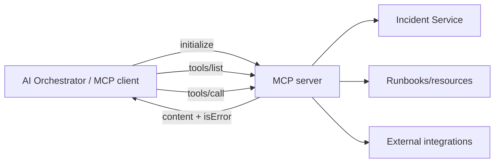

#### Code behind the MCP server

The actual FastMCP read tool combines a precise description, schema, safety annotations, execution, and a protocol-visible error:

```ts
export const getIncidentDetailsTool: Tool<FastMCPSessionAuth, typeof incidentNumberParams> = {
  name: "get_incident_details",
  description: "Retrieve full details of an incident by its incident number (e.g. INC-0001).",
  annotations: {
    title: "Get Incident Details",
    readOnlyHint: true,
    destructiveHint: false,
    idempotentHint: true,
    openWorldHint: true,
  },
  parameters: incidentNumberParams,
  execute: async (args, context) => {
    const n = resolveIncidentNumber(args);
    context.log.info("get_incident_details called", { incidentNumber: n });
    const result = await getIncidentDetails(n);
    if (!result.success) {
      return {
        content: [{ type: "text", text: JSON.stringify(result, null, 2) }],
        isError: true,
      };
    }
    return JSON.stringify(result, null, 2);
  },
};
```

Used in: `services/mcp-server/src/fastmcp/tools/incidentTools.ts`. The complete file registers the seven incident tools. Resources and reusable prompts are registered from `fastmcp/resources` and `fastmcp/prompts`.

OpsMind prefers a configured remote streamable-HTTP gateway and can fall back to the local stdio MCP server. Secrets are supplied through runtime environment variables and must not be checked into configuration.

## 4.4 Tool error policy

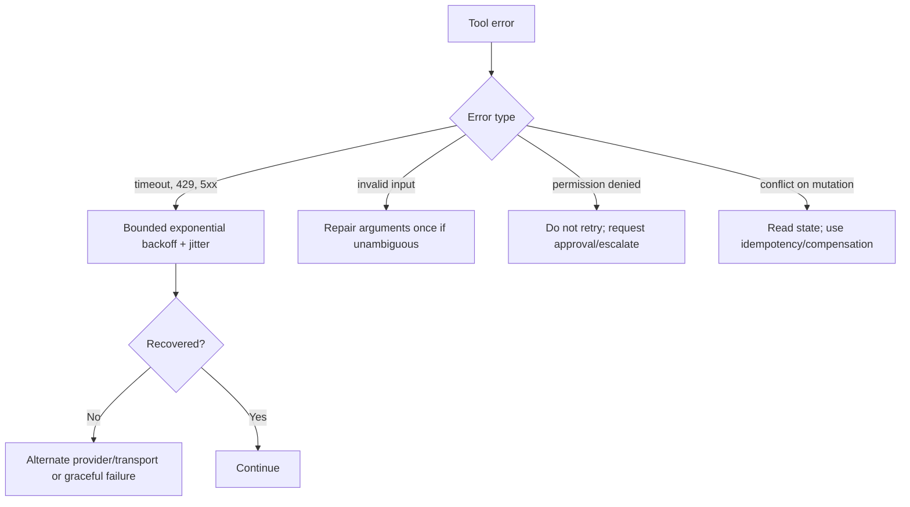

#### Code behind retry classification

OpsMind retries only errors likely to be transient and caps the number of attempts:

```ts
const retryable =
  status === 0 || [408, 409, 429].includes(status) || status >= 500;

if (!retryable || attempt === this.maxRetries) {
  throw error;
}

const exponentialDelay = this.retryBaseDelayMs * 2 ** attempt;
const serverDelay = getServerRetryDelayMs(error) ?? 0;
const delayMs = Math.min(
  Math.max(exponentialDelay, serverDelay),
  this.maxRetryDelayMs,
);
await sleep(delayMs);
```

Used in: `services/ai-orchestrator/src/providers/claudeProvider.ts`. Validation and permission errors are not made retryable because another attempt cannot fix missing authority or an invalid contract.

An MCP tool should return a failed tool result (`isError`) for domain/dependency failures so the model can reason about the failure. Protocol breakage is different from a normal tool-level error.

## 4.5 Production scenario: duplicate incident mutation

**Situation:** the network times out after `create_incident`. The client does not know whether the incident was created.

**Unsafe answer:** blindly retry `create_incident`.

**Production answer:** supply an idempotency key or first query by stable correlation key; separate `find_incident` and `create_incident`; return a typed conflict result; record the final incident number. OpsMind currently annotates creation as non-idempotent, so orchestration must treat its retry risk explicitly.

## 4.6 Domain 2 recall

- Fix overlapping names/descriptions before adding prompt tricks.
- Tool schema validates shape, not authorization.
- Read and write tools should be visibly distinct.
- Retry only transient failures and bound attempts.
- MCP tools, resources, and prompts serve different purposes.
- Keep credentials outside model-visible and checked-in content.

---

# Domain 3 - Claude Code Configuration and Workflows (20%)

## 5.1 Instruction topology

`CLAUDE.md` is durable repository guidance. Rules should be placed at the narrowest scope that consistently needs them.

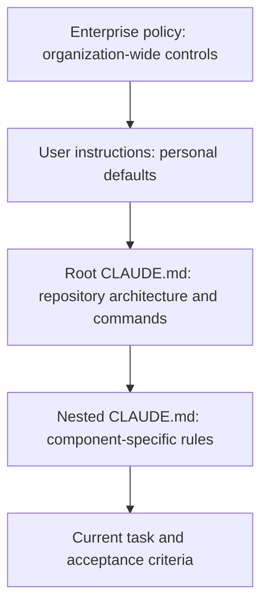

#### Project files behind the instruction layers

The root instruction file directs repository-wide work and explicitly delegates narrower rules:

```md
# CLAUDE.md

Read a nested `CLAUDE.md` when working in a component that contains one.
```

The MCP component then adds rules that apply only to that service:

```md
# services/mcp-server/CLAUDE.md

- Keep every tool description and JSON input schema accurate and discoverable.
- Mark tools with correct read-only, destructive and idempotency annotations.
- New write tools require an explicit approval design and audit consideration.
- Preserve both Streamable HTTP and stdio transports.
```

This is why the diagram narrows from enterprise/project instructions toward component and task context. A developer working only on the portal should not have MCP implementation detail consuming attention.

OpsMind examples:

- Root `CLAUDE.md` explains the repository and requires reading nested instructions.
- `services/ai-orchestrator/CLAUDE.md` requires audit hooks for tool and subagent lifecycle events.
- `services/mcp-server/CLAUDE.md` requires accurate schemas, correct annotations, explicit approval design for new writes, and preservation of HTTP and stdio transports.
- `apps/web-portal/CLAUDE.md` scopes frontend behavior.

Put stable project facts and commands in `CLAUDE.md`; put reusable procedures in skills or commands; put deterministic security controls in permissions/hooks/application code.

## 5.2 Explore, plan, execute, review

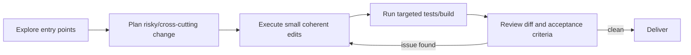

#### Commands behind the workflow

OpsMind provides deterministic validation commands instead of asking the model to guess whether a change works:

```json
{
  "scripts": {
    "validate:deployment": "node scripts/validate-deployment.mjs",
    "validate:claude-config": "node scripts/validate-claude-config.mjs",
    "test:acceptance": "node --test scripts/live-acceptance.test.mjs",
    "build": "npm run incident:build && npm run ai:build && npm run mcp:build && npm run web:build"
  }
}
```

Used in: `package.json`. In an exam answer, Claude can explore and propose, but builds and tests provide deterministic evidence for review.

Use direct execution for a narrow, reversible, obvious change. Use planning for ambiguous requirements, multi-service changes, security-sensitive behavior, migrations, or unfamiliar architecture. Planning is a risk control, not ceremony.

Efficient repository exploration is incremental:

1. Search for symbols, routes, and error text.
2. Read the entry point and directly related imports.
3. Trace only the relevant path.
4. Edit targeted files.
5. Test the smallest meaningful unit, then broaden if risk requires it.

## 5.3 Claude Code in CI/CD

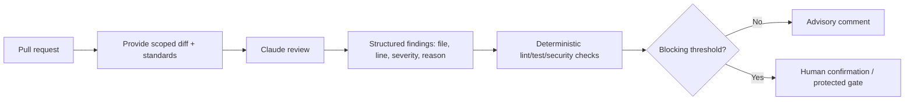

#### Code behind least-privilege Claude Code execution

The SDK run automatically permits only read tools and requires an explicit callback for writes:

```ts
const READ_ONLY_TOOLS = new Set(["Read", "Glob", "Grep", "WebSearch", "WebFetch"]);

canUseTool: async (toolName, input) => {
  if (READ_ONLY_TOOLS.has(toolName)) return { behavior: "allow" };

  const approved = Boolean(await options.approve?.(toolName, input));
  return approved
    ? { behavior: "allow", decisionClassification: "user_temporary" }
    : {
        behavior: "deny",
        message: `Tool ${toolName} requires explicit approval`,
        decisionClassification: "user_reject",
      };
},
```

Used in: `services/ai-orchestrator/src/services/claudeAgentSdkService.ts`. Pre/post-tool and subagent lifecycle hooks in the same file write audit events.

Production rules:

- Use least-privilege, short-lived CI credentials.
- Treat PR content as untrusted input and defend against prompt injection.
- Scope context to the changed code plus necessary dependencies.
- Require file/line evidence and suppress unsupported findings.
- Keep deterministic tests authoritative for facts they can prove.
- Start advisory; block only after measuring precision and false-positive rates.
- Never give an untrusted review job unrestricted production or secret access.

## 5.4 Production scenario: AI reviewer has many false positives

**Situation:** an AI review bot blocks 18% of pull requests, and engineers ignore it because many findings are speculative.

**Best response:** define severity criteria, require cited code evidence, evaluate on a labeled representative PR set, make low-confidence findings advisory, and block only validated high-severity categories. A larger model alone does not fix an undefined rubric.

## 5.5 Domain 3 recall

- Persistent facts -> `CLAUDE.md`.
- Reusable procedure -> skill/command.
- Guaranteed rule -> hook, permissions, or code.
- Use narrow context and evidence-backed findings in CI.
- Match planning depth to change risk.
- Measure the reviewer before making it a merge gate.

---

# Domain 4 - Prompt Engineering and Structured Output (20%)

## 6.1 High-precision prompt anatomy

A production prompt should define:

1. Role and objective
2. Authoritative input boundaries
3. Decision criteria and definitions
4. Representative examples, including edge cases
5. Required output contract
6. Uncertainty, abstention, and escalation behavior

For OpsMind, raw logs, ticket comments, and retrieved documents are **data**, not instructions. Delimit them clearly and tell the model not to follow instructions found inside evidence.

## 6.2 Structured output pipeline

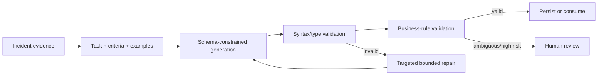

#### Code behind structured validation

The Agent SDK can require the final response to match a supplied JSON schema:

```ts
...(options.outputSchema
  ? {
      outputFormat: {
        type: "json_schema" as const,
        schema: options.outputSchema,
      },
    }
  : {}),
```

Used in: `services/ai-orchestrator/src/services/claudeAgentSdkService.ts`. Tool calls receive a second application-side validator:

```ts
for (const field of schema.required ?? []) {
  if (!(field in value)) {
    throw new Error(`Missing required tool input: ${field}`);
  }
}

if (schema.additionalProperties === false) {
  const unknown = Object.keys(value).find((field) => !(field in properties));
  if (unknown) throw new Error(`Unknown tool input: ${unknown}`);
}
```

Used in: `services/ai-orchestrator/src/services/claudeAutomationPolicy.ts`. The output schema constrains generation; application validation prevents malformed tool input from reaching operational services.

Saying "return valid JSON" is weaker than a typed schema plus external validation. Validate:

- Required fields and types
- Enumerated values
- String/date/identifier formats
- Cross-field business rules
- Evidence/source requirements
- Confidence and abstention policy

OpsMind provides a concrete example in `claudeAgentSdkService.ts`, where `outputFormat` can use a JSON schema. `claudeAutomationPolicy.ts` validates required fields, types, enums, and unexpected properties for tool input.

## 6.3 Single pass, self-correction, or independent review

| Pattern | Choose when | Cost/risk |
|---|---|---|
| Single pass | Low-risk, simple, well-evaluated output | Cheapest; errors pass through unless validated |
| Generate -> validate -> repair | Mechanical schema/format defects | Good efficiency; bound repair attempts |
| Independent generator and reviewer | Subtle or high-impact semantic quality | More latency/cost; reduces correlated self-review bias |
| Human review | Consequential or genuinely ambiguous decision | Slowest; appropriate final authority |

## 6.4 Synchronous API versus Message Batches

- Use synchronous calls for interactive incident response, pre-merge decisions, and multi-turn tool loops.
- Use Message Batches for large independent, latency-tolerant work such as overnight postmortem classification or historical incident extraction.
- Preserve a stable `custom_id`/correlation ID, retry only failed items, and validate a small representative sample before scaling.
- Current batch pricing, limits, and completion windows are product facts that must be checked in current official documentation rather than memorized from old material.

## 6.5 Production scenario: postmortem extraction

**Situation:** thousands of historical postmortems must be converted into `{service, severity, rootCauseCategory, contributingFactors, preventiveActions, evidence}`.

**Best design:** define enums and nullable/unknown behavior; test representative edge cases; use schema-constrained output; batch independent documents; map results with stable IDs; validate syntax and business rules; selectively repair or review failures; measure recall specifically for critical root-cause categories.

**Common trap:** 97% valid JSON does not mean 97% correct data. Format validity and semantic accuracy are separate metrics.

## 6.6 Domain 4 recall

- Specific decision criteria beat vague caution.
- Examples should cover boundaries and near-misses.
- Schema constrains shape; validators enforce application rules.
- Do not silently coerce ambiguous values.
- Independent review is valuable when semantic risk justifies its cost.
- Batch by token budget and semantic independence, not only row count.

---

# Domain 5 - Context Management and Reliability (15%)

## 7.1 Context engineering

The goal is not maximum context. The goal is the smallest sufficient, current, authoritative context for the next decision.

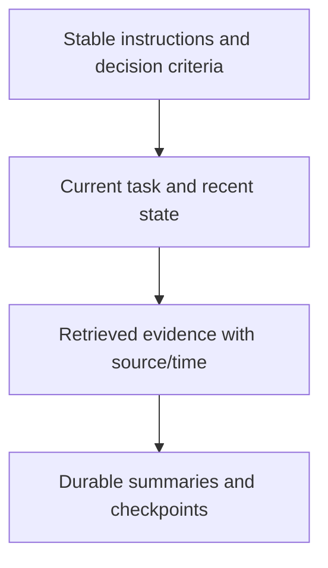

#### Code behind context retrieval and provenance

The RAG client retrieves only context relevant to the current query, incident, and service:

```ts
async retrieveContext(params: {
  query: string;
  incidentNumber?: string;
  service?: string;
}): Promise<RAGContext | null> {
  if (!this.enabled) return null;
  const response = await this.client.post("/retrieve-context", params);
  return response.data.success ? response.data.context : null;
}
```

Used in: `services/ai-orchestrator/src/services/ragService.ts`. Observability context keeps time and source visible:

```ts
return [
  `Generated: ${context.generatedAt}`,
  `Service: ${context.service}`,
  `Time range: last ${context.timeRangeMinutes} minutes`,
  "Metrics:",
  metrics || "No metrics available",
  "Log findings:",
  logs || "No log findings available",
].join("\n");
```

Used in: `services/ai-orchestrator/src/services/observabilityFormatter.ts`. This lets the model distinguish fresh evidence from stale summaries.

Use just-in-time retrieval. Preserve raw evidence for critical claims because summaries are lossy. Tag evidence with incident ID, source system, timestamp, retrieval query, and freshness. When sources conflict, expose the conflict rather than inventing certainty.

OpsMind's RAG service retrieves incidents, logs, runbooks, tickets, and knowledge-base items. Its observability formatter preserves source names and time range. The AI Copilot distinguishes MCP+AI, fallback-provider, MCP-facts-only, and prompt-parser response sources in metadata.

## 7.2 Reliability is explicit routing

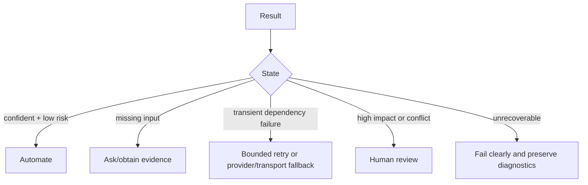

#### Code behind provider fallback

If the caller did not explicitly demand one provider, OpsMind tries only configured alternatives and records the original provider:

```ts
const fallbackCandidates = ["generic", "openai", "claude"];

for (const candidateName of fallbackCandidates) {
  if (candidateName === primaryName) continue;
  const fallbackProvider = ProviderFactory.getProvider(candidateName, {
    silent: true,
  });
  if (!fallbackProvider) continue;

  try {
    const response = await fallbackProvider.call(systemPrompt, userMessage);
    return { response, fallbackFrom: primaryProvider.name };
  } catch (fallbackError) {
    fallbackErrors.push(`${fallbackProvider.name}: ${toErrorMessage(fallbackError)}`);
  }
}
```

Used in: `services/ai-orchestrator/src/services/llmFallbackService.ts`. Explicit provider selection disables automatic substitution, preserving the caller's intent. The Copilot service also labels facts-only and fallback responses in metadata rather than presenting degraded output as normal.

Reliability controls include timeouts, bounded exponential retry, jitter, circuit breakers, idempotency, fallbacks, explicit degraded modes, audit trails, and human escalation.

OpsMind's Claude provider retries network/408/409/429/5xx failures with exponential delay. The MCP client supports a remote gateway with local stdio fallback. `aiCopilotService.ts` can return facts-only degraded responses rather than fabricating an AI analysis.

## 7.3 Evaluation and confidence

Model confidence is not truth. Calibrate thresholds using labeled, representative outcomes.

Measure at least:

- Task success and exact schema validity
- Precision/recall by severity, service, and root-cause category
- Unsupported claim/hallucination rate
- Tool-selection and tool-argument accuracy
- Mutation approval violations (target: zero)
- Retry/fallback/escalation rates
- Latency, token use, and cost per resolved incident
- SRE acceptance and remediation success
- MTTA/MTTR impact without hiding safety regressions

An overall average can conceal failure in a critical class. If total RCA accuracy is 94% but security incidents are only 58%, the system is not production-ready for autonomous security routing.

## 7.4 Production scenario: Claude unavailable during SEV-1

**Situation:** the selected LLM returns 529/overload while a critical incident is active.

**Best design:** retry within a small latency budget using server guidance/backoff; fall back only to a configured and evaluated provider; clearly label the provider change; if synthesis remains unavailable, return authoritative MCP/observability facts and manual runbook links; never fabricate RCA; page a human and preserve diagnostics.

## 7.5 Domain 5 recall

- Retrieve just in time and keep provenance.
- Summary is not a replacement for critical raw evidence.
- Retry transient failures, not permission or validation failures.
- Degraded mode must be visible.
- Evaluate by risk segment, not only overall average.
- Define automation and escalation thresholds before launch.

---

# 8. Four complete exam-style scenario drills

These four cases combine all five domains, matching the exam's scenario-oriented style.

## Scenario A - Autonomous SRE investigation

**Prompt:** A SEV-1 checkout incident is open. The agent has tools for incident data, logs, metrics, Kubernetes state, recommendations, and deployment rollback. Design the safest fast response.

**Ideal architecture:**

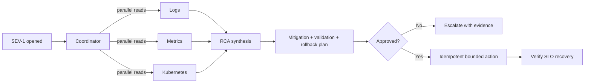

#### Project implementation used by this scenario

The production automation prompt makes the evidence-before-action rule explicit, while code separately controls the write:

```ts
`You are the OpsMind production SRE automation agent.
Gather the incident record and evidence before recommending action.
Clearly distinguish facts from hypotheses.
Do not persist changes unless the update tool is explicitly approved.`
```

Used in: `services/ai-orchestrator/src/services/opsIncidentAutomationService.ts`. In the scenario, `get_incident_details`, `analyze_incident_logs`, and `get_incident_metrics` supply the read path; `get_remediation_recommendations` supplies the plan; `update_incident_ai_insights` represents the approval-gated write. A real deployment rollback tool should follow the same contract but also include idempotency, validation, rollback, and audit fields.

**Key answer points:** narrow read access; parallel independent evidence; sourced handoffs; no mutation without approval; bounded loop; validation after action; rollback/compensation path; audit metadata.

## Scenario B - MCP tool catalog redesign

**Prompt:** Claude confuses `manage_incident` and `incident_action`, sometimes updating records when the user requested a lookup.

**Best answer:** replace overlapping broad tools with `get_incident_details`, `search_incidents`, `create_incident`, and `update_incident_details`; make descriptions distinguish read versus write intent; use strict schemas; expose only role-required tools; annotate side effects; validate authorization outside the model; evaluate tool-selection confusion on a test set.

**Why not prompt-only:** "Never update accidentally" is probabilistic. Clear interfaces plus deterministic approval reduce both confusion and impact.

## Scenario C - Claude Code pull-request reviewer

**Prompt:** Build a repository-aware reviewer for OpsMind that checks MCP annotations and approval paths.

**Best answer:** place stable MCP rules in nested `CLAUDE.md`; supply only changed files plus direct dependencies; use a reusable review procedure; require structured findings with file/line/evidence; run deterministic schema/build/tests; treat PR text as untrusted; use read-only CI permission; begin advisory; promote evaluated high-precision rules to blocking.

## Scenario D - Historical incident extraction

**Prompt:** Extract structured RCA information from 100,000 archived tickets at acceptable cost.

**Best answer:** sample and refine first; define schema and unknown values; use stable correlation IDs; batch semantically independent records within token limits; validate every result; selectively retry failed records; independently review high-risk classes; retain source references; measure accuracy per service/severity/category.

---

# 9. Production architecture review checklist

Use this when explaining OpsMind in an architecture interview or scenario response.

## Objective and boundaries

- Is the business outcome and stop condition explicit?
- Which decisions require model reasoning, and which should be deterministic?
- What are maximum turns, duration, cost, and retries?

## Identity and permissions

- Is the caller authenticated at the API boundary?
- Does every agent/tool have least privilege?
- Are write tools approval-gated?
- Are secrets excluded from prompts, repositories, logs, and tool results?

## Tools and data

- Are names/descriptions unambiguous?
- Are schemas strict and outputs structured?
- Are side-effect and idempotency annotations correct?
- Are external/tool results treated as untrusted data?

## State and failure

- Is durable state stored outside the transcript?
- Are timeouts and transient retries bounded?
- Are mutations idempotent or compensatable?
- Is fallback visible and evaluated?
- Is there a facts-only or graceful degraded mode?

## Quality and operations

- Are claims linked to source and freshness?
- Are thresholds calibrated on representative labeled data?
- Are metrics segmented by risk class?
- Are tool calls, approvals, provider, latency, tokens, and outcomes auditable?
- Is a human escalation path operationally staffed?

---

# 10. Practice questions

Choose one answer before opening the answer key.

### Q1

An agent continues calling read tools after it already has enough evidence. What is the best fix?

A. Always stop after two calls  
B. Remove history  
C. Inspect the model's termination signal and enforce bounded turns/cost  
D. Allow unlimited calls for completeness

### Q2

A refund must never occur before identity verification. What is the strongest control?

A. Add two examples  
B. Lower temperature  
C. Put "always verify" in the prompt  
D. Implement a deterministic prerequisite gate before the refund tool

### Q3

Three research specialists return overlapping and contradictory conclusions. What should change first?

A. Give each the full transcript  
B. Add a coordinator that owns boundaries, evidence, conflict handling, and synthesis  
C. Increase maximum tokens  
D. Let specialists update the final report directly

### Q4

When should a task stay in one agent?

A. When work is tightly coupled and handoff cost exceeds specialization benefit  
B. Whenever multiple files are involved  
C. Whenever a large model is available  
D. Never; multi-agent is always safer

### Q5

Claude selects a write tool instead of a similar read tool. Best first intervention?

A. Raise temperature  
B. Rename and redescribe tools to make intent and side effects distinct  
C. Add all tools to the prompt twice  
D. Retry the same response

### Q6

Which guarantee does a JSON input schema provide?

A. The user is authorized  
B. The data is factually correct  
C. Arguments have an expected structural shape  
D. The operation is idempotent

### Q7

The server returns permission denied for a mutation. What should the agent do?

A. Retry with exponential backoff  
B. Change the tool name  
C. Escalate/request approval; do not retry blindly  
D. Switch providers until one permits it

### Q8

Which MCP primitive best represents a reusable SRE triage template selected by a user?

A. Prompt  
B. Resource  
C. Tool result  
D. Transport

### Q9

A network timeout occurs after a non-idempotent create call. What is safest?

A. Retry immediately ten times  
B. Check via stable correlation/idempotency key before creating again  
C. Assume failure  
D. Ask the model whether creation succeeded

### Q10

Where should stable repository-wide build commands live?

A. Every user prompt  
B. Root `CLAUDE.md`  
C. Model output schema  
D. Production database

### Q11

Where should a mandatory prohibition on production deletion be enforced?

A. Only in `CLAUDE.md`  
B. In a few-shot example  
C. In permissions/policy/hook/application code  
D. In a longer model response

### Q12

An AI PR reviewer is untested. What is the best rollout?

A. Make all findings blocking immediately  
B. Begin advisory, evaluate precision by severity, then gate validated categories  
C. Give it production credentials  
D. Suppress evidence to reduce output size

### Q13

What is the strongest design for machine-readable incident extraction?

A. "Return JSON" plus regex  
B. Schema-constrained output, external validation, bounded repair/escalation  
C. Free-form text parsed manually later  
D. High temperature and a long example

### Q14

Why include edge cases and near-misses in prompt examples?

A. They clarify decision boundaries  
B. They guarantee authorization  
C. They remove the need for evaluation  
D. They reduce every request's token count

### Q15

When is independent review preferable to self-correction?

A. Every trivial format conversion  
B. When subtle, high-impact semantic errors justify added cost  
C. Only when JSON is invalid  
D. Never

### Q16

Which workload best fits asynchronous Message Batches?

A. Interactive SEV-1 remediation  
B. A multi-turn agent waiting for tool calls  
C. Overnight extraction from many independent postmortems  
D. A synchronous merge gate with a strict latency target

### Q17

What is the best context strategy for long incident investigations?

A. Send the full history to every specialist  
B. Drop all old evidence  
C. Retrieve just in time, checkpoint durable state, and preserve critical raw evidence  
D. Rely only on the model's memory

### Q18

Overall accuracy is 96%, but recall for CRITICAL incidents is 55%. What should happen?

A. Launch autonomous critical remediation  
B. Ignore category metrics  
C. Route critical cases to review and improve/evaluate that segment  
D. Increase batch size

### Q19

Claude is unavailable during a SEV-1. What is the best degraded behavior?

A. Fabricate the most likely RCA  
B. Hide provider fallback  
C. Return authoritative facts/runbooks, label degraded mode, and escalate  
D. Retry forever

### Q20

Which OpsMind statement is correct?

A. The five `agents/` folders are five autonomous production deployments  
B. PostgreSQL is the reasoning engine  
C. Logical agent facades describe responsibilities; orchestration runs mainly in the service layer  
D. The web portal directly executes MCP mutations

---

# 11. Answer key with reasoning

| Q | Answer | Reason |
|---:|:---:|---|
| 1 | C | Termination comes from the model/API state, while the host applies safety bounds. Fixed call counts are brittle. |
| 2 | D | A prerequisite that must never be bypassed belongs in deterministic code. |
| 3 | B | The missing control is ownership of decomposition and synthesis, not more context or tokens. |
| 4 | A | Decomposition has a cost; split only across meaningful boundaries. |
| 5 | B | Discriminable interfaces improve selection and make read/write risk clear. Approval remains an external control. |
| 6 | C | Schema checks structure. Authentication, truth, and idempotency require separate mechanisms. |
| 7 | C | Permission failure is non-transient; retries cannot create authority. |
| 8 | A | MCP prompts are reusable workflow templates; resources are contextual data and tools perform operations. |
| 9 | B | The outcome is uncertain, so identify the prior operation before repeating a non-idempotent write. |
| 10 | B | Stable shared repository facts belong in repository-level instructions. |
| 11 | C | Deterministic controls belong outside probabilistic prompt adherence. |
| 12 | B | Measure false positives and severity precision before granting blocking authority. |
| 13 | B | Constrained generation plus independent validation and controlled recovery is the strongest pipeline. |
| 14 | A | Boundary cases teach the distinction between categories better than repetitive obvious examples. |
| 15 | B | Independent context reduces correlated self-review blind spots when the risk warrants the cost. |
| 16 | C | Independent, high-volume, latency-tolerant records are the natural batch workload. |
| 17 | C | This balances relevance, continuity, token use, and evidence integrity. |
| 18 | C | Aggregate accuracy hides critical-class failure; route by risk and evaluate per segment. |
| 19 | C | A visible facts-only mode is useful and honest; persistent failure requires human escalation. |
| 20 | C | The repository explicitly distinguishes readable logical agents from executable services. |

### Score interpretation

- **18-20:** strong; explain every distractor before moving on.
- **15-17:** review the domains behind missed questions and retake tomorrow.
- **11-14:** rebuild the five-domain mental model and trace each concept into OpsMind.
- **0-10:** study one domain per day, then attempt scenarios rather than memorizing the key.

---

# 12. Architecture interview drill

Practice this 90-second explanation:

> OpsMind separates the experience, operational state, AI reasoning, and tool planes. The AI Orchestrator gives Claude a narrow set of typed MCP capabilities. Claude decides which evidence to gather and synthesizes RCA, while the Incident Service and PostgreSQL remain authoritative. Tool inputs are schema-validated; reads use least privilege; persistent actions require explicit approval. The host bounds turns, budget, retries, and time, preserves tool results and audit metadata, and can degrade to authoritative facts when the LLM is unavailable. Kubernetes, Helm, and Terraform provide the deployment layer. This hybrid architecture gains agent flexibility without handing uncontrolled production authority to the model.

Then be ready to answer:

1. Why is the model not the system of record?
2. Why is MCP useful beyond a direct REST call?
3. How do you prevent duplicate mutations after timeouts?
4. How do you handle prompt injection inside logs?
5. Which metrics prove the system improves incident response safely?
6. What happens if the selected LLM or remote MCP gateway fails?
7. Which actions require human approval, and why?

---

# 13. Seven-day preparation plan

| Day | Learn | Hands-on in this repository | Exam practice |
|---|---|---|---|
| 1 | Agent loop, termination, bounds | Trace `automateIncident` and Claude tool loop | Q1-Q4 |
| 2 | Decomposition, state, approvals | Trace logical agents and approval allow-list | Redraw Scenario A |
| 3 | Tool contracts and MCP | Inspect FastMCP tools/resources/prompts and annotations | Q5-Q9 |
| 4 | Claude Code configuration and CI | Compare root and nested `CLAUDE.md` files | Q10-Q12 |
| 5 | Prompting, schema, validation | Trace output schema and automation policy | Q13-Q16 |
| 6 | Context, retry, fallback, evaluation | Trace RAG, observability metadata, provider retries | Q17-Q19 |
| 7 | Full timed review | Explain architecture without notes | All 20 + four scenarios |

Daily cadence: 45 minutes concepts, 45 minutes code tracing, 30 minutes scenario questions, and 15 minutes maintaining an error log. Record the missed principle, not just the correct letter.

---

# 14. Last-minute recall sheet

1. **Loop:** model decision -> validated tool -> result in history -> termination signal -> bounded stop.
2. **Agents:** decompose at real boundaries; coordinator owns synthesis and conflicts.
3. **Governance:** prompts guide; code, permissions, and approvals guarantee.
4. **Tools:** narrow verb-noun contract, typed schema, structured errors, accurate side-effect hints.
5. **MCP:** tools act, resources inform, prompts template workflows.
6. **Claude Code:** stable facts in scoped `CLAUDE.md`; reusable procedures in skills; deterministic rules in hooks/code.
7. **Output:** constrain, validate, repair within bounds, then escalate.
8. **Context:** retrieve only what is sufficient; preserve provenance and critical raw evidence.
9. **Reliability:** retry transient failures; use visible evaluated fallback; never fabricate degraded results.
10. **Evaluation:** segment by risk; aggregate accuracy can hide production-dangerous failures.

---

# 15. Repository evidence map

| Exam concept | Project evidence |
|---|---|
| Governed agent loop | `services/ai-orchestrator/src/providers/claudeProvider.ts` |
| Turn and budget bounds | `services/ai-orchestrator/src/services/claudeAgentSdkService.ts` |
| Approval allow-list | `services/ai-orchestrator/src/controllers/agentController.ts`; `opsIncidentAutomationService.ts` |
| Prompt-injection guard | `services/ai-orchestrator/src/services/claudeAutomationPolicy.ts`; Claude provider |
| Typed MCP schemas | `services/mcp-server/src/tools/incidentMcpSchemas.ts` |
| MCP annotations/errors | `services/mcp-server/src/fastmcp/tools/incidentTools.ts` |
| MCP resources/prompts | `services/mcp-server/src/fastmcp/resources`; `fastmcp/prompts` |
| Remote/local MCP transport | `services/ai-orchestrator/src/services/mcpClient.ts` |
| Structured output | `services/ai-orchestrator/src/services/claudeAgentSdkService.ts` |
| Context retrieval | `services/ai-orchestrator/src/services/ragService.ts` |
| Source-aware observability | `observabilityService.ts`; `observabilityFormatter.ts` |
| Retry/backoff | `services/ai-orchestrator/src/providers/claudeProvider.ts` |
| Provider fallback/degraded output | `llmFallbackService.ts`; `aiCopilotService.ts` |
| Scoped Claude Code rules | root and component-level `CLAUDE.md` files |
| Deployment architecture | `docker-compose.yml`, `infrastructure/kubernetes`, `helm`, `terraform` |

---

# 16. References

- [Anthropic: Claude Partner Network and CCA-F announcement](https://www.anthropic.com/news/claude-partner-network)
- [Anthropic documentation: Tool use](https://docs.anthropic.com/en/docs/agents-and-tools/tool-use/overview)
- [Anthropic documentation: Model Context Protocol](https://docs.anthropic.com/en/docs/agents-and-tools/mcp)
- [Anthropic documentation: Claude Code](https://docs.anthropic.com/en/docs/claude-code/overview)
- Repository source and existing `deliverables/build_cca_f_exam_prep.js`

> Integrity note: the practice questions above are original. They teach architectural decision-making and are not copied exam questions. Verify current exam weights, delivery details, model names, API limits, pricing, and batch behavior in the official portal and documentation before the exam.
