# CCAR-F Complete Study Guide

> Based on *[Unofficial] CCAR-F — Recaps From All Lectures* (71 pages).  
> This is an unofficial learning aid. Product behavior can change; verify version-sensitive facts against current official documentation before the exam.

## How to use this guide

The exam is easier when you learn **decision rules**, not isolated sentences. For each topic:

1. Understand the mental model.
2. Memorize the contrast table or decision rule.
3. Trace the diagram without looking at the notes.
4. Answer the checkpoint question and explain why every wrong option is wrong.
5. Finish with the mixed practice exam.

### The complete roadmap

```mermaid
flowchart LR
    A[Agent loop] --> B[Tool design]
    B --> C[MCP and built-ins]
    C --> D[Coordinators and subagents]
    D --> E[Hooks and sessions]
    E --> F[Memory, rules, skills]
    F --> G[Interactive and CI use]
    G --> H[Precise prompting]
    H --> I[Structured output and batches]
    I --> J[Context management]
    J --> K[Escalation, confidence, attribution]
```

## 1. What you run and how an agent runs it

### The core idea

Running `claude` opens an interactive session. A slash-prefixed message invokes a command. Claude can be used through three broad surfaces: an interactive coding environment, an SDK, or a direct API integration where the application owns the tool loop.

An API model is not secretly running your tools. Your application repeatedly sends the conversation, inspects the response, executes requested tools, and returns the results.

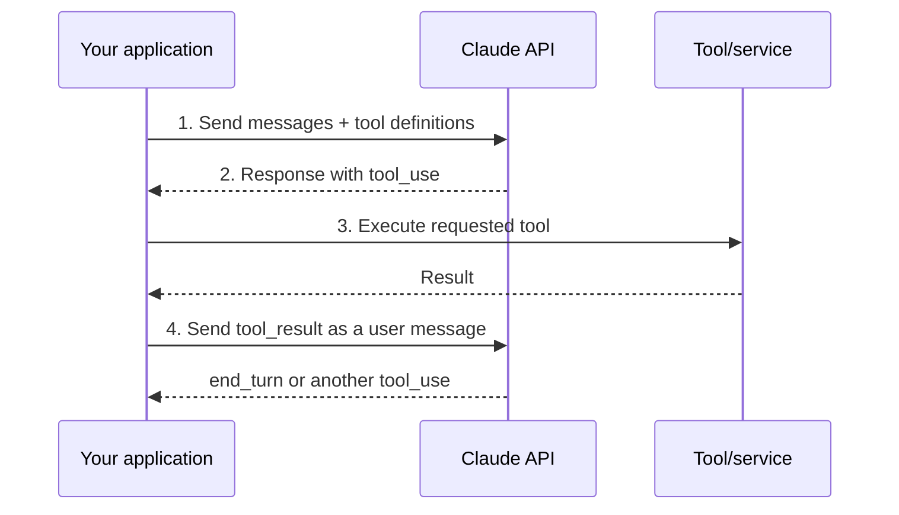

Every API call is stateless. Continuity exists only because the application sends the relevant conversation history again. Tool results therefore become conversation history. A `tool_result` is returned in a message whose role is `user`, and its `tool_use_id` pairs it with the request.

### Stop reasons control the loop

Never infer completion from prose such as “done.” Branch on `stop_reason`:

| Stop reason | Meaning | Application action |
|---|---|---|
| `tool_use` | Model requested one or more tools | Execute them and return results |
| `end_turn` | Model completed the turn | Stop the loop and present the result |
| `pause_turn` | A long server-side turn paused | Send the response back to continue it |
| Any other value | A distinct termination condition | Handle explicitly rather than guessing |

Turn and budget caps are safety limits. Hitting one does **not** prove success.

### Workflow versus agent

| Workflow | Agent |
|---|---|
| Code chooses the path in advance | Model chooses its next steps |
| Predictable and repeatable | Flexible and adaptive |
| Best for stable, known procedures | Best for open-ended investigation |
| Easier to test and bound | Needs stronger controls and observation |

Prompt chaining is a workflow: step B receives step A’s output. Start with the simplest design that works and add autonomy only when it produces measurable benefit.

### How to divide work

- Separate independent work and merge it later.
- Keep interacting issues together.
- A code review often needs per-file passes **and** a cross-file pass.
- **Sectioning** assigns different subtasks to parallel workers.
- **Voting** repeats the same task to estimate agreement or confidence.

**Exam checkpoint:** If the assistant writes “All tests passed” but the response has `stop_reason: "tool_use"`, what should the loop do?  
**Answer:** Run the requested tool. Prose is not the control signal.

## 2. Designing tools and their failures

### Tool definition anatomy

Every MCP tool definition needs:

```text
name + description + inputSchema
```

Optional metadata can include `outputSchema`, title, icons, and annotations. Tool names must be unique within a server; consistent prefixes reduce collision risk. Parameter names should carry meaning (`user_id`, not `user`). Anything the model needs to know must be present in the definition.

> API spelling: `input_schema`  
> MCP spelling: `inputSchema`

### Schemas constrain shape, not truth

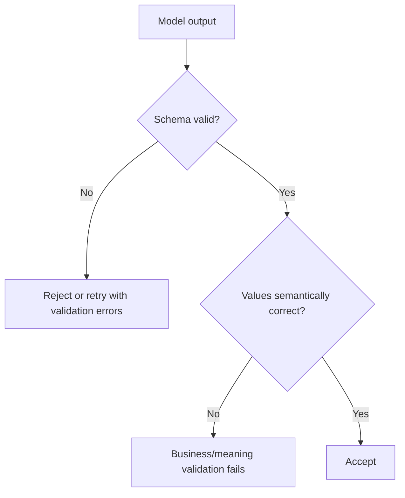

A required field can pressure the model to invent a value when the source is silent. Make a field optional when absence is legitimate. Enums can include escape values such as `unclear` and `other`. Validation confirms types, fields, and allowed shapes—not factual correctness.

### Good descriptions and boundaries

A useful description explains:

- when to call the tool;
- when a similar tool is the better choice;
- important constraints;
- two or three representative input/output examples.

Prefer one tool per coherent job. The implementation may perform several internal operations, but the exposed contract should be unambiguous. Constrain access using identifiers from your own system and return only what the next step needs.

### `tool_choice`

| Setting | Effect |
|---|---|
| `auto` | Model decides whether and which tool to call |
| `any` | A tool call is required; model chooses the tool |
| `none` | No tool use in this turn |
| A named tool | That exact tool is required; no natural-language preamble |

Forcing a source-of-truth retrieval tool first prevents later steps from guessing shared inputs.

### Two error channels

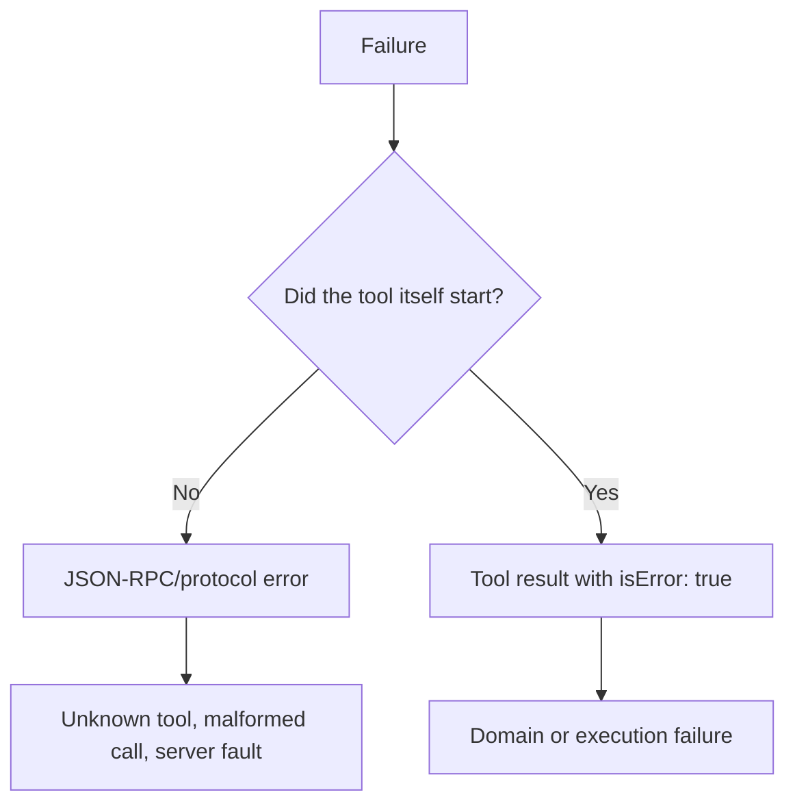

Do not disguise failure as a normal result. Zero matches is a successful query with an empty result; lack of access is a failure.

Actionable errors contain a category, readable reason, retryability, and a next step. Retry only transient conditions such as a timeout. A business-rule refusal should be non-retryable and explained plainly.

**Exam checkpoint:** A record has a correctly typed `customer_id`, but the ID does not exist. Did schema validation work?  
**Answer:** Yes. Semantic validation must separately reject the nonexistent ID.

## 3. MCP servers and built-in tools

### Configuration scope

| Scope | Location/visibility | Best use |
|---|---|---|
| Project | Repository; version-controlled | Shared team server configuration |
| User | User home configuration | All projects for one user/machine |
| Local | One project, private to the user; default for a new server | Personal or experimental setup |

Each user must approve a project-scoped server. Prefer an existing integration for standard products; build a custom server for a genuinely custom workflow.

### Credentials, discovery, and resources

Environment-variable expansion keeps secrets out of shared configuration. A missing variable without a default may remain literal and reach the server. `${VAR:-default}` supplies a fallback.

Claude Code discovers a server’s tool list on connection. MCP resources are readable content addressed by URI; they let a client discover and read content without modeling every read as a tool action.

### Choose the right built-in

| Need | Tool concept |
|---|---|
| Find text, imports, callers, or error strings inside files | Grep |
| Find files by path/name/extension such as `**/*.test.tsx` | Glob |
| Inspect an entire file or a slice | Read |
| Replace/create the whole file | Write |
| Replace one exact, unique text region | Edit |

The source notes that ignored files may produce different Grep and Glob results. Treat tool-specific ignore behavior as version-sensitive.

Before an exact edit, the file must have been read, the old text must match exactly, and the match must be unique. If it is duplicated, provide a longer match or intentionally replace all occurrences. Large files may require offset/limit reads.

### Exploring unfamiliar code

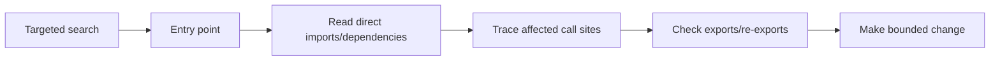

Do not load the whole repository “just in case.” Begin with a precise search, follow imports, and inspect exports because re-exports can hide call sites.

**Exam checkpoint:** You know the extension but not the text inside a file. Use what?  
**Answer:** Glob/path matching. Use Grep when searching file contents.

## 4. Coordinators and subagents

### Context and handoff

A subagent begins with a fresh context and normally returns one final message. Its prompt must therefore contain the goal, needed facts, constraints, output format, and quality bar. Delegate phases that read much but return a concise result.

A subagent definition has three central parts:

1. description;
2. system prompt;
3. tool list.

Give only tools appropriate to the role. Permission rules, tool lists, and hook matchers rely on the exact canonical tool name.

### Coordination patterns

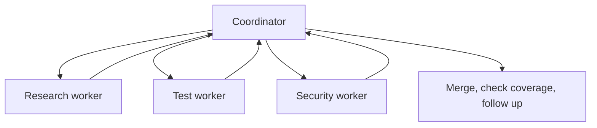

In hub-and-spoke coordination, the coordinator owns decomposition, routing, failure handling, and merging. Direct messaging may be possible inside the same session, but centralized routing provides one observation point.

Parallel calls finish at roughly the pace of the slowest worker. Assign non-overlapping subjects or source types; identical broad prompts create duplicate output. Subtasks that are too narrow can create confident-looking coverage gaps.

### Independent evaluation

The producer should not be its own only judge. An evaluator-optimizer loop uses a fresh context:

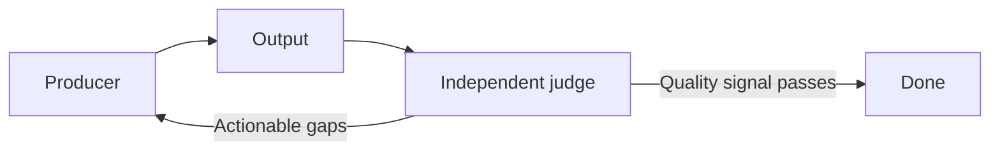

Continue only while feedback yields useful improvement. Give the judge a checkable rubric or signal.

### Failure reporting

A useful worker failure reports:

- failure type and attempt;
- partial results;
- uncovered area;
- recommended next step.

Preserve good partial work and label the merged report’s coverage. An infrastructure/API failure that terminates a worker may prevent even its final message from returning.

**Exam checkpoint:** Three workers receive “research this entire repository.” What is the likely flaw?  
**Answer:** Overlap and duplicated findings. Give each worker a distinct scope.

## 5. Hooks and session control

### Instructions versus enforcement

Instructions ask the model to behave a certain way; compliance is probabilistic. Hooks execute when their event fires. Use code for deterministic policy and gates for objective success conditions.

| Mechanism | When | Can prevent action? | Typical purpose |
|---|---|---:|---|
| `PreToolUse` | Before tool execution | Yes | Authorization, safety, policy |
| `PostToolUse` | After successful execution | No | Normalize, filter, or reshape output |
| Prompt instruction | During model reasoning | Not guaranteed | Judgment and guidance |

A blocking pre-hook should return a reason so the agent can choose another path. In the source, exit code 2 blocks the call and cannot be overridden by the hook’s JSON.

### Session choices

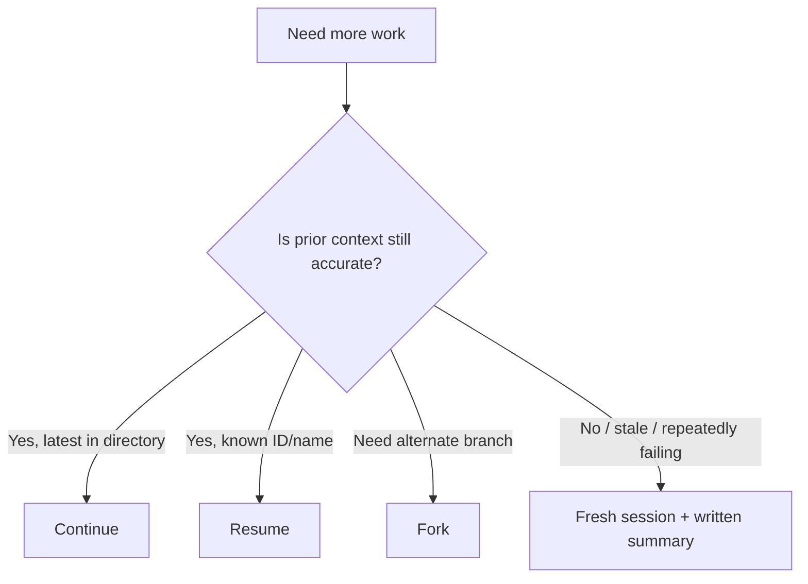

- **Continue** selects the most recent session in the current directory.
- **Resume** targets a session ID or name.
- **Fork** copies history into a new session and preserves the original.
- Forks still share the working directory, so file changes are visible to both.

Resume only while earlier context matches current code. State which files changed. After repeated failed corrections on the same issue, start clean and rewrite the prompt; preserve durable conclusions in a summary.

**Exam checkpoint:** You need to explore an alternate approach without changing the original conversation history.  
**Answer:** Fork—but remember both branches can still change the same files.

## 6. Memory, rules, and skills

### Instruction placement

| Need | Place |
|---|---|
| Rules for every project on one machine | `~/.claude/CLAUDE.md` |
| Team rules for one repository | `./CLAUDE.md` |
| Rules for one codebase area | Subdirectory `CLAUDE.md` |
| File-pattern-specific rules | `.claude/rules/` entry with `paths` |
| Optional repeatable procedure | Skill (`SKILL.md`) |

Imports and split rule files improve organization but do not automatically save context if all are loaded. Rules without `paths` load at launch. Path-scoped rules or subdirectory instructions load when matching files are touched. Use a glob for a file type and a subdirectory instruction for a folder.

Instruction files are context, not enforcement. Long, vague, or contradictory instruction sets reduce reliability. Use context/memory inspection commands to confirm what loaded.

### Skill model

A skill is a `SKILL.md` with YAML frontmatter. Important controls in the source include:

- `name` and `description`;
- `argument-hint` for autocomplete guidance;
- `disable-model-invocation: true` for manual-only invocation;
- `context: fork` to run away from the main conversation;
- `allowed-tools` to pre-approve listed tools for that turn;
- `disallowed-tools` to remove tools for that turn.

Crucial trap: `allowed-tools` grants listed tools but does **not** restrict tools omitted from the list. A deny permission applies more broadly. A same-named skill takes precedence over a legacy command. Use a skill for an occasional procedure and `CLAUDE.md` for an always-on standard.

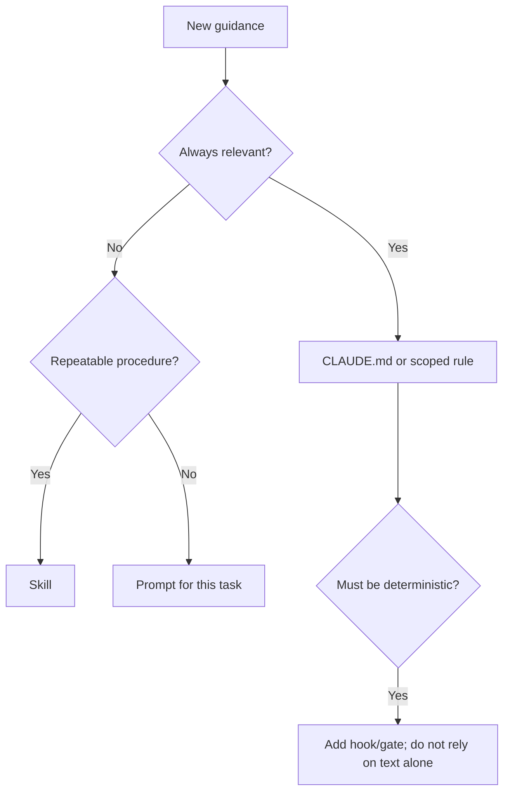

**Exam checkpoint:** Does omitting `Write` from `allowed-tools` prohibit writes?  
**Answer:** No. It only pre-approves listed tools; use restrictions/deny rules to remove access.

## 7. Claude Code in a session and in CI

### Plan or act

Use planning for unfamiliar code, uncertain architecture, or broad changes. A one-sentence, low-risk change usually does not need a lengthy plan. Plan mode allows exploration while edits remain blocked until approval.

An interview can surface missing requirements before implementation. Record decisions in a spec so a clean session can build from them. Tests written first create objective pass/fail feedback. Ask for actual test output, not a verbal completion claim.

### Unattended execution

An unattended/print-mode run answers and exits rather than waiting interactively. It must receive permissions and context up front. Denying everything except explicit allow rules avoids an impossible prompt for human approval. Exit code zero signals process success; nonzero enables CI branching.

Bare execution skips project discovery, so required context must be supplied explicitly.

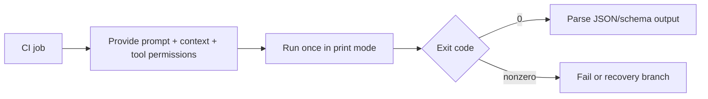

JSON output provides an envelope; a schema stabilizes the payload. Fixed structures make automated inline comments and downstream processing practical. Project instructions should name test commands and standards the agent cannot infer. Supply existing tests to avoid redundant coverage.

**Exam checkpoint:** Why can a CI agent not rely on an approval prompt?  
**Answer:** No person is present. Permissions must be established before execution.

## 8. Prompting for precision

### Write operational instructions

Say what to do and make it testable. Explain the reason so the model can generalize to unseen cases.

Weak:

```text
Do not make low-quality findings.
```

Stronger:

```text
Report only defects that can change runtime behavior. For each finding, cite the
file and line, describe the failing input, and explain the observable consequence.
Omit style preferences because they create review noise.
```

“High confidence” is not a usable criterion by itself. Define categories and severity with examples. False positives reduce trust in the entire system; temporarily disable a noisy category while refining its prompt.

### Examples teach shape and judgment

Three to five varied examples are a useful guideline, not an absolute limit. Examples should reflect real cases, especially ambiguous edges. Wrap samples clearly—such as in `<example>` tags—so sample content is not mistaken for live instruction.

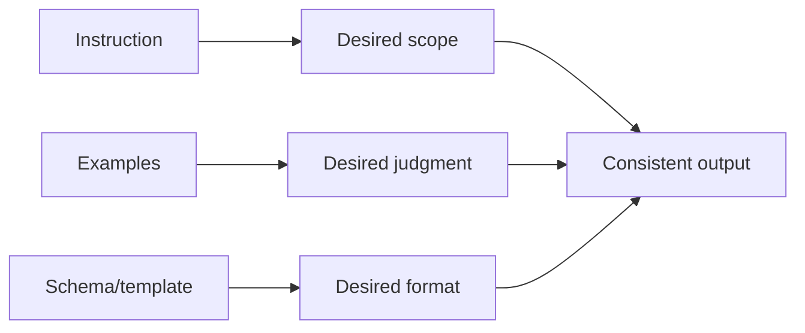

Include at least one complete output record. If examples never show a valid missing/alternate shape, the model may invent values or leave fields inconsistently empty. Demonstrate why a borderline case is included or excluded.

**Exam checkpoint:** What best improves severity consistency: “be consistent” or labeled examples with code?  
**Answer:** Definitions plus labeled examples.

## 9. Claude API: structured output and batches

### Structured extraction

There are two related mechanisms in the recap:

- an extraction tool with `name`, `description`, and `input_schema`;
- structured response formatting through `output_config.format`.

Setting strict tool use constrains tool input to its schema. Structured output improves schema compliance, but refusals, token cutoffs, and normalization/capitalization edge cases still require handling. Schemas cannot normalize source meaning; put normalization rules in the prompt.

### Retry correctly

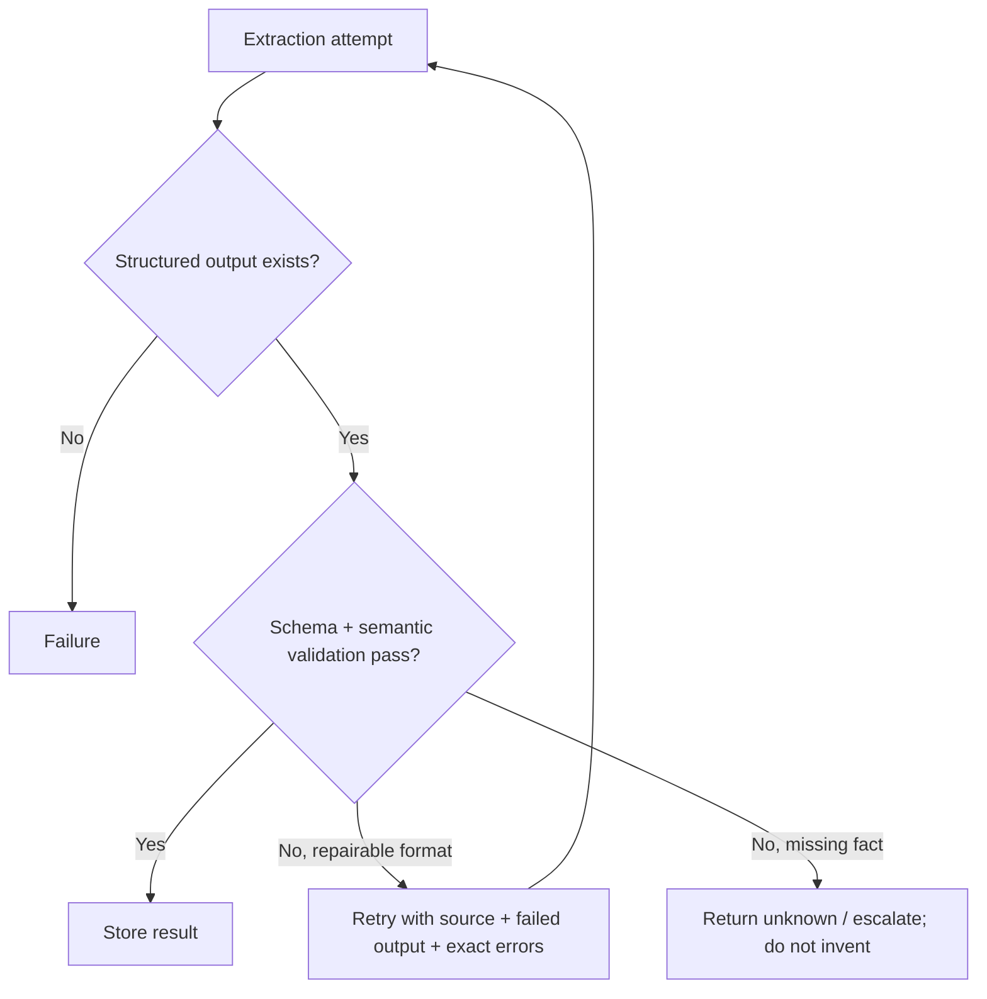

A retry can repair a formatting mistake; it cannot create a fact absent from the document. Explicit permission to answer “I do not know” reduces invention. Success without structured output is a failure.

Self-checking extractions can include:

- `stated_total` and `calculated_total`;
- a conflict flag;
- the triggering rule/construct for each finding;
- exact supporting quotes captured before synthesis.

### Batch trade-offs

According to the source, the Batch API trades latency for 50% lower standard pricing, allows up to 100,000 requests or 256 MB per batch, and has a 24-hour processing window. These numbers are version-sensitive and should be checked against current official limits.

Server-side tools can run inside a batch; a client-side interactive tool loop cannot continue there. Use batches when volume is high and nobody is waiting.

Every request needs a unique `custom_id`, because results may arrive out of order. Test a small sample first, submit early enough for the promised deadline, and resubmit only failed entries after correcting their failure cause.

**Exam checkpoint:** May you pair batch results to requests by array position?  
**Answer:** No. Match using `custom_id`.

## 10. Context management

### Recognize context pressure

Performance can degrade before the hard context limit. Warning signs include forgotten instructions, more mistakes, and answers becoming generic. A single huge file or verbose command may consume thousands of tokens.

### Position and shape matter

For long multi-document input, place documents near the top and the query/instructions near the end. Lead an aggregation with key findings, followed by labeled supporting detail. The source reports that end-positioned queries performed substantially better in a referenced test; treat the percentage as study context, not a universal guarantee.

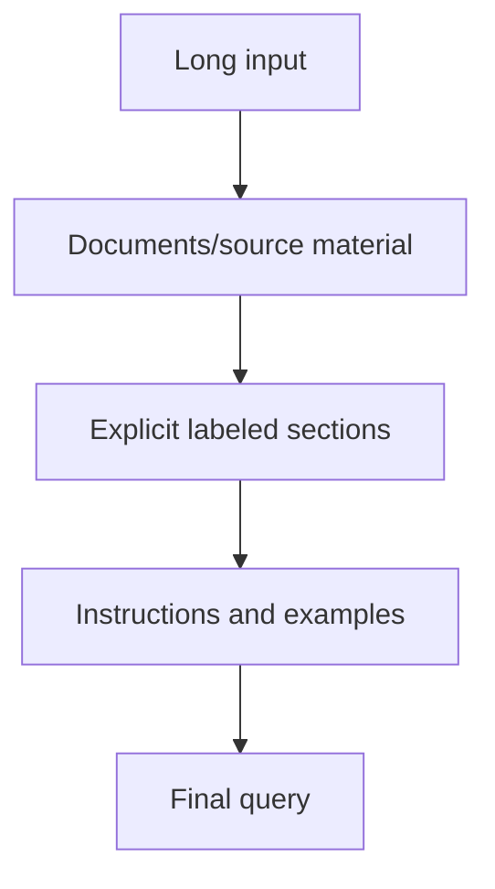

### Durable state versus conversational history

Transactional facts that must remain exact should be resent in a stable block. Trim verbose tool output before it enters context. Give downstream workers structured facts and citations rather than lengthy hidden reasoning.

| Technique | What it does | Main risk |
|---|---|---|
| Context editing | Drops old tool results after a threshold | Lost detail |
| Compaction | Replaces older messages with a summary | Exact facts/instructions may disappear |
| Clear/fresh session | Removes stale exploration | Must re-seed essential state |
| External state file | Persists decisions, findings, diffs | Must be kept current and reloaded |
| Subagent delegation | Isolates verbose exploration | Handoff may omit needed facts |

Compaction is appropriate when a good summary can preserve what matters. Exploration-heavy history may be better cleared or delegated. A pre-compaction hook is the last opportunity to save state. Files and application-managed memory survive because the application stores them—not because the model remembers.

**Exam checkpoint:** Where should an exact account balance that must survive summarization live?  
**Answer:** In a durable/transactional state block or external store that is resent, not only in old chat history.

## 11. Escalation, confidence, and attribution

### Escalation rules

Escalate when:

1. the customer asks for a human;
2. policy is silent or unclear for the request;
3. the agent cannot make meaningful progress.

Frustration alone is not automatically a handoff: acknowledge it and solve what is safely solvable. Tone is not task difficulty, and self-reported model confidence is not proof.

When lookup returns multiple plausible records, ask for another identifier. A heuristic choice hides a guess behind apparent certainty. Put escalation criteria in the system prompt and teach the boundary with both escalated and successfully resolved examples.

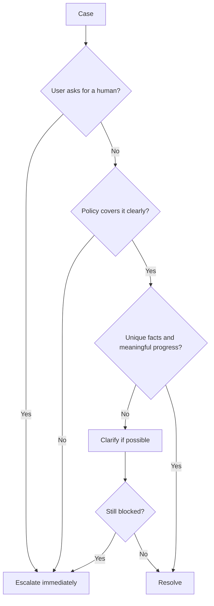

### Calibrate confidence

A raw score has no operational meaning until tested against labeled cases. Score each finding, calibrate thresholds, ship the reliable region, and route uncertain findings to humans. Repeating the same prompt and comparing results can surface instability.

Do not hide weak segments inside one overall accuracy score. Measure by document type, field, or other meaningful slice. Keep human review for ambiguous and internally contradictory sources regardless of a high numeric score. Randomly sample high-confidence results within every segment to detect drift.

### Preserve attribution

At every transformation, keep:

```text
claim → supporting quote → source → publication/collection date
```

Retract claims without support. When credible sources conflict, preserve both values, their sources, dates, wording, and methods. The coordinator—not the collection worker—owns reconciliation. Separate established from contested findings and choose an output form that fits the data (for example, a table for financial figures).

**Exam checkpoint:** Two credible reports give different values from different years. Is this necessarily a contradiction?  
**Answer:** No. Preserve dates and methods before judging the conflict.

## 12. High-yield comparisons—explained simply

This section compares concepts that look similar in exam questions. For every pair, first ask: **What decision is the question asking me to make?** Then use the rule and example below.

### 12.1 Assistant says “done” versus `end_turn`

**Meaning:** “Done” is only text generated by the model. `end_turn` is a machine-readable stop reason returned by the API.

**Example:** The assistant writes, “I have completed the report,” but the response has `stop_reason: "tool_use"` and requests `save_report`. The application must run `save_report` and continue. It must not stop because of the sentence.

**Exam rule:** The agent loop follows `stop_reason`, never completion phrases in natural language.

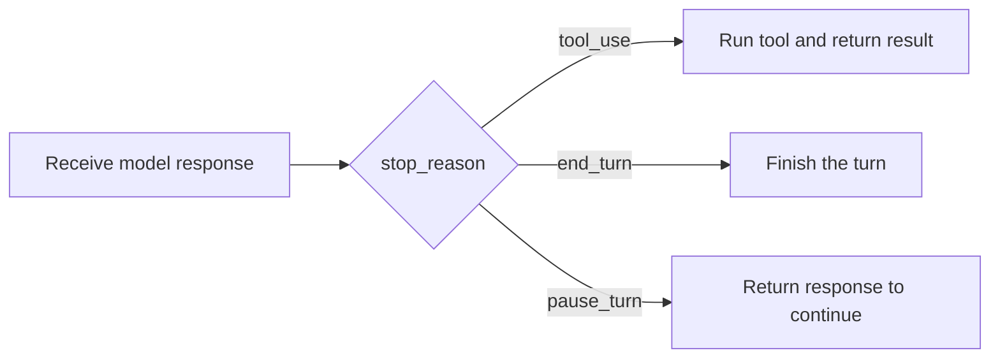

### 12.2 Schema validity versus factual validity

**Schema validity** asks whether the output has the required structure and data types. **Factual or semantic validity** asks whether the values are true and meaningful.

```json
{
  "customer_id": "C-999",
  "age": 250
}
```

Both values may satisfy a schema requiring a string and an integer. However, the customer may not exist and the age is probably invalid. Business checks must catch those problems.

**Exam rule:** A schema guarantees shape—not truth, existence, reasonableness, or business correctness.

### 12.3 Required versus optional fields

A **required** field must always appear. An **optional** field may be absent when the source does not provide it.

Suppose an invoice sometimes has no purchase-order number. If `purchase_order_number` is required, the model may invent one simply to satisfy the schema. Making it optional accurately represents the source.

**Use required** when every valid source must contain the value. **Use optional** when legitimate documents may omit it. You can also permit `null` or a value such as `unknown` when the contract explicitly calls for one.

**Exam rule:** Do not require information that may not exist. Required fields can increase fabrication pressure.

### 12.4 Empty result versus error

An **empty result** means the operation worked but found nothing. An **error** means the operation could not complete correctly.

| Situation | Correct classification |
|---|---|
| Search ran successfully and found zero customers | Successful empty result |
| Database was unavailable | Error, possibly retryable |
| User lacked permission to search | Error, normally not fixed by repeating the same call |
| Search query was malformed | Error; correct the input |

**Exam rule:** “No matches” and “could not search” are different outcomes.

### 12.5 Grep versus Glob

**Grep searches inside files. Glob searches file paths and names.**

- “Find files ending in `.test.tsx`” → Glob: `**/*.test.tsx`
- “Find every file that calls `createUser`” → Grep for `createUser`
- “Find where this error message is written” → Grep
- “Find every YAML file under config” → Glob

**Memory aid:** **Grep = words; Glob = paths.**

### 12.6 Write versus Edit

**Write** creates or replaces a whole file. **Edit** changes one exact section of an existing file.

Use Write for a new file or an intentional full replacement. Use Edit for a small, targeted modification. A safe exact edit requires the file to have been read, the old text to match exactly, and the match to be unique. If the same text occurs twice, provide more surrounding context or deliberately replace all matches.

**Exam rule:** Prefer the smallest precise operation. Do not replace an entire file to make one small change.

### 12.7 Prompt versus hook

A **prompt** tells the model what it should do. A **hook** is code that runs when a defined event occurs.

| Requirement | Better choice | Why |
|---|---|---|
| “Prefer concise explanations” | Prompt | Requires model judgment |
| “Never write outside this directory” | Pre-tool hook/permission rule | Must be enforced every time |
| “Format tool output consistently” | Post-tool hook | Deterministic transformation |

**Exam rule:** Use prompts for judgment and guidance; use programmatic controls for guaranteed enforcement.

### 12.8 `PreToolUse` versus `PostToolUse`

`PreToolUse` runs **before** the tool and can block it. `PostToolUse` runs **after a successful call** and therefore cannot prevent the action that already happened.

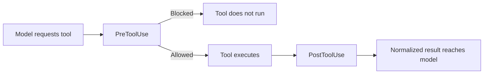

Use `PreToolUse` for authorization and safety policy. Use `PostToolUse` to normalize, filter, or reshape results.

**Exam trap:** A post-use hook cannot undo a dangerous tool action.

### 12.9 Continue versus Resume

Both reuse an existing session, but they select it differently:

- **Continue** opens the most recent session for the current directory.
- **Resume** opens a particular session using its ID or name.

**Example:** Use Continue when you worked on this project five minutes ago and simply want the latest session. Use Resume when several sessions exist and you need the one called `payment-debugging`.

**Memory aid:** **Continue = latest; Resume = selected.**

### 12.10 Forked history versus shared working files

Forking creates a new conversation branch with a copy of the earlier history. It does **not** create an independent copy of the repository.

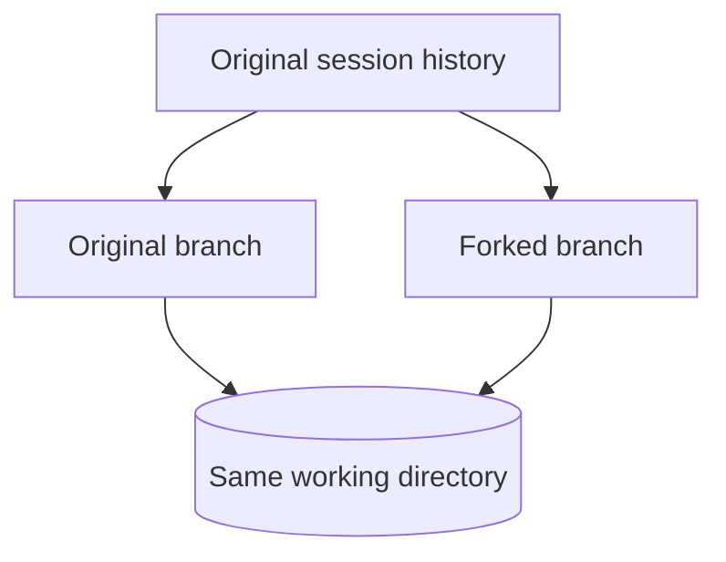

If the fork edits `app.py`, the original session will see the changed file. The histories are separate, but the filesystem is shared.

**Exam trap:** A session fork is not a Git branch and not a filesystem copy.

### 12.11 `allowed-tools` versus deny/restriction

In skill configuration, `allowed-tools` **pre-approves** listed tools for that skill invocation. It does not necessarily remove every unlisted tool. A deny rule or `disallowed-tools` actually blocks/removes access in its applicable scope.

**Example:** A skill lists `Read` under `allowed-tools` but omits `Write`. This alone does not prove that Write is prohibited. To prevent writing, explicitly deny or disallow it.

**Exam rule:** **Allowed means granted without another approval; denied means unavailable.** Omission is not automatically denial.

### 12.12 Workflow versus agent

A **workflow** follows a route written in advance by code. An **agent** lets the model decide the next step based on what it discovers.

| Scenario | Better design |
|---|---|
| Extract, validate, then store every invoice | Workflow |
| Investigate an unfamiliar production failure | Agent |
| Run the same compliance checks each night | Workflow |
| Explore an unknown repository and propose a repair | Agent |

**Exam rule:** Start with the simplest reliable design. Choose an agent only when adaptive decision-making adds value.

### 12.13 Sectioning versus voting

Both use multiple runs or workers, but for different reasons.

- **Sectioning:** Give different parts of the task to different workers. Goal: coverage and speed.
- **Voting:** Give the same task to multiple workers. Goal: measure agreement or improve confidence.

**Example of sectioning:** One worker reviews security, another performance, and another tests.  
**Example of voting:** Three workers independently classify the same support ticket.

**Memory aid:** **Sectioning splits the work; voting repeats the work.**

### 12.14 Producer versus evaluator

The **producer** creates the answer. The **evaluator** judges it against a rubric. Evaluation is stronger when performed in a fresh context, because the producer may repeat or defend its original assumptions.

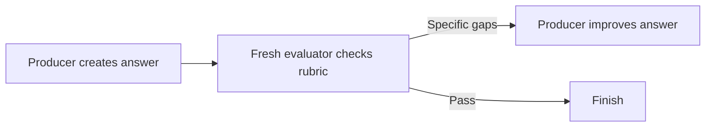

**Exam rule:** For independent quality control, do not make the producing context its only judge.

### 12.15 Retryable versus non-retryable failures

A **retryable** failure may disappear when the same valid operation is tried later. A **non-retryable** failure needs changed input, changed permission, changed policy, or human action.

| Failure | Retry unchanged? |
|---|---|
| Temporary timeout | Yes, within a bounded retry policy |
| Rate limit | Yes, after the appropriate delay |
| Missing required identifier | No; obtain the identifier |
| Policy prohibits the action | No; explain or escalate |
| Source document lacks the fact | No; return unknown or escalate |

**Exam rule:** Retry transient failures, not permanent facts or business refusals.

### 12.16 Structured output versus truthful output

Structured output makes the response conform to a requested form, such as valid JSON with known fields. It does not prove the values were correctly extracted.

```json
{
  "invoice_total": 9000.00,
  "currency": "USD"
}
```

This can be perfectly structured while the document actually says `$900.00`. Validate calculations, compare with source quotes, allow unknown values, and flag conflicts.

**Exam rule:** Structure improves machine readability; grounding and validation improve correctness.

### 12.17 Batch order versus `custom_id`

Batch results may finish in any order. Therefore, position 1 in the results is not guaranteed to belong to position 1 in the requests. Assign every request a unique `custom_id` and join the result back using that ID.

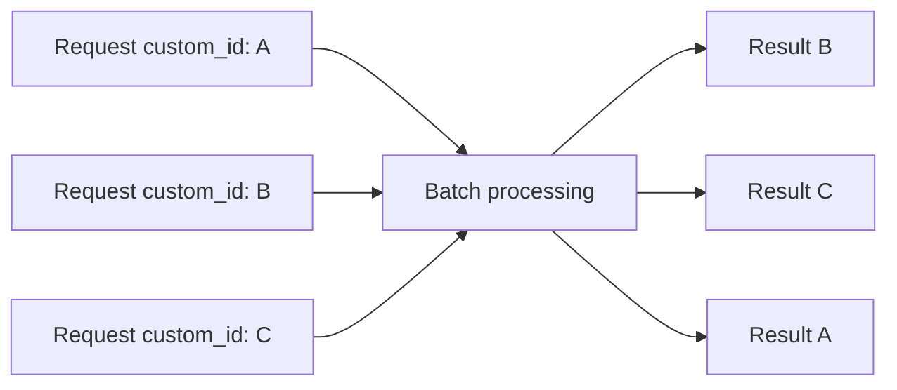

**Exam rule:** Match batch input and output by ID, never by arrival position.

### 12.18 Compaction versus durable state

**Compaction** replaces older conversation details with a shorter summary. **Durable state** stores important facts outside the shrinking conversation—for example, in a file or application database—and reloads them when needed.

Compaction may preserve “the customer has a billing problem” but lose an exact invoice number or amount. Exact transactional facts, decisions, citations, and changed-file lists should be saved in durable state.

**Exam rule:** Use compaction for narrative continuity; use external storage for facts that must remain exact.

### 12.19 Confidence versus calibration

**Confidence** is a score, such as 0.92. **Calibration** tests what scores mean using labeled examples.

If 100 past answers scored near 0.9 but only 60 were correct, the score is poorly calibrated. You should not automatically ship all future 0.9 answers. Set thresholds only after comparing scores with real outcomes, and measure important segments separately.

**Exam rule:** A confidence number becomes useful only after evidence connects it to observed accuracy.

### 12.20 Summary versus attribution

A **summary** states the conclusion. **Attribution** preserves how each claim connects to its evidence.

Weak summary:

```text
Revenue increased by 20%.
```

Auditable result:

```text
Claim: Revenue increased by 20%.
Supporting quote/value: ...
Source: Annual Report 2025, page 42
Publication date: 2026-03-10
```

When another agent summarizes the finding, the claim-to-source link must travel with it. If credible sources disagree, retain both claims, dates, and methods instead of silently choosing one.

**Exam rule:** A claim without its supporting source becomes unauditable after handoffs.

### One-minute memory table

| If the question asks about… | Remember… |
|---|---|
| Loop completion | `stop_reason`, not prose |
| Correct JSON versus correct facts | Schema checks shape; validation checks meaning |
| A possibly missing source value | Make it optional/unknown; do not force invention |
| Search found nothing | Empty success is not an execution error |
| File contents versus filenames | Grep = words; Glob = paths |
| Whole file versus small change | Write = whole; Edit = exact piece |
| Guidance versus enforcement | Prompt = guidance; hook/rule = enforcement |
| Before versus after a tool | Pre can block; Post can reshape |
| Latest versus selected session | Continue = latest; Resume = selected |
| Conversation branch | History separates; files remain shared |
| Tool permission | Allow grants; deny restricts |
| Fixed versus adaptive path | Workflow = fixed; agent = adaptive |
| Parallel work pattern | Section = divide; vote = repeat |
| Quality review | Fresh evaluator checks producer |
| Whether to retry | Retry transient failures only |
| JSON correctness | Structured does not mean truthful |
| Batch matching | Use `custom_id`, never position |
| Long-session memory | Compact narrative; persist exact state |
| Confidence score | Calibrate against labeled outcomes |
| Auditable claims | Keep claim + quote + source + date |

## 13. Exam-solving method

### Read scenario questions in this order

1. **Identify the required property:** deterministic enforcement, factual accuracy, speed, context isolation, auditability, or cost.
2. **Locate the control layer:** prompt, schema, tool, hook, coordinator, or human.
3. **Eliminate category errors:** a schema cannot prove truth; a post-hook cannot prevent a call; a retry cannot create missing facts.
4. **Prefer the simplest sufficient design:** fixed workflow before autonomous agent; targeted read before repository-wide ingestion.
5. **Look for lifecycle timing:** before/after tool, current/new context, synchronous/batch, transient/permanent.

### Common distractor patterns

- A probabilistic prompt is offered where deterministic enforcement is required.
- A valid JSON shape is presented as proof that values are correct.
- “Retry” is proposed for missing source information or policy refusal.
- A subagent is assumed to inherit the parent’s complete context.
- Parallel workers receive overlapping scopes.
- Output is paired by position when an identifier is required.
- Confidence is trusted without calibration data.
- A summary drops source, date, or quote metadata.

## 14. Original practice exam

These questions were created for this guide; they are not copied from the PDF or an official exam.

### Questions

1. An API response contains a friendly final paragraph and `stop_reason: "tool_use"`. What should the application do?
   - A. Show the paragraph and stop
   - B. Execute the requested tool and continue the loop
   - C. Retry the same request without history
   - D. Treat it as a schema error

2. A document may not contain a middle name. Which schema design best reduces fabrication?
   - A. Require `middle_name` as a string
   - B. Require `middle_name` with an empty-string default
   - C. Make `middle_name` optional and define missing-value behavior
   - D. Remove validation

3. You must prevent writes outside an approved directory every time. Which control is strongest?
   - A. A reminder in the user prompt
   - B. A `PreToolUse` policy hook
   - C. A `PostToolUse` formatter
   - D. A positive example

4. Three parallel research workers return nearly identical findings. What should change?
   - A. Increase their context windows
   - B. Give each worker a distinct subtopic or source class
   - C. Ask each to be more confident
   - D. Merge without review

5. A batch contains 5,000 requests. How should results be matched?
   - A. Arrival order
   - B. Submission array index
   - C. `custom_id`
   - D. Model confidence

6. A tool successfully searches for a customer and finds no matches. How should this usually be represented?
   - A. Protocol error
   - B. Server crash
   - C. Successful empty result
   - D. Retryable timeout

7. A model returns a valid invoice object whose total is arithmetically wrong. What failed?
   - A. JSON parsing only
   - B. Semantic validation
   - C. Tool discovery
   - D. Session resume

8. A team standard applies only to Python files. What is the best placement?
   - A. A path-scoped rule for Python files
   - B. Every user prompt
   - C. A batch `custom_id`
   - D. A post-tool error payload

9. What is the important risk when forking a session?
   - A. The original history is deleted
   - B. Both branches still share real working files
   - C. No tools can be called
   - D. The fork receives no history

10. An extraction fails because the source never states the requested value. What is the correct retry strategy?
    - A. Retry until a value appears
    - B. Raise temperature
    - C. Return unknown or escalate under the defined policy
    - D. Make the field required

11. Which pattern is voting rather than sectioning?
    - A. One worker reviews security and one reviews performance
    - B. Three workers independently classify the same record
    - C. One worker finds files and another reads them
    - D. One worker produces and a fresh worker evaluates

12. Why should every finding retain a quote and source?
    - A. To increase the token count
    - B. To make the claim auditable through later summaries
    - C. To avoid using schemas
    - D. To guarantee all sources agree

13. A CI run needs to create comments from findings. What most improves reliability?
    - A. Free-form prose and manual parsing
    - B. A fixed JSON/schema output shape
    - C. A longer greeting
    - D. An interactive permission prompt

14. A raw confidence score of 0.91 is produced. What makes it operationally useful?
    - A. Displaying more decimals
    - B. Comparing it against labeled cases and choosing a threshold
    - C. Replacing all human review immediately
    - D. Treating it as factual proof

15. A long session repeatedly gives generic answers and forgets early constraints. What is the best diagnosis?
    - A. Tool names are necessarily invalid
    - B. Context pressure or stale context
    - C. Batch result ordering
    - D. The schema has too few required fields

### Answers and explanations

1. **B.** `stop_reason` controls the loop; `tool_use` requires execution.
2. **C.** Optionality honestly represents absence and reduces pressure to invent.
3. **B.** A pre-use hook can deterministically block the action before it occurs.
4. **B.** Non-overlapping assignments reduce duplicated work and improve coverage.
5. **C.** Batch completion order is not guaranteed.
6. **C.** The operation succeeded; its result set is empty.
7. **B.** Shape validation passed, but meaning/business validation did not.
8. **A.** Conditional path loading fits a file-type-specific standard.
9. **B.** Conversation history branches, but filesystem edits are shared.
10. **C.** Retry cannot create a fact missing from the source.
11. **B.** Voting repeats the same job to inspect agreement.
12. **B.** The claim-to-source mapping must survive every handoff and summary.
13. **B.** Stable structured output is reliably machine-parseable.
14. **B.** Calibration links the number to observed performance.
15. **B.** These are classic signs of a crowded or stale session.

## 15. Final revision checklist

Before the exam, confirm you can explain without notes:

- the four-step tool loop and each stop reason;
- workflow versus agent, sectioning versus voting;
- tool schema versus semantic validation;
- `auto`, `any`, `none`, and forced tool selection;
- protocol errors versus `isError` tool results;
- Grep/Glob and Read/Write/Edit;
- clean subagent handoffs, parallel scoping, and independent evaluation;
- hooks versus prompts and pre-use versus post-use timing;
- continue, resume, fork, and fresh-session decisions;
- instruction hierarchy, conditional rules, skills, and real tool restrictions;
- interactive planning versus unattended CI;
- operational prompts, examples, and severity definitions;
- structured extraction, meaningful retries, and batch result pairing;
- context positioning, compaction, and durable state;
- escalation triggers, confidence calibration, segmented accuracy, and attribution.

If you can teach each contrast and justify the practice-exam answers, you understand the material at the level scenario questions usually test.
