# Domain 1 — Agentic Architecture & Orchestration

## 1. What this domain is testing

The supplied slide describes this as the largest domain and focuses on how Claude-based systems perform **multi-step work**.

Core topics shown in the slide:

- Agentic loops
- Multi-agent systems and orchestration
- Coordinator and subagent patterns
- Task/tool concepts, hooks, and handoffs
- Session state and resumption
- Workflow design

The key idea is not merely “Claude answers a prompt.”  
The key idea is:

> **Claude repeatedly reasons, selects actions, receives results, and continues until the objective is complete or the system must stop/escalate.**

---

# 2. The Agentic Loop

## 2.1 Basic loop

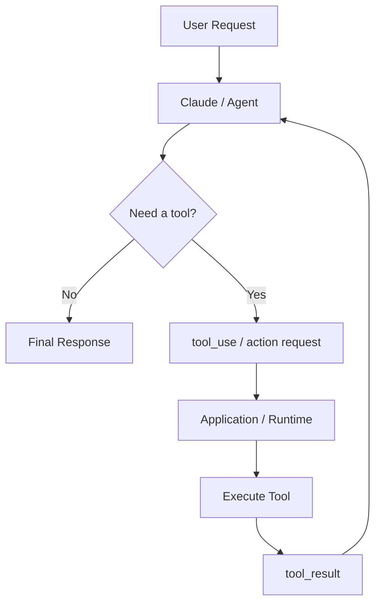
```mermaid
flowchart TD
    U[User Request] --> M[Claude / Agent]
    M --> D{Need a tool?}
    D -- No --> R[Final Response]
    D -- Yes --> T[tool_use / action request]
    T --> A[Application / Runtime]
    A --> X[Execute Tool]
    X --> TR[tool_result]
    TR --> M
```

For client-executed tools, the application normally:

1. Sends messages + tool definitions.
2. Claude returns one or more tool calls.
3. Application validates/authorizes.
4. Application executes the tools.
5. Application sends tool results back.
6. Claude continues.
7. Loop ends when Claude no longer requests another tool.

### Exam keyword
If the question says:

- “continues until complete”
- “repeatedly calls tools”
- “feeds tool results back”
- “multi-step task”
- “stop_reason is tool_use”

Think **agentic loop**.

---

## 2.2 Why the model does not directly execute your business function

A crucial architecture boundary:

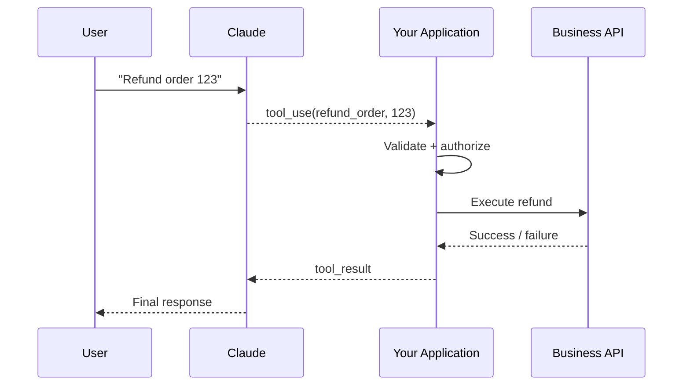
```mermaid
sequenceDiagram
    participant U as User
    participant C as Claude
    participant APP as Your Application
    participant API as Business API

    U->>C: "Refund order 123"
    C-->>APP: tool_use(refund_order, 123)
    APP->>APP: Validate + authorize
    APP->>API: Execute refund
    API-->>APP: Success / failure
    APP-->>C: tool_result
    C-->>U: Final response
```

**Exam trap:**  
Do not assume the LLM itself has silently performed the database/API side effect. For client tools, your application controls execution.

---

# 3. Stop Conditions

A safe agent needs explicit stop behavior.

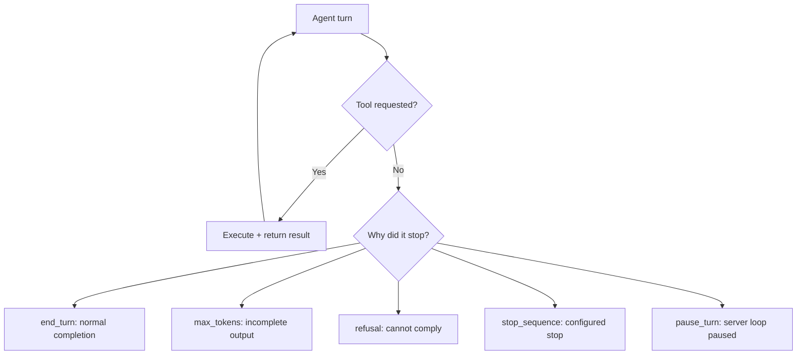
```mermaid
flowchart TD
    A[Agent turn] --> B{Tool requested?}
    B -- Yes --> C[Execute + return result]
    C --> A
    B -- No --> D{Why did it stop?}
    D --> E[end_turn: normal completion]
    D --> F[max_tokens: incomplete output]
    D --> G[refusal: cannot comply]
    D --> H[stop_sequence: configured stop]
    D --> I[pause_turn: server loop paused]
```

## Exam rule

**Do not treat every non-tool stop as successful completion.**  
Production code should inspect why execution stopped and handle each case appropriately.

---

# 4. Single-Agent vs Multi-Agent

## 4.1 Single-agent architecture

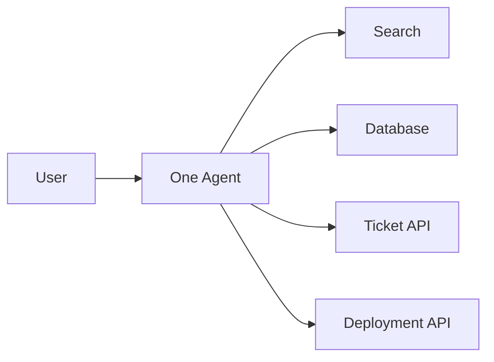
```mermaid
flowchart LR
    U[User] --> A[One Agent]
    A --> T1[Search]
    A --> T2[Database]
    A --> T3[Ticket API]
    A --> T4[Deployment API]
```

Use a single agent when:

- The task is reasonably coherent.
- Tool count/context is manageable.
- One reasoning thread is enough.
- Coordination overhead would not add value.

### Advantages
- Simpler
- Less orchestration
- Easier tracing
- Lower coordination cost

### Risk
A huge toolset and huge context can make the agent less focused.

---

## 4.2 Multi-agent architecture

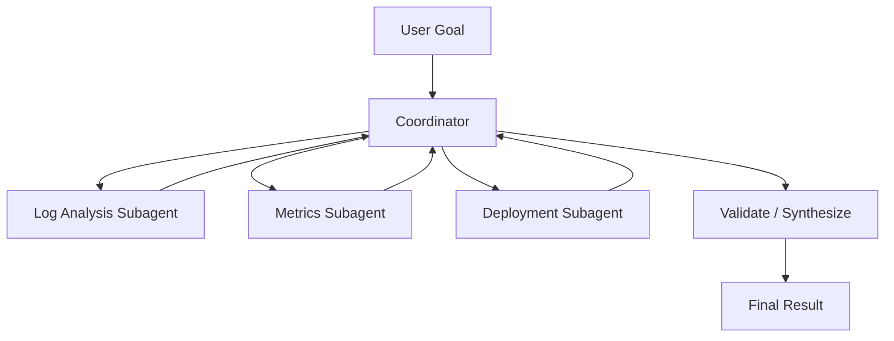
```mermaid
flowchart TD
    U[User Goal] --> C[Coordinator]
    C --> S1[Log Analysis Subagent]
    C --> S2[Metrics Subagent]
    C --> S3[Deployment Subagent]
    S1 --> C
    S2 --> C
    S3 --> C
    C --> V[Validate / Synthesize]
    V --> U2[Final Result]
```

Use multiple agents when:

- Work naturally decomposes into specialized tasks.
- Different agents need different context/tools/permissions.
- Parallel investigation gives meaningful latency reduction.
- A side task would pollute the main agent context.
- Isolation is valuable.

### Important
Multi-agent is **not automatically better**.

Extra agents introduce:
- orchestration complexity
- cost
- latency
- duplicated work
- consistency problems
- more permission surfaces

---

# 5. Coordinator / Subagent Pattern

The coordinator is responsible for the **overall objective**.

Typical coordinator duties:

1. Understand the goal.
2. Split work.
3. Select subagents.
4. Provide bounded instructions/context.
5. Receive outputs.
6. Detect contradictions/gaps.
7. Request more work if necessary.
8. Synthesize the final result.
9. Escalate to a human when required.

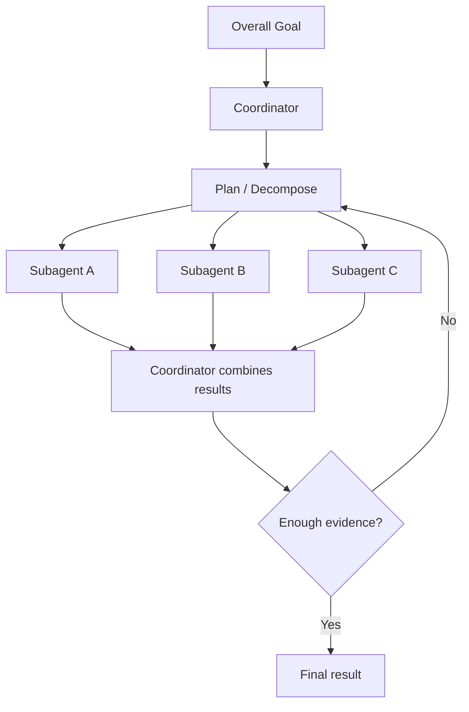
```mermaid
flowchart TD
    G[Overall Goal] --> C[Coordinator]
    C --> P[Plan / Decompose]
    P --> A1[Subagent A]
    P --> A2[Subagent B]
    P --> A3[Subagent C]
    A1 --> K[Coordinator combines results]
    A2 --> K
    A3 --> K
    K --> Q{Enough evidence?}
    Q -- No --> P
    Q -- Yes --> F[Final result]
```

## Exam clue

If the question says:

> “Several specialists produce outputs and one component must combine them and resolve conflicts.”

Answer direction: **Coordinator/orchestrator**.

---

# 6. Sequential vs Parallel Orchestration

## 6.1 Sequential

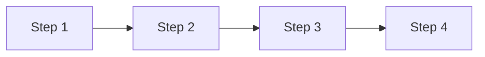
```mermaid
flowchart LR
    A[Step 1] --> B[Step 2]
    B --> C[Step 3]
    C --> D[Step 4]
```

Use when step N+1 depends on output of step N.

Examples:
- Fetch incident → identify service → query service logs → propose fix.
- Read customer → check entitlement → perform action.

## 6.2 Parallel

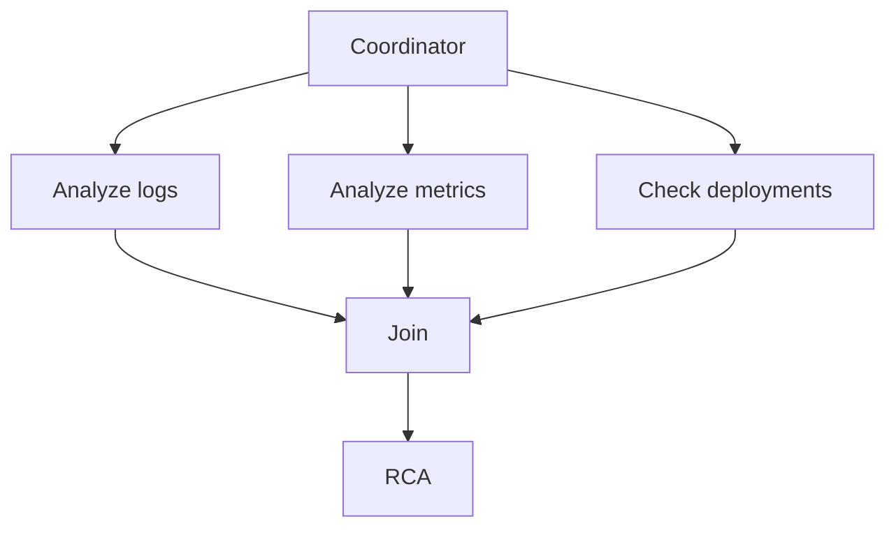
```mermaid
flowchart TD
    C[Coordinator] --> A[Analyze logs]
    C --> B[Analyze metrics]
    C --> D[Check deployments]
    A --> J[Join]
    B --> J
    D --> J
    J --> R[RCA]
```

Use when work items are independent.

### Exam keyword
“Independent checks”, “reduce latency”, “can run simultaneously” → **parallelization**.

### Trap
Do not parallelize dependent operations.

---

# 7. Fan-out / Fan-in

A common multi-agent pattern.

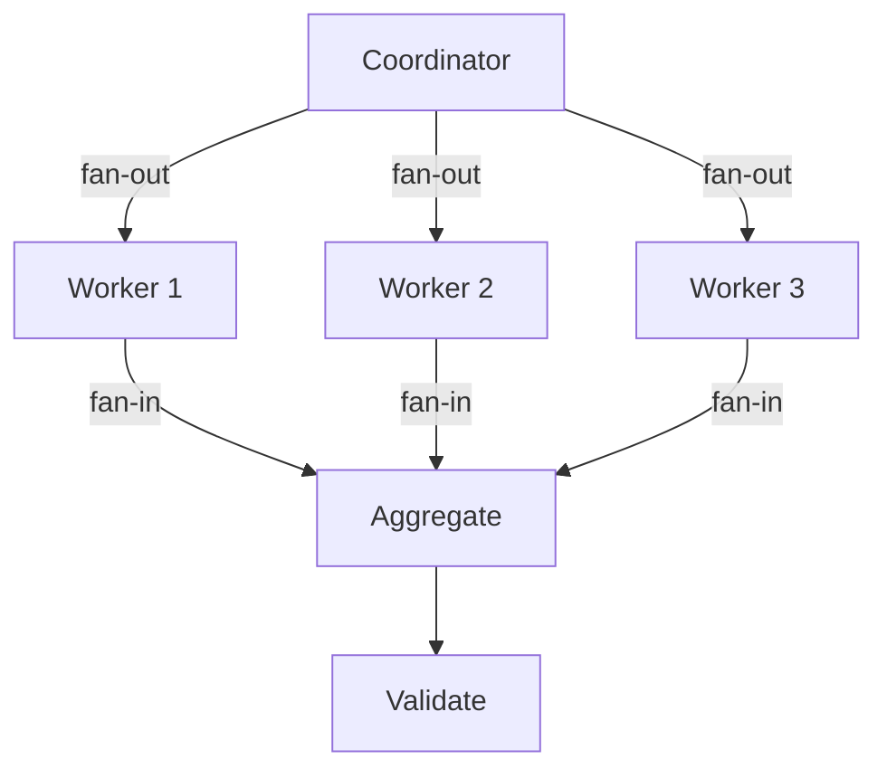
```mermaid
flowchart TD
    C[Coordinator] -->|fan-out| A1[Worker 1]
    C -->|fan-out| A2[Worker 2]
    C -->|fan-out| A3[Worker 3]
    A1 -->|fan-in| J[Aggregate]
    A2 -->|fan-in| J
    A3 -->|fan-in| J
    J --> V[Validate]
```

Good for:
- research across independent sources
- log shards
- services in a distributed incident
- code review by specialties

Need:
- aggregation logic
- deduplication
- conflict handling
- timeout policy
- partial-result policy

---

# 8. Handoffs

A handoff transfers responsibility from one agent/stage to another.

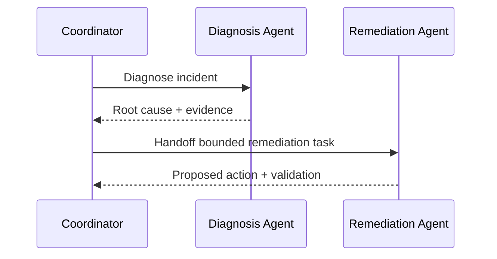
```mermaid
sequenceDiagram
    participant C as Coordinator
    participant A as Diagnosis Agent
    participant B as Remediation Agent

    C->>A: Diagnose incident
    A-->>C: Root cause + evidence
    C->>B: Handoff bounded remediation task
    B-->>C: Proposed action + validation
```

A good handoff carries:

- objective
- relevant context
- constraints
- evidence
- expected output format
- permissions/limits
- completion criteria

### Bad handoff
“Fix it.”

### Good handoff
“Investigate API 5xx increase from 10:20–10:40 UTC. Use read-only logs/metrics. Return root-cause hypothesis, evidence, confidence, and next recommended action. Do not deploy.”

---

# 9. Tools, Tasks, and Delegation

Terminology can differ between Claude API, Claude Code, and Agent SDK versions.

Architecturally, separate these concepts:

## Tool
A capability for performing or retrieving something.

Examples:
- read file
- query database
- call REST API
- run tests
- search
- create ticket

## Task / delegated work
A bounded unit of work tracked or assigned to an agent/subagent.

## Agent
A reasoning loop that may use tools to complete a goal.

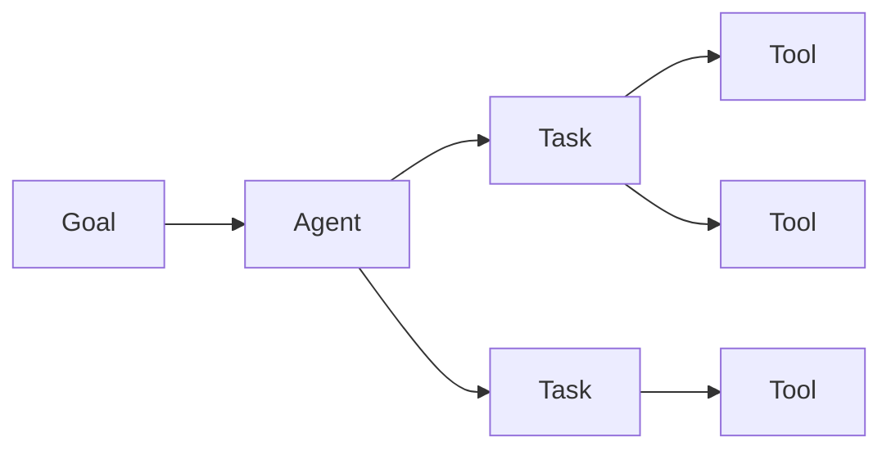
```mermaid
flowchart LR
    Goal --> Agent
    Agent --> Task1[Task]
    Agent --> Task2[Task]
    Task1 --> Tool1[Tool]
    Task1 --> Tool2[Tool]
    Task2 --> Tool3[Tool]
```

### Exam trap
A **tool** is not the same as a **subagent**:
- tool = capability/action interface
- subagent = separate delegated reasoning context

---

# 10. Hooks

Hooks run at lifecycle points and are useful for deterministic controls or integrations.

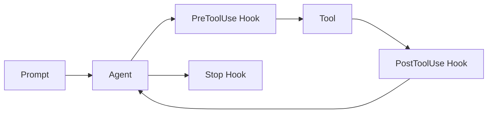
```mermaid
flowchart LR
    P[Prompt] --> A[Agent]
    A --> PRE[PreToolUse Hook]
    PRE --> T[Tool]
    T --> POST[PostToolUse Hook]
    POST --> A
    A --> STOP[Stop Hook]
```

Common uses:

### PreToolUse
- deny destructive command
- validate path
- check policy
- require approval
- sanitize inputs

### PostToolUse
- audit result
- run linter
- record telemetry
- detect failure pattern

### SessionStart
- load dynamic context
- initialize runtime data

### Stop
- verify completion
- persist state
- notify external system

## Prompt instructions vs hooks

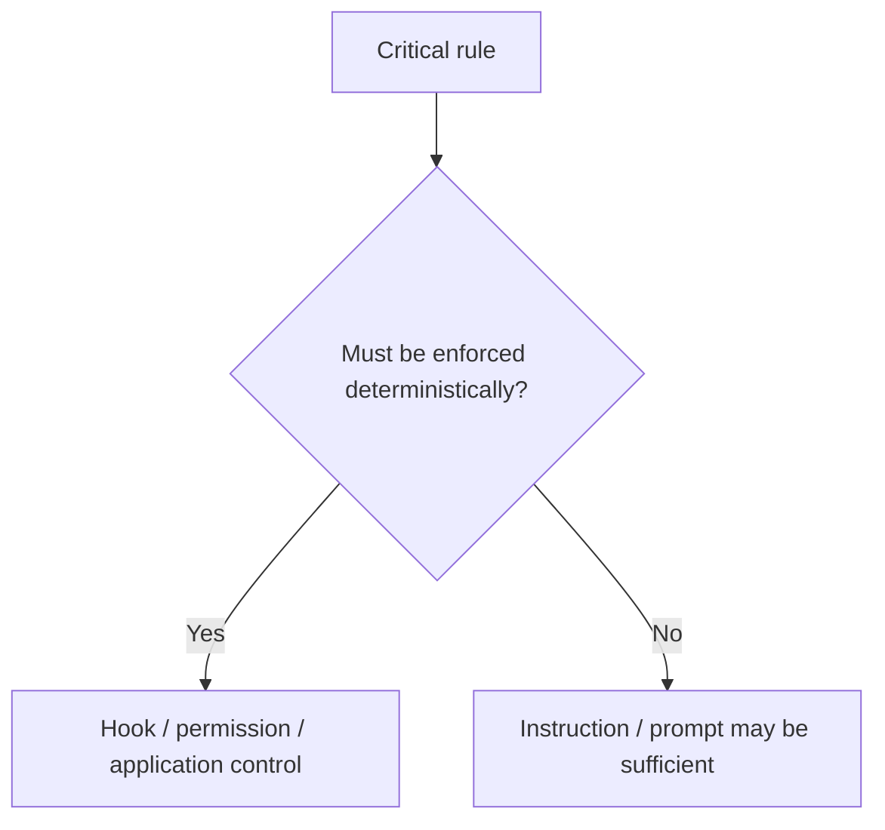
```mermaid
flowchart TD
    R[Critical rule] --> Q{Must be enforced deterministically?}
    Q -- Yes --> H[Hook / permission / application control]
    Q -- No --> I[Instruction / prompt may be sufficient]
```

**Exam principle:**  
For security-critical enforcement, do not rely only on “please do not do X” in a prompt.

---

# 11. Human-in-the-Loop

Agents should escalate when autonomy should stop.

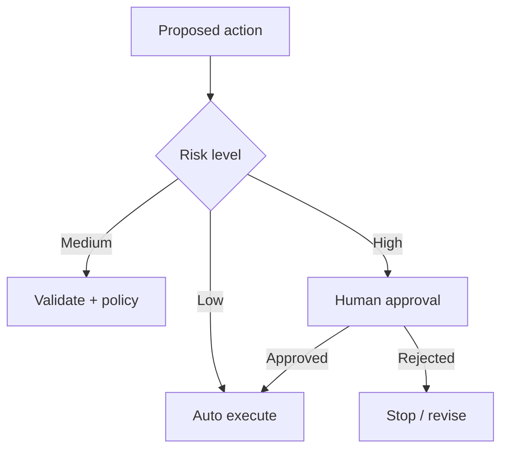
```mermaid
flowchart TD
    A[Proposed action] --> R{Risk level}
    R -- Low --> E[Auto execute]
    R -- Medium --> V[Validate + policy]
    R -- High --> H[Human approval]
    H -->|Approved| E
    H -->|Rejected| S[Stop / revise]
```

Typical approval candidates:
- production database write
- financial transaction
- deleting resources
- production deployment
- privilege change
- sending legally sensitive communication

### Exam clue
“Irreversible”, “high impact”, “regulated”, “production write” → consider **human approval**.

---

# 12. Session State

State allows the system to continue coherently across steps or sessions.

State may include:
- conversation history
- task progress
- tool outputs
- IDs/references
- checkpoints
- authorization context
- completed vs pending work
- resumable session identifier

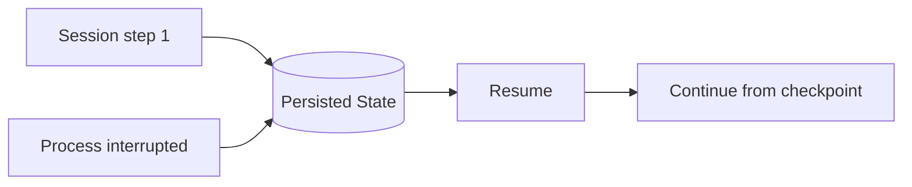
```mermaid
flowchart LR
    S1[Session step 1] --> ST[(Persisted State)]
    S2[Process interrupted] --> ST
    ST --> R[Resume]
    R --> S3[Continue from checkpoint]
```

## What should be durable?

Durable if needed to safely resume:
- task status
- idempotency key
- external operation IDs
- approvals
- committed actions
- retry counts
- checkpoint version

Do **not** depend only on the model “remembering.”

---

# 13. Resumption

Resumption means continuing prior work without starting from zero.

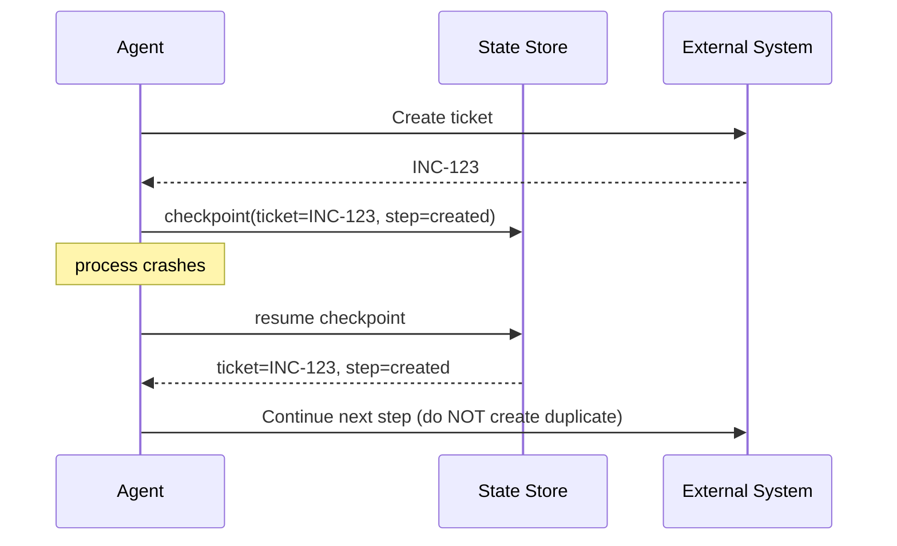
```mermaid
sequenceDiagram
    participant A as Agent
    participant S as State Store
    participant X as External System

    A->>X: Create ticket
    X-->>A: INC-123
    A->>S: checkpoint(ticket=INC-123, step=created)
    Note over A: process crashes
    A->>S: resume checkpoint
    S-->>A: ticket=INC-123, step=created
    A->>X: Continue next step (do NOT create duplicate)
```

## Production principle: idempotency

If a retry could repeat a side effect, use:
- idempotency keys
- “already completed?” checks
- durable step status
- unique external correlation IDs

### Exam trap
After a crash, blindly rerunning the entire workflow can duplicate side effects.

---

# 14. Context Management in Orchestration

Large systems must control what each agent sees.

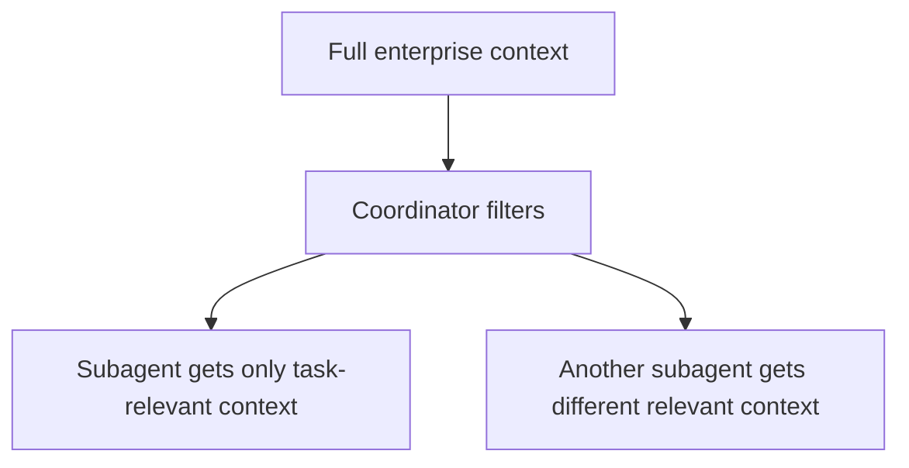
```mermaid
flowchart TD
    F[Full enterprise context] --> C[Coordinator filters]
    C --> A[Subagent gets only task-relevant context]
    C --> B[Another subagent gets different relevant context]
```

Benefits:
- less token usage
- less distraction
- better confidentiality
- specialization
- fewer irrelevant tool choices

## Principle
Give an agent the **minimum sufficient context and permissions** needed for its task.

---

# 15. Permission Boundaries

Use least privilege.

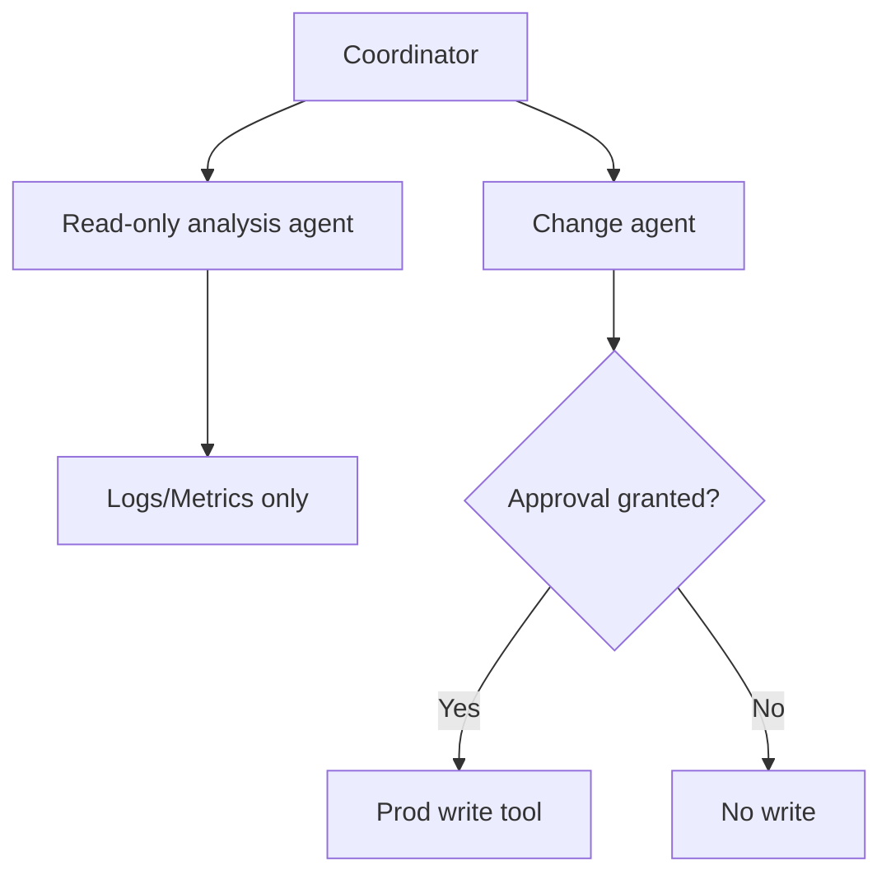
```mermaid
flowchart TD
    C[Coordinator] --> R[Read-only analysis agent]
    C --> W[Change agent]
    R --> L[Logs/Metrics only]
    W --> A{Approval granted?}
    A -- Yes --> P[Prod write tool]
    A -- No --> X[No write]
```

Do not give every subagent:
- shell access
- production write
- credentials
- every MCP server
- every database

---

# 16. Failure Handling

A production agent should expect failures.

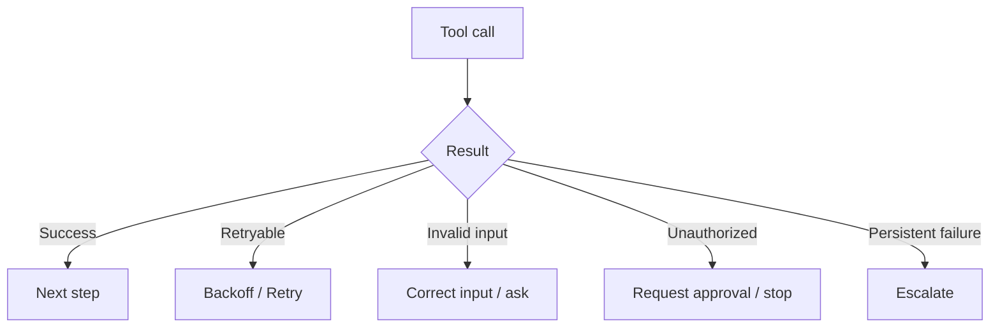
```mermaid
flowchart TD
    T[Tool call] --> R{Result}
    R -- Success --> N[Next step]
    R -- Retryable --> B[Backoff / Retry]
    R -- Invalid input --> C[Correct input / ask]
    R -- Unauthorized --> H[Request approval / stop]
    R -- Persistent failure --> E[Escalate]
```

Design for:
- timeouts
- transient network errors
- malformed results
- partial success
- rate limits
- duplicate calls
- tool unavailable
- conflicting subagent outputs

---

# 17. Validation Before Action

Reasoning is not validation.

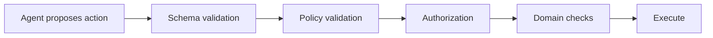
```mermaid
flowchart LR
    A[Agent proposes action] --> V1[Schema validation]
    V1 --> V2[Policy validation]
    V2 --> V3[Authorization]
    V3 --> V4[Domain checks]
    V4 --> E[Execute]
```

Example:
Agent proposes:
`transfer_money(amount=1000000, account=X)`

Application should verify:
- numeric range
- authorized account
- user identity/permission
- transaction policy
- required approvals

---

# 18. Workflow Patterns You Must Recognize

## A. Router pattern

```mermaid
flowchart TD
    U[Request] --> R{Classify}
    R --> A[Billing agent]
    R --> B[Technical agent]
    R --> C[Account agent]
```

Use when request types are distinct.

---

## B. Planner-executor pattern

```mermaid
flowchart LR
    G[Goal] --> P[Planner]
    P --> E[Executor]
    E --> V[Verifier]
    V -->|Needs changes| P
    V -->|Done| F[Final]
```

Use when complex work benefits from explicit planning and verification.

---

## C. Evaluator / verifier loop

```mermaid
flowchart LR
    W[Worker output] --> V{Verifier}
    V -- Pass --> F[Finish]
    V -- Fail --> W
```

Use when objective quality criteria exist.

Risk: infinite iteration → add iteration/time/cost limit.

---

## D. Map-reduce style

```mermaid
flowchart TD
    D[Large workload] --> M1[Analyze chunk 1]
    D --> M2[Analyze chunk 2]
    D --> M3[Analyze chunk 3]
    M1 --> R[Reduce / Synthesize]
    M2 --> R
    M3 --> R
```

Use for independent chunks.

---

# 19. Production Observability for Agents

Capture structured telemetry for:

- session/run ID
- agent/subagent ID
- task ID
- tool name
- latency
- success/failure
- token/cost metrics where available
- retries
- approval decisions
- stop reason
- final outcome

```mermaid
flowchart LR
    A[Agent] --> T[Tools]
    A --> O[(Trace / Logs / Metrics)]
    T --> O
    H[Hooks] --> O
    S[State] --> O
```

Why?
Because “final answer was wrong” is insufficient. You need to know **which decision/tool/result caused the failure**.

---

# 20. Security Architecture

```mermaid
flowchart TD
    U[Untrusted User/Input] --> A[Agent]
    A --> G[Guardrail / Validation]
    G --> P[Permission Check]
    P --> T[Tool]
    T --> V[Validate Tool Output]
    V --> A
```

Remember:
- user input is untrusted
- retrieved content can be untrusted
- tool output can be malformed
- LLM output is not authorization
- sensitive actions need deterministic controls

---

# 21. End-to-End Production Example — AI SRE Incident Agent

```mermaid
flowchart TD
    I[Alert: checkout 5xx high] --> C[Incident Coordinator]
    C --> L[Log Analysis Agent]
    C --> M[Metrics Agent]
    C --> D[Deployment History Agent]
    L --> J[Evidence Join]
    M --> J
    D --> J
    J --> R[RCA Candidate]
    R --> V{Confidence / policy}
    V -- Low --> H[Escalate to engineer]
    V -- High, read-only next step --> Q[Run diagnostic]
    Q --> P{Remediation write needed?}
    P -- Yes --> A[Human approval]
    A -->|Approved| X[Remediation tool]
    X --> Z[Verify health]
    P -- No --> Z
    Z --> S[(Persist incident state)]
    S --> F[Close / report]
```

## Why this architecture is strong
- independent evidence collection can run in parallel
- coordinator owns overall goal
- remediation is separated from diagnosis
- high-risk write requires approval
- state persists for restart/recovery
- verification happens after remediation

---

# 22. High-Value Exam Distinctions

| Scenario | Best concept |
|---|---|
| Repeated tool calls until goal complete | Agentic loop |
| Independent investigations | Parallel subagents |
| Step B needs output from step A | Sequential workflow |
| Many workers return to one aggregator | Fan-out/fan-in |
| Specialist context should not pollute main thread | Subagent |
| Must deterministically block dangerous command | PreToolUse / policy enforcement |
| Need to continue after interruption | Persisted state + resume |
| Retry could duplicate a side effect | Idempotency |
| Production write is high impact | Human approval / authorization |
| Different request categories | Router |
| Need independent quality check | Verifier/evaluator |
| Huge toolset causing confusion | Narrow tool access / specialized agent |

---

# 23. Common Exam Traps

## Trap 1 — “More agents = better”
False. Use multiple agents only when decomposition/isolation/parallelism justifies overhead.

## Trap 2 — “Prompt is sufficient for security”
False for hard guarantees. Enforce critical rules in hooks/application/policy/permissions.

## Trap 3 — “Tool call means action happened”
Not necessarily. For client tools, it is a request until the application executes it.

## Trap 4 — “Retry everything from the start”
Dangerous if side effects already happened. Resume from durable state and use idempotency.

## Trap 5 — “Parallelize every step”
Wrong when dependencies exist.

## Trap 6 — “Coordinator should receive every raw token from every worker”
Not always. Prefer bounded summaries/evidence to protect context.

## Trap 7 — “Agent should decide its own authorization”
Authorization belongs in trusted deterministic controls.

---

# 24. Fast Decision Tree

```mermaid
flowchart TD
    Q1{Task needs external data/action?}
    Q1 -- No --> A1[Direct model response]
    Q1 -- Yes --> Q2{One coherent task?}
    Q2 -- Yes --> A2[Single tool-using agent]
    Q2 -- No --> Q3{Subtasks independent?}
    Q3 -- Yes --> A3[Parallel subagents + aggregation]
    Q3 -- No --> A4[Sequential orchestration]
    A2 --> Q4{High-risk action?}
    A3 --> Q4
    A4 --> Q4
    Q4 -- Yes --> A5[Human/policy approval]
    Q4 -- No --> Q5{Long-running / resumable?}
    A5 --> Q5
    Q5 -- Yes --> A6[Persist checkpoints + idempotency]
    Q5 -- No --> A7[Normal completion]
```

---

# 25. Final Domain Formula

Memorize:

> **Goal → Plan → Delegate/Tool → Validate → Authorize → Execute → Observe → Persist → Verify → Continue/Stop**

If you can apply that formula to scenarios, you are answering the architecture question rather than memorizing product names.
