# Domain 1 — Production Scenarios & Answers

# Scenario 1 — SRE Incident RCA and Remediation

## Requirement

A checkout service suddenly produces 15% HTTP 500 errors. The system must:
- inspect logs
- inspect metrics
- inspect recent deploys
- identify likely root cause
- propose remediation
- never make a production change without approval

## Recommended architecture

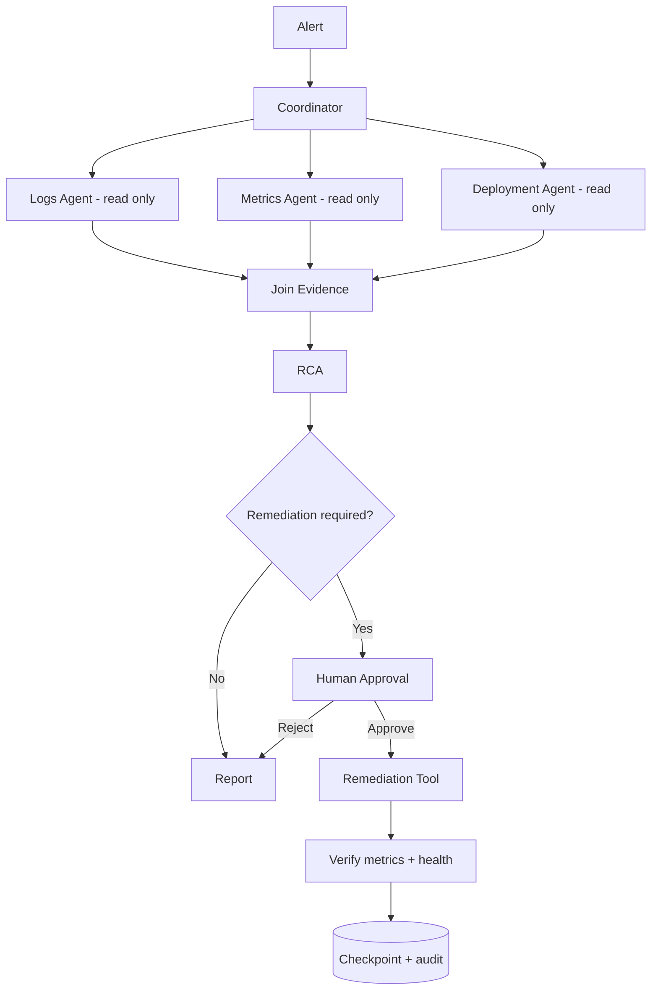

## Why
- investigation is independent → parallel
- least privilege for diagnostic agents
- coordinator combines evidence
- production write is an approval boundary
- verification follows change
- state/audit supports recovery

## Production interview/exam question
**Why not give the logs agent deployment access?**

**Answer:** It violates least privilege and increases blast radius. The diagnostic role should have only the tools required for diagnosis.

---

# Scenario 2 — Banking Payment Agent

## Requirement
User asks: “Pay ₹50,000 to beneficiary X.”

## Architecture

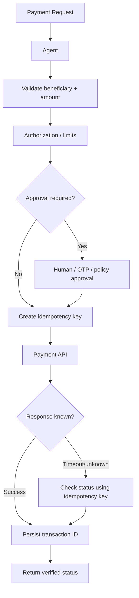

## Key exam points
- authorization outside LLM
- idempotency
- status reconciliation after timeout
- do not repeat a financial side effect blindly

---

# Scenario 3 — Software Change Agent

## Requirement
Agent receives bug report, updates code, runs tests, creates PR.

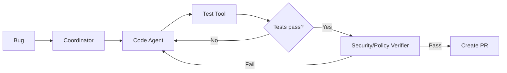

## Critical controls
- iteration limit on fix/test loop
- no direct production deployment
- hooks can automatically run formatter/linter
- PR creation is lower risk than production merge/deploy

---

# Scenario 4 — Customer Support Multi-Agent

## Requirement
Support requests can be billing, account-access, or technical.

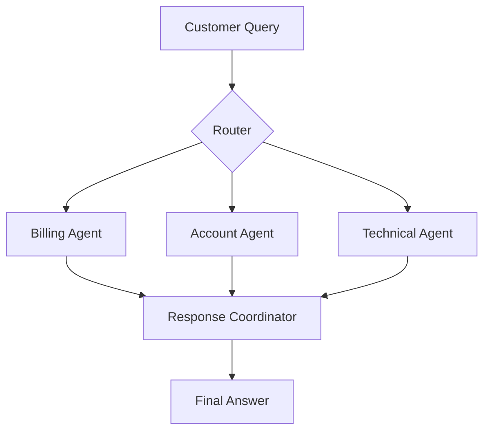

## When this is useful
Different domains have:
- different tools
- different policies
- different knowledge
- different escalation paths

## When not useful
If all requests are simple and share the same tools/context, a single agent can be simpler.

---

# Scenario 5 — Resume a Long Workflow

## Requirement
Generate a quarterly compliance report over 500 systems. The run can last hours.

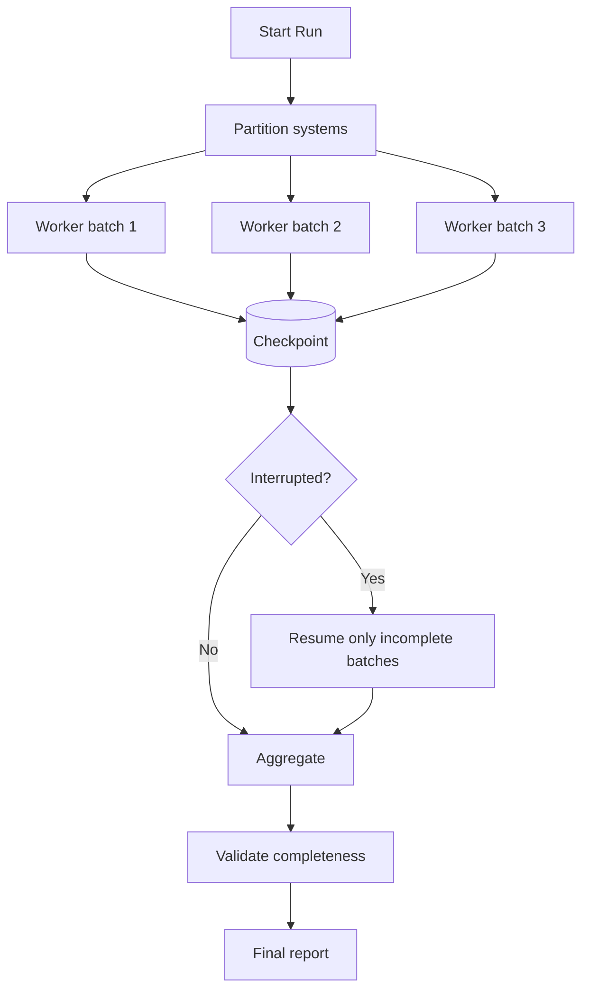

## Required state
- run ID
- batch IDs
- completed batches
- failed batches
- retry count
- evidence locations
- report version

---

# Scenario 6 — Secure Database Assistant

## Requirement
Users can ask read questions. Only DBAs may execute writes.

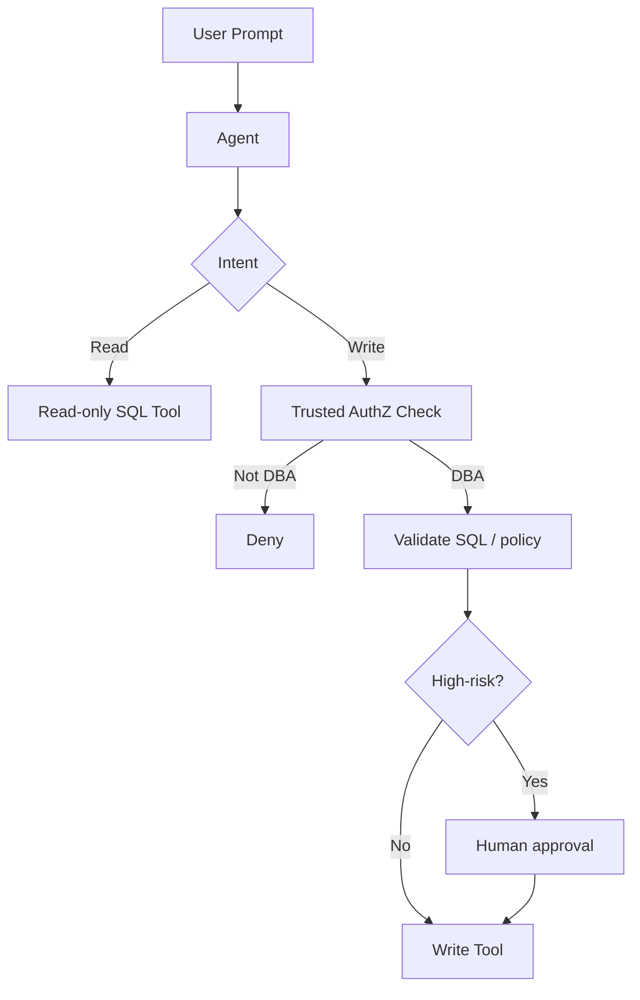

## Exam answer
Never let the model decide “this user looks like a DBA.”  
Use authenticated identity and application authorization.

---

# Scenario 7 — Research Agent with Conflicting Sources

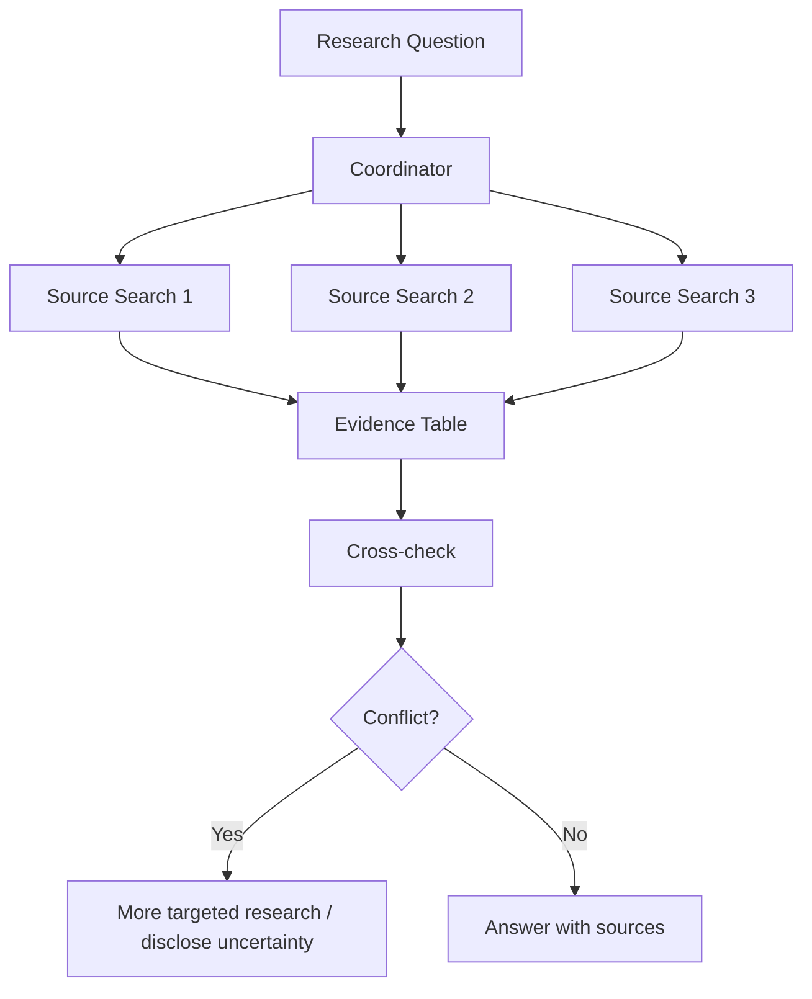

## Production principle
The aggregator should not silently collapse disagreement. Preserve provenance and confidence.

---

# Scenario 8 — Hooks for Enterprise Policy

## Requirement
- block reads of `.env`
- log every shell command
- run unit tests after source-code edits

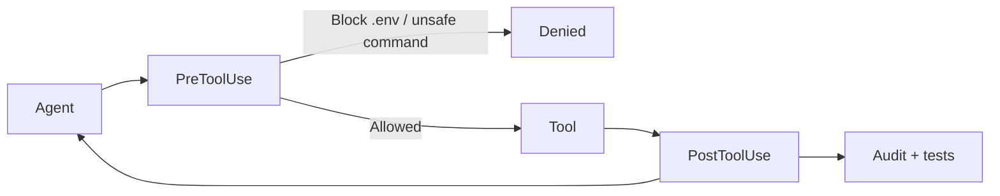

## Why hooks
These requirements must fire consistently at defined lifecycle points.

---

# Scenario 9 — Agent Handoff to Human

## Requirement
An agent can prepare a legal contract summary but must not approve legal terms.

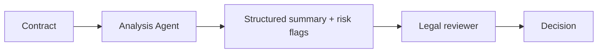

## Good handoff package
- document ID/version
- extracted obligations
- risk clauses
- unanswered questions
- evidence citations
- no unauthorized conclusion

---

# Scenario 10 — Avoiding Agent Explosion

A user asks:
“Read this JSON and tell me which field is missing.”

Bad design:
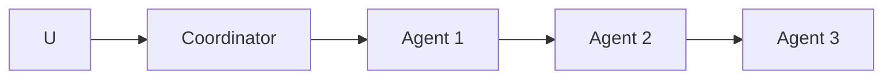

Better:
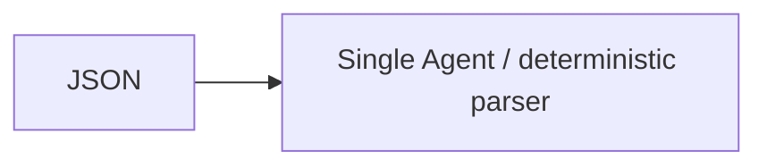

## Lesson
Architecture should match problem complexity. Orchestration is not a goal by itself.

---

# Production Design Checklist

Before shipping an agent, answer:

1. What is the goal and explicit completion condition?
2. Which steps are deterministic vs reasoning-based?
3. Which tools have side effects?
4. Where are authorization decisions made?
5. Which operations require human approval?
6. What state must survive restart?
7. How are duplicates prevented?
8. What is the maximum loop depth/turn count?
9. What happens when a tool fails?
10. How do parallel branches join?
11. How are conflicting outputs resolved?
12. What is logged/traced?
13. Which subagent gets which tools?
14. How do you validate tool inputs and outputs?
15. What is the fallback/escalation path?
