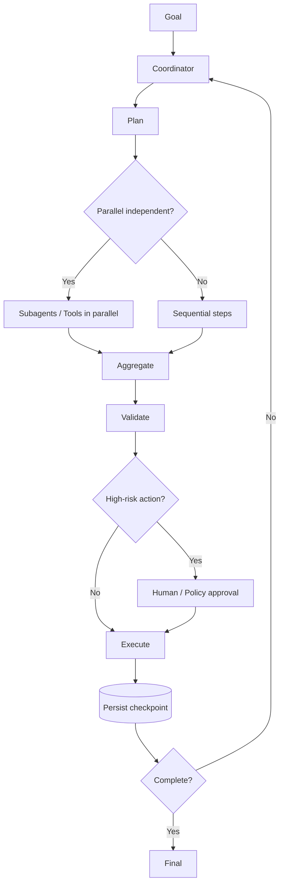

# Domain 1 — Quick Revision Cheat Sheet

# 1. One-line definitions

- **Agentic loop:** Model reasons → requests tool/action → receives result → continues until stop/completion.
- **Orchestrator/coordinator:** Owns overall goal, decomposition, delegation, aggregation, and completion.
- **Subagent:** Delegated reasoning worker with separate/bounded context and potentially restricted tools.
- **Tool:** External capability/action interface.
- **Handoff:** Transfer of bounded responsibility plus relevant context/constraints.
- **Hook:** Lifecycle-triggered deterministic callback/control.
- **Session state:** Information required to continue coherently.
- **Resumption:** Continue prior work using preserved state instead of starting over.
- **Idempotency:** Safe repeated request does not create duplicate side effect.
- **Fan-out/fan-in:** Parallel delegation followed by aggregation.
- **Verifier:** Independent check of worker output against criteria.
- **Human-in-the-loop:** Human approval/decision at risk or uncertainty boundary.

---

# 2. Master diagram

---

# 3. Exam keyword → answer

| Keyword in scenario | Think |
|---|---|
| “continue after tool result” | Agentic loop |
| “independent subtasks” | Parallel |
| “depends on previous output” | Sequential |
| “specialized worker” | Subagent |
| “combine several worker results” | Coordinator / fan-in |
| “must always block” | Hook / deterministic policy |
| “restart after failure” | Persisted state + resumption |
| “duplicate write/payment” | Idempotency |
| “dangerous/irreversible” | Approval |
| “different request categories” | Router |
| “quality check” | Verifier |
| “too much context” | Scope context / subagent summary |
| “minimum access” | Least privilege |
| “conflicting results” | Coordinator + evidence/policy |
| “tool timeout” | Retry policy / reconcile state |

---

# 4. The 10 most important rules

1. A model tool request is **not** automatically a completed side effect.
2. Authorization must be enforced in trusted code/policy, not inferred from model output.
3. Use multi-agent only when specialization, context isolation, or parallelism provides value.
4. Parallelize independent work; serialize dependencies.
5. Give each agent the minimum tools/context it needs.
6. Persist durable checkpoints for long-running or side-effecting workflows.
7. Make retries safe with idempotency and external operation IDs.
8. Add loop/time/cost limits.
9. Verify important outputs and post-action health.
10. Escalate to a human when policy, risk, or uncertainty requires it.

---

# 5. 30-second answer framework

For any architecture scenario, say:

> **I would use [single agent/coordinator + subagents] because [dependency/parallelism/specialization]. The agent uses [tools] through a controlled loop. Before side effects, the application performs validation and authorization. High-risk actions require approval. I persist checkpoints and idempotency IDs for recovery, and I verify the result before marking the workflow complete.**

---

# 6. Common wrong answers

- “Use more agents because agents are powerful.”
- “Let Claude enforce security using the system prompt.”
- “Retry the full workflow after every crash.”
- “Give every agent all tools.”
- “Assume a successful-looking LLM message means the API succeeded.”
- “Parallelize dependent steps.”
- “Use model confidence as authorization.”

---

# 7. Final memory line

**G-P-D-V-A-E-O-S**

- **G**oal
- **P**lan
- **D**elegate / choose tool
- **V**alidate
- **A**uthorize
- **E**xecute
- **O**bserve / verify
- **S**ave state / stop or continue
