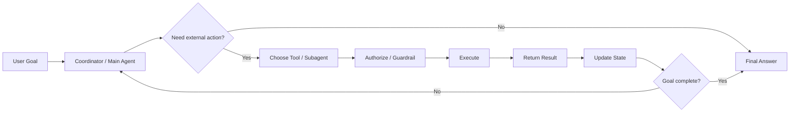

# Domain 1 — Agentic Architecture & Orchestration

> Study pack for GitHub / Git Wiki  
> Focus: **agentic loops, multi-agent orchestration, coordinator/subagent patterns, tools/tasks/hooks/handoffs, session state & resumption, workflow design**

## How to use this pack

1. Read `01-domain1-agentic-architecture-orchestration.md` end-to-end.
2. Practice `02-exam-scenario-question-bank.md` without looking at the answers first.
3. Work through `03-production-scenarios.md` and explain *why* each architecture is chosen.
4. Use `04-quick-revision-cheatsheet.md` during the final 1–2 days.
5. In exam questions, identify the **decision keyword** before choosing an answer.

## Files

- [01 — Full Domain Guide](./01-domain1-agentic-architecture-orchestration.md)
- [02 — Exam Scenario Question Bank](./02-exam-scenario-question-bank.md)
- [03 — Production Scenarios](./03-production-scenarios.md)
- [04 — Quick Revision Cheat Sheet](./04-quick-revision-cheatsheet.md)
- [05 — Official Sources](./05-official-sources.md)

## Domain map

## Exam mindset

When a scenario appears, ask:

**Goal → Decomposition → Tool/Agent Selection → Permission → Execution → Result → Validation → State → Continue/Stop**

That sequence is the backbone of this domain.

> **Important:** This guide is a study aid based on the supplied Domain 1 slide plus current public Anthropic documentation. Certification blueprints and product behavior can change; always compare against the official exam guide available to you.
