# Domain 2 — Tool Design & MCP Integration

# 1. What this domain tests

The supplied slide covers:

- Tool schemas and descriptions
- MCP tools and MCP resources
- Structured tool errors
- Retryable vs non-retryable failures
- Tool distribution across agents
- Built-in tools such as Read, Write, Edit, Bash, Grep, Glob

The domain is really asking:

> **Can you design external capabilities so Claude can understand when to use them, call them safely, interpret results, and recover from failures?**

---

# 2. Tool Design — The Foundation

A production-quality tool should have:

1. Clear name
2. Precise description
3. Precise input schema
4. Predictable output
5. Explicit errors
6. Appropriate permissions
7. Safe side-effect behavior

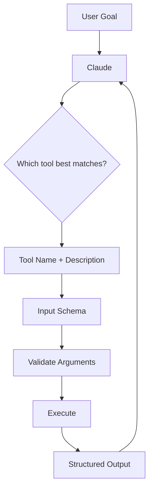

## Exam rule

If multiple tools overlap heavily, Claude may select the wrong one.

Weak names:
- `doThing`
- `process`
- `manage`

Better names:
- `get_customer_profile`
- `list_open_orders`
- `cancel_order`
- `search_internal_docs`

The name and description should make the tool's **purpose, trigger, and limitations** obvious.

---

# 3. Tool Descriptions

A strong description answers:

- What does the tool do?
- When should it be used?
- What important limitations exist?
- Is it read-only or side-effecting?
- Which identifiers are required?

Weak:

```text
Gets data.
```

Better:

```text
Retrieves current details for one order ID.
Use when the user asks about order status, amount, items, or shipping state.
This tool is read-only.
```

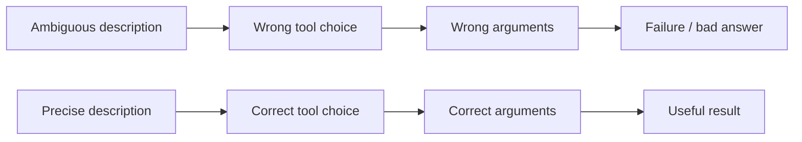

### Exam keyword

“Claude selects the wrong tool even though the API works.”

Think:
- ambiguous tool name
- overlapping capabilities
- weak description
- unclear schema

---

# 4. Tool Input Schemas

A schema defines the valid shape of tool arguments.

```json
{
  "type": "object",
  "properties": {
    "order_id": {
      "type": "string",
      "description": "Unique order identifier"
    }
  },
  "required": ["order_id"],
  "additionalProperties": false
}
```

Why precise schemas matter:
- fewer malformed arguments
- fewer missing fields
- fewer type errors
- less ambiguity
- easier validation

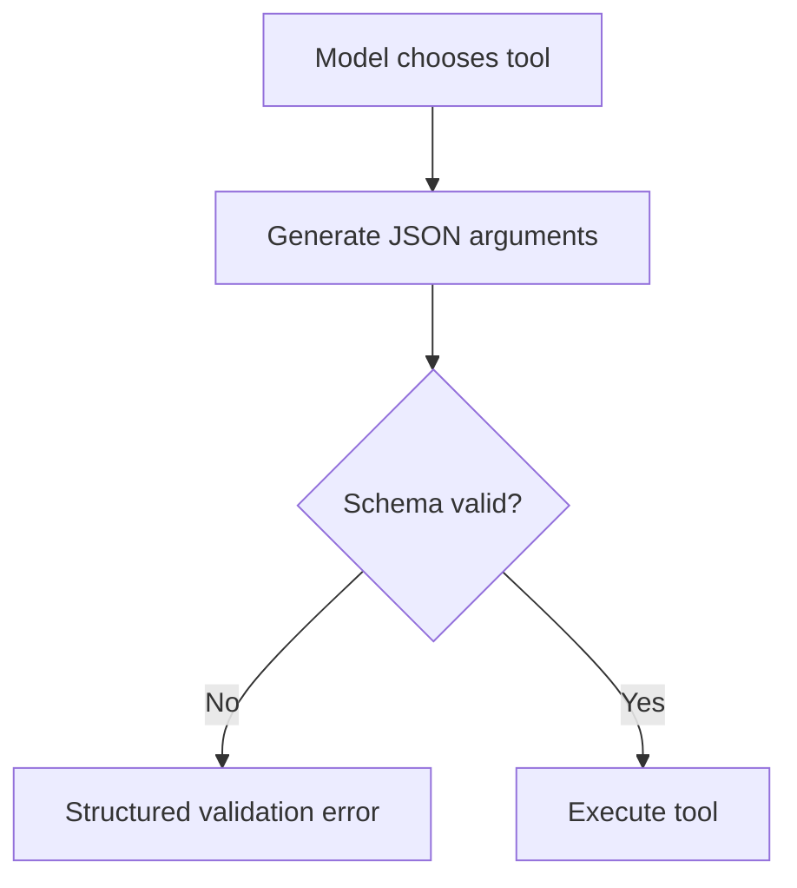

---

# 5. Required vs Optional Fields

Only mark a field optional if the operation can truly work without it.

If `account_id` is mandatory in the backend, make it mandatory in the schema.

### Exam scenario

A tool repeatedly fails because Claude omits `account_id`.

Best fix:
- mark `account_id` required
- explain its format
- validate before execution

Not:
- keep the schema vague and rely on prompt wording alone

---

# 6. Enums and Constraints

If the backend accepts only known values, represent that restriction.

```json
{
  "status": {
    "type": "string",
    "enum": ["OPEN", "CLOSED", "PENDING"]
  }
}
```

This is better than a free-form string when only a fixed vocabulary is valid.

---

# 7. Schema Validation vs Domain Validation

Schema validation is not enough.

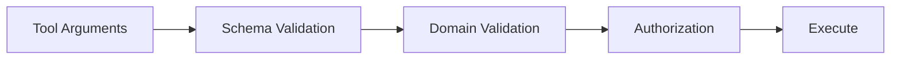

Example: schema says `amount` is a number.

Business checks can still require:
- amount > 0
- amount <= allowed limit
- valid beneficiary
- authorized user
- permitted account

### Exam trap

**Valid JSON ≠ valid business action.**

---

# 8. Tool Output Design

Weak:

```text
Done.
```

Better:

```json
{
  "success": true,
  "order_id": "ORD-123",
  "status": "CANCELLED",
  "cancellation_reference": "CAN-9001"
}
```

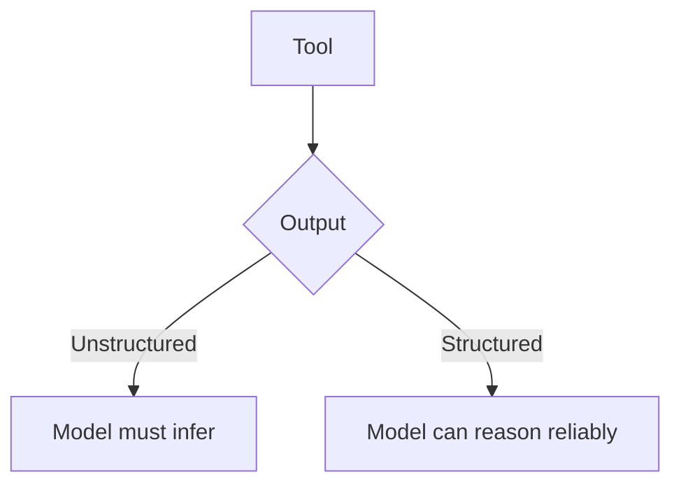

Good outputs make important state explicit.

---

# 9. Structured Tool Errors

Good errors tell Claude what happened and what can be done next.

```json
{
  "success": false,
  "error": {
    "code": "INVALID_ORDER_ID",
    "message": "order_id must start with ORD-",
    "retryable": false
  }
}
```

Retryable example:

```json
{
  "success": false,
  "error": {
    "code": "RATE_LIMITED",
    "message": "Try again after 10 seconds",
    "retryable": true,
    "retry_after_seconds": 10
  }
}
```

---

# 10. Retryable vs Non-Retryable Failures

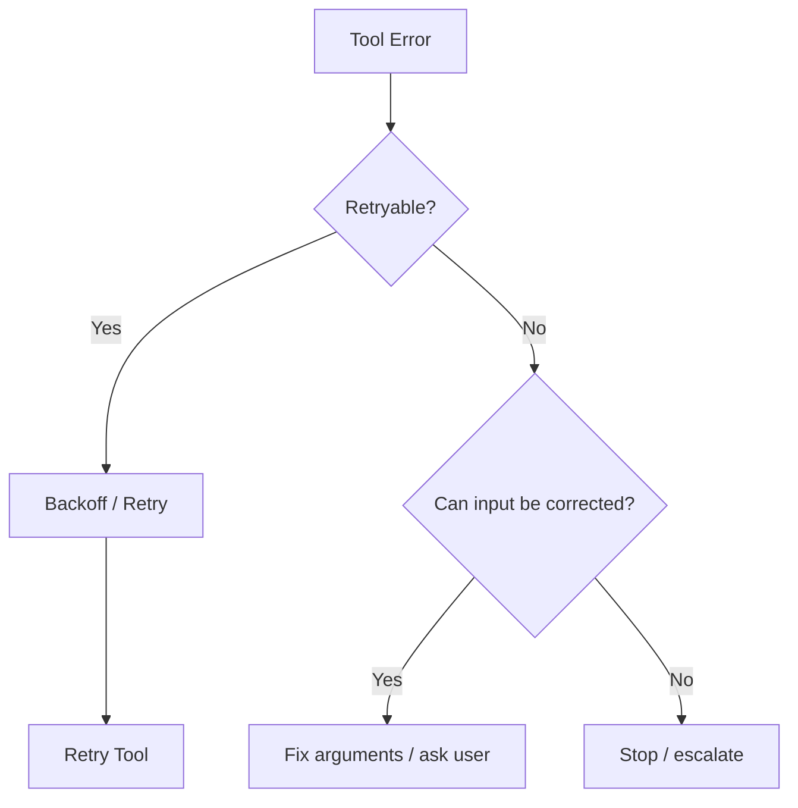

## Common retryable failures

- temporary network issue
- transient service unavailable
- rate limiting
- temporary read timeout

## Common non-retryable failures

- invalid ID format
- permission denied
- business-rule violation
- unsupported operation
- permanently missing resource
- invalid schema/input

### Important complication: side effects

A timeout after a write does **not** prove that the write failed.

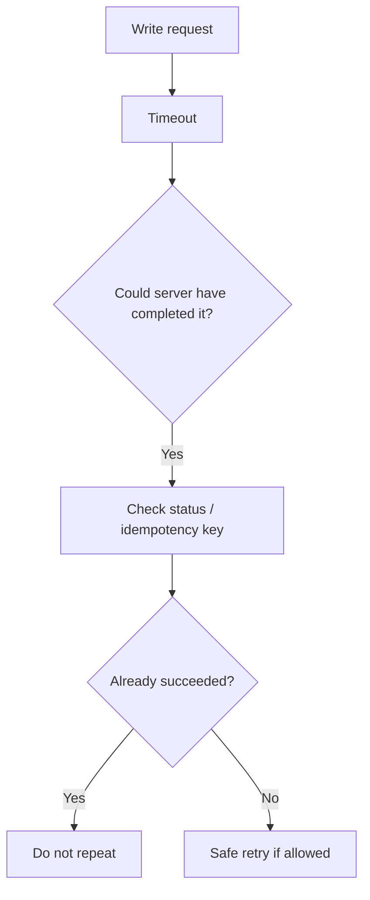

---

# 11. Tool-Level vs Protocol/Infrastructure Errors

Conceptually distinguish:

## Tool/domain error

The operation was understood, but the requested business action cannot complete.

Examples:
- invalid email
- order already cancelled
- invalid state transition

The model may be able to correct the input.

## Protocol/infrastructure error

The request could not be processed normally.

Examples:
- malformed protocol message
- transport failure
- unexpected server exception
- unavailable service

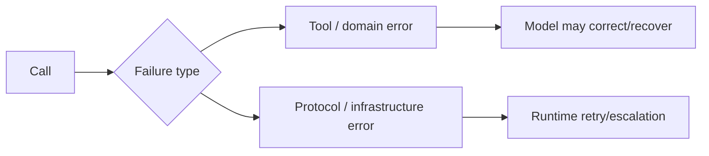

---

# 12. MCP — Core Mental Model

Model Context Protocol is a standard integration layer that allows AI applications to connect to external capabilities.

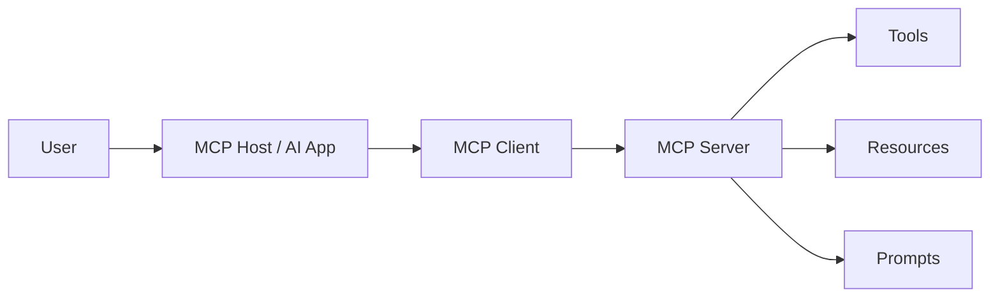

MCP is **not the LLM**. It standardizes the connection between the AI application and external systems/capabilities.

---

# 13. MCP Roles

## Host
The AI application environment.

## Client
Communicates with the MCP server on behalf of the host.

## Server
Exposes capabilities such as tools, resources, and prompts.

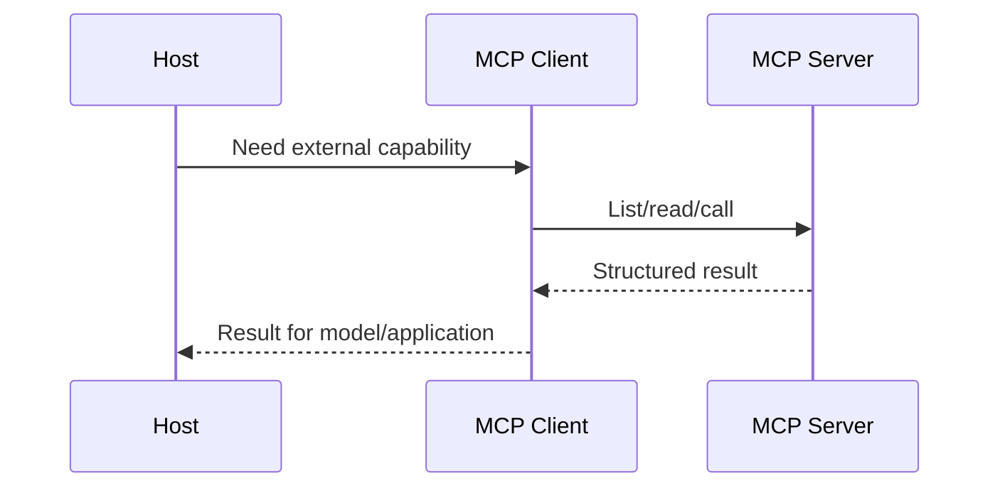

---

# 14. MCP Tools

Tools are callable operations.

Examples:
- `search_incidents`
- `create_jira_ticket`
- `query_customer`
- `restart_service`

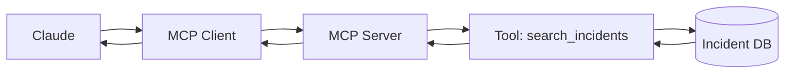

---

# 15. MCP Resources

Resources expose readable data/context, typically addressed by a resource identifier/URI.

Examples:
- documentation
- configuration
- files
- records
- application data

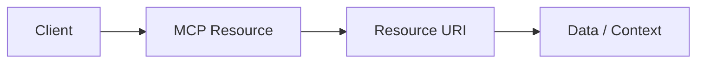

## Tool vs Resource

| Tool | Resource |
|---|---|
| Callable operation | Readable context/data |
| Has operation arguments | Typically identified by URI |
| May have side effects | Data/context oriented |
| “Do something” | “Read/get something” |

### Exam shortcut

**Action/verb → tool**  
**Context/data/URI → resource**

---

# 16. Tool vs Resource Scenarios

> Restart a Kubernetes deployment.

Answer: **Tool** — it performs an action and has side effects.

> Expose `policy://refunds/current` for reading.

Answer: **Resource** — it is readable contextual data addressed by URI.

> Search incident history.

Usually a **tool** — it is an invoked search operation.

---

# 17. MCP Tool Design

A well-designed MCP tool follows the same principles as any good agent tool:

- clear name
- useful description
- precise schema
- validation
- authorization
- structured result
- explicit error behavior

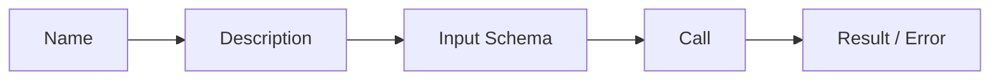

---

# 18. Tool Distribution Across Agents

Do not give every agent every tool.

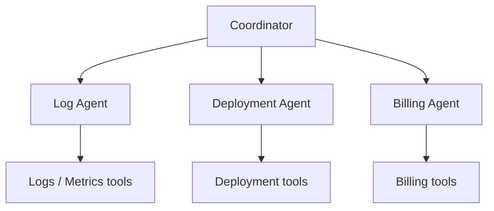

Benefits:
- least privilege
- smaller selection space
- clearer specialization
- fewer accidental calls
- reduced tool ambiguity

### Exam keyword

“Agent has too many unrelated tools and often chooses the wrong one.”

Think: **tool scoping/distribution by responsibility**.

---

# 19. Why Too Many Tools Hurt

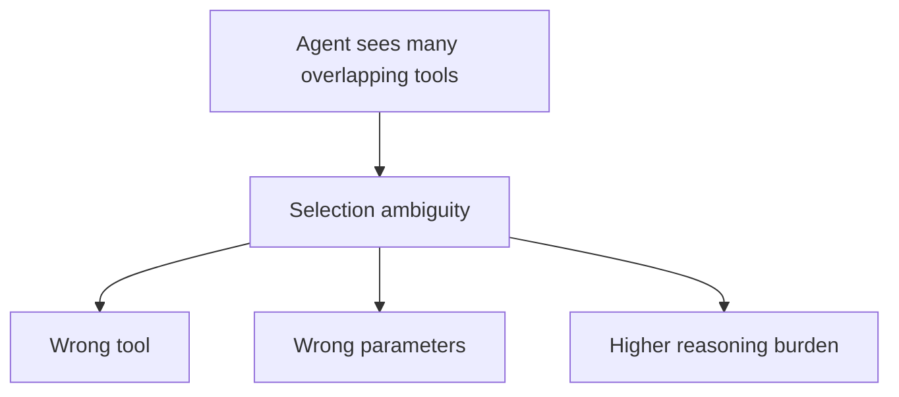

Better:
- group tools by responsibility
- attach only relevant tools
- improve naming
- use a coordinator/router when appropriate

---

# 20. Built-In Tool Mental Model

Your slide lists:

- Read
- Write
- Edit
- Bash
- Grep
- Glob

Understand the **intent** of each.

## Read
Read contents of a known file.

## Write
Create or replace file content.

## Edit
Modify existing file content.

## Bash
Run shell commands.

## Grep
Search **inside file contents** for text/patterns.

## Glob
Find **files/paths by name pattern**.

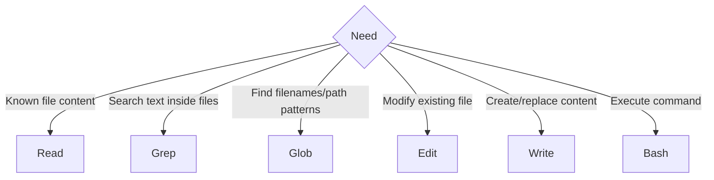

---

# 21. Grep vs Glob — High-Value Exam Point

## Grep
Search **file contents**.

Example:
> Find all occurrences of `getCustomerById`.

Use **Grep**.

## Glob
Search **file paths/names**.

Example:
> Find all `*.java` files.

Use **Glob**.

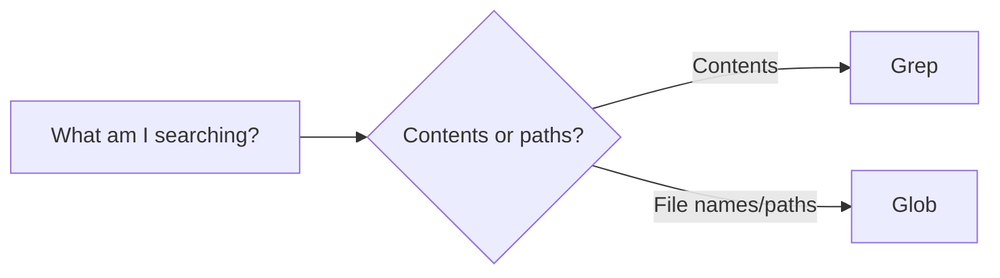

---

# 22. Read vs Grep

Known exact file path and need contents → **Read**.

Don't know where a symbol appears → **Grep**.

---

# 23. Edit vs Write

Modify one method in an existing file → **Edit**.

Create a new configuration file → **Write**.

### Exam principle
Use the most specific capability necessary.

---

# 24. Bash Safety

Bash is broad and powerful.

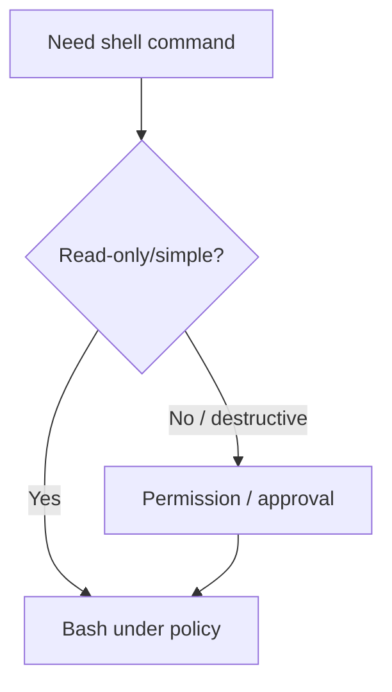

Risks:
- destructive commands
- secret exposure
- network access
- privilege escalation
- unintended file modification

Prefer purpose-built tools when they can provide a safer interface.

---

# 25. Purpose-Built Tool vs Bash

Need: “Fetch customer 123.”

Safer design:

```text
get_customer(customer_id="123")
```

rather than a broad shell command that manually calls an API.

Why?
- schema
- validation
- observability
- authorization
- smaller attack surface
- clearer selection semantics

---

# 26. Tool Granularity

Too broad:

```text
manage_customer
```

Too tiny:
- dozens of almost-identical tools

Good granularity:
- one meaningful business operation
- clear inputs
- clear outputs
- clear permission boundary

Examples:
- `get_customer_profile`
- `update_customer_phone`
- `list_customer_orders`

---

# 27. Read-Only vs Write Tools

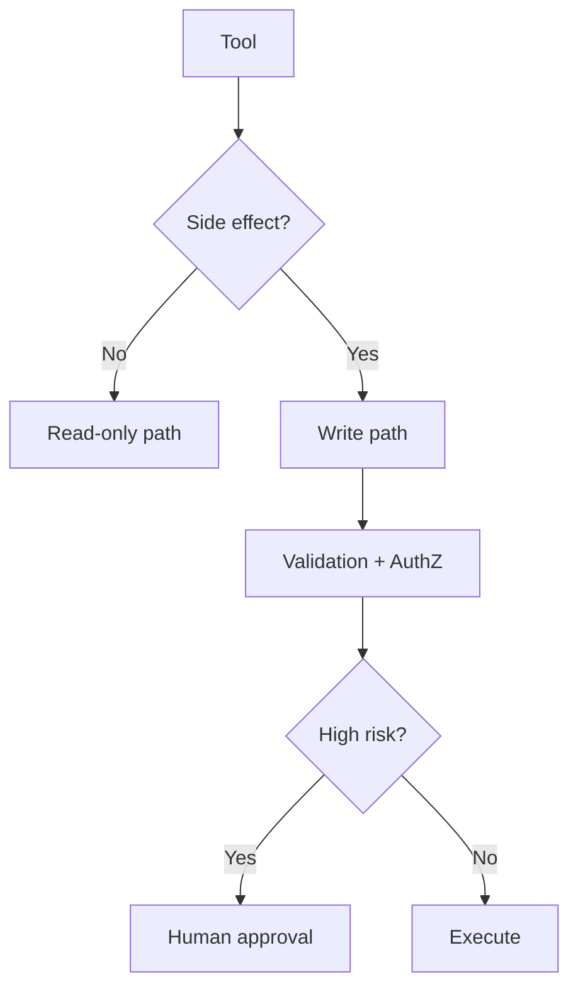

Write tools need stronger controls.

---

# 28. Idempotency

Retries are dangerous for non-idempotent operations.

Useful patterns:

```text
create_payment(idempotency_key, ...)
create_ticket(request_id, ...)
```

A repeated request with the same key should not create duplicates when the backend supports idempotency.

Important for:
- network timeouts
- workflow resumption
- client retries
- repeated agent calls

---

# 29. Tool Timeout Strategy

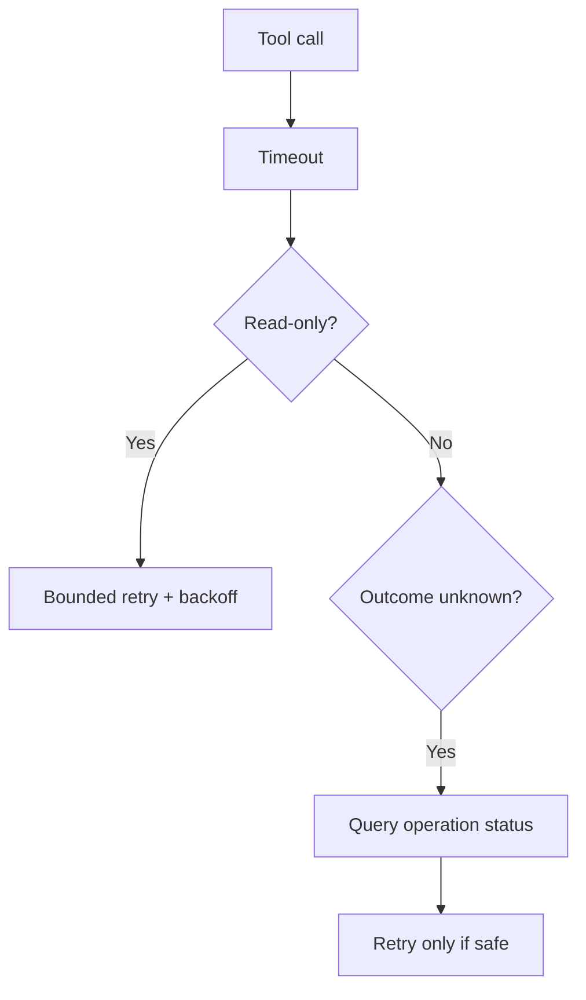

---

# 30. Authentication and Authorization

MCP does not remove normal security requirements.

```mermaid
flowchart LR
    H[Host] --> C[MCP Client]
    C --> A[Authentication]
    A --> Z[Authorization]
    Z --> S[MCP Server]
    S --> T[Tool]
```

Remember:
- authenticated does not mean authorized for every tool
- model-generated arguments are untrusted until validated
- sensitive capabilities should use least privilege

---

# 31. Secrets

Prefer keeping credentials in trusted systems rather than model context.

```mermaid
flowchart LR
    C[Claude] --> T[Tool request]
    T --> S[Trusted service]
    S --> K[(Secret store)]
    K --> S
```

---

# 32. Observability

Capture:
- tool name
- call ID
- agent/subagent
- duration
- result status
- retry count
- error class
- request/correlation ID
- side-effect outcome

Redact secrets and sensitive values.

```mermaid
flowchart LR
    A[Agent] --> T[Tool]
    T --> O[(Telemetry)]
    M[MCP Server] --> O
    E[Errors] --> O
```

---

# 33. Tool Contract Versioning

Schema changes can break clients.

Production guidance:
- prefer backward-compatible additions
- version breaking changes
- coordinate migrations
- test old/new clients

---

# 34. Production SRE MCP Example

```mermaid
flowchart TD
    C[Claude SRE Agent] --> MC[MCP Client]
    MC --> S[SRE MCP Server]
    S --> L[get_logs]
    S --> M[get_metrics]
    S --> D[get_deployment]
    S --> R[restart_service]
    L --> O[(Observability)]
    M --> O
    D --> K[Kubernetes API]
    R --> P{Approval / policy}
    P --> K
```

Recommended:
- diagnostic tools read-only
- restart protected
- structured failures
- bounded retry for transient read failures
- no blind write retry if outcome is unknown

---

# 35. Common Exam Traps

## Trap 1 — “Tool description is not important if schema is correct”
False. The model needs semantic guidance for tool selection.

## Trap 2 — “All failures should be retried”
False. Invalid inputs and authorization errors are not fixed by blind retry.

## Trap 3 — “Timeout means the operation failed”
False. A side-effecting action may have succeeded even if the response was lost.

## Trap 4 — “Every agent should get every tool”
False. Use least privilege and relevant tool distribution.

## Trap 5 — “MCP tool and resource are the same thing”
False. Tools are callable operations; resources expose readable context/data.

## Trap 6 — “Use Bash for everything”
Poor design when a purpose-built tool can be safer and clearer.

## Trap 7 — “Grep finds filenames”
False. Grep searches contents; Glob matches paths/names.

## Trap 8 — “Schema validation equals authorization”
False. Authorization is a separate trusted decision.

---

# 36. Final Domain Formula

Memorize:

> **NAME → DESCRIPTION → SCHEMA → VALIDATE → AUTHORIZE → EXECUTE → STRUCTURED RESULT → CLASSIFY ERROR → RETRY/STOP**

And for MCP:

> **HOST → CLIENT → MCP SERVER → TOOL/RESOURCE → RESULT → MODEL**
