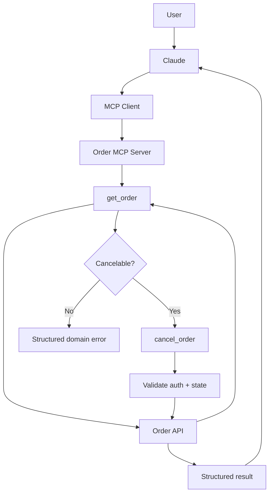
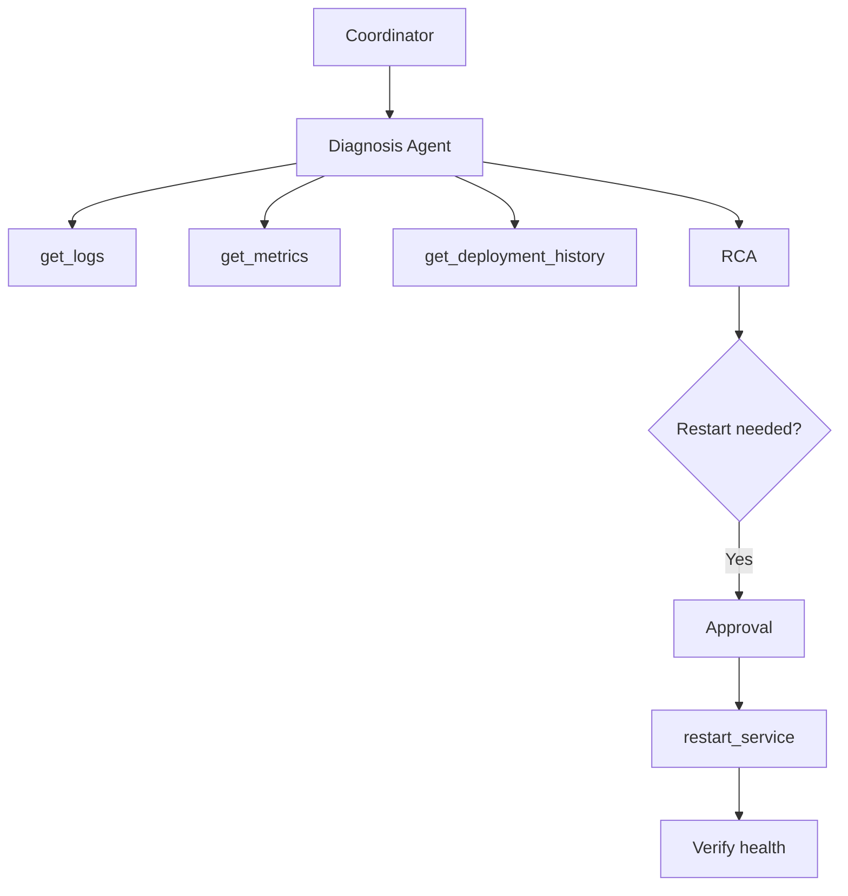
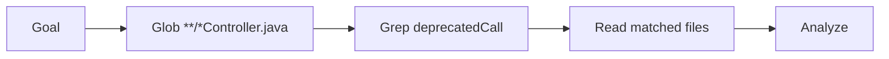
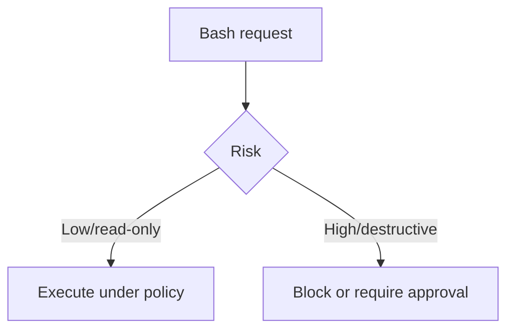
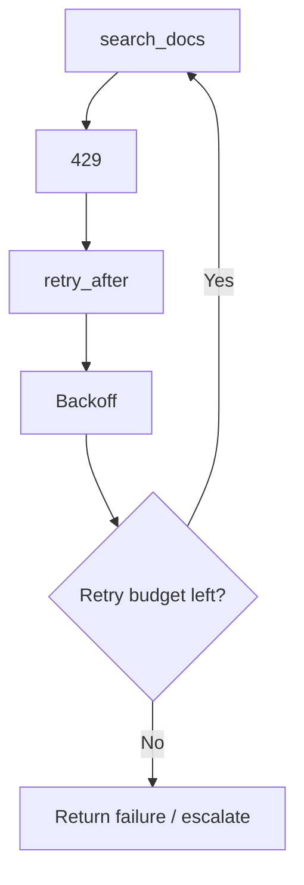
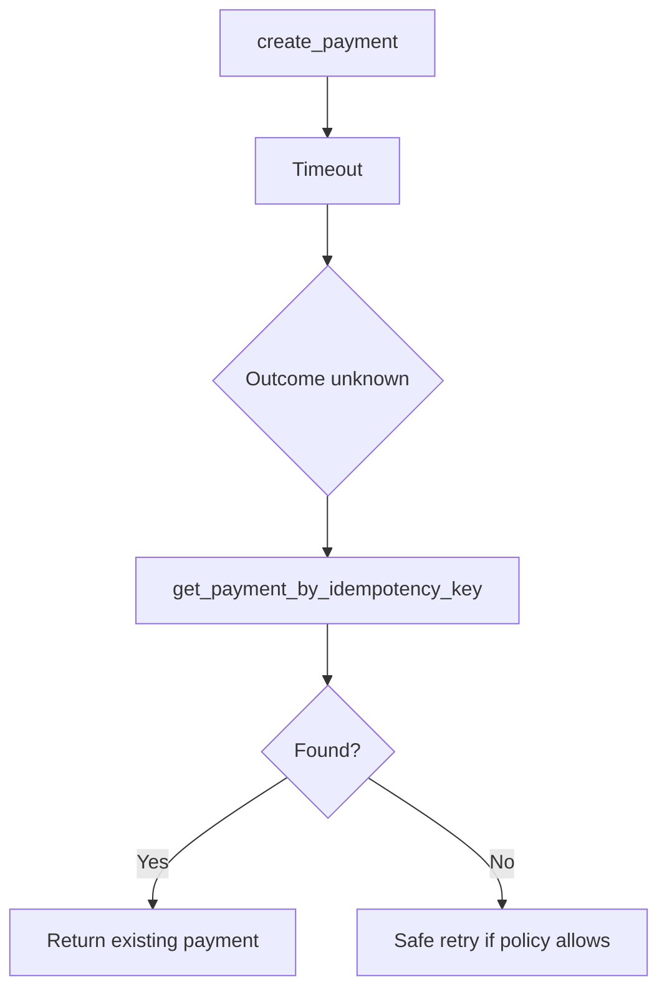
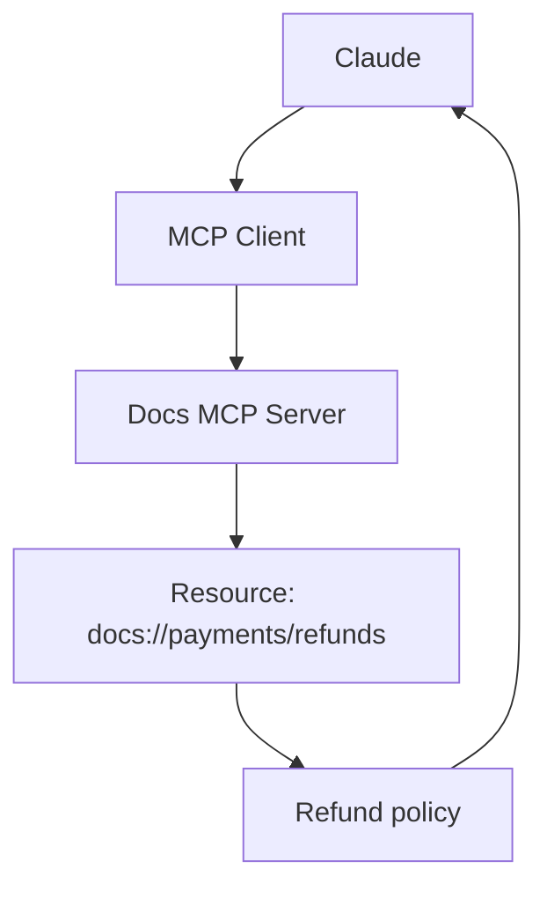
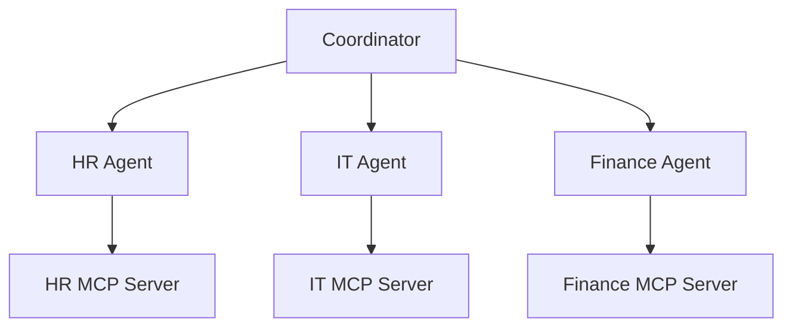

# Domain 2 — Production Scenarios & Answers

# Scenario 1 — Order Management MCP

## Requirements

Agent must:
- retrieve order
- cancel eligible order
- explain failure
- avoid duplicate side effects



## Why split `get_order` and `cancel_order`?

They have different:
- semantics
- side effects
- permissions
- validation requirements
- retry risk

---

# Scenario 2 — SRE MCP Integration

Tools:
- `get_logs`
- `get_metrics`
- `get_deployment_history`
- `restart_service`



Diagnosis agent gets read tools. Remediation path gets write tool only when authorized.

---

# Scenario 3 — File Analysis

Goal: find Java controllers containing a deprecated call.



Why?
- Glob narrows paths
- Grep searches content
- Read retrieves full relevant files

---

# Scenario 4 — Secure Bash

Need to check disk usage: low-risk read operation.

Need to recursively delete production data: destructive/high-risk.



Tool capability never implies unrestricted permission.

---

# Scenario 5 — Customer Profile Tool Design

Bad:

```text
customer(action, value)
```

Better:

```text
get_customer_profile(customer_id)
update_customer_phone(customer_id, phone)
list_customer_orders(customer_id)
```

Benefits:
- clearer tool selection
- clearer schema
- clearer permissions
- easier telemetry

---

# Scenario 6 — Structured Error Recovery

Call:

```text
get_order(order_id="123")
```

Result:

```json
{
  "success": false,
  "error": {
    "code": "INVALID_FORMAT",
    "message": "order_id must have format ORD-<number>",
    "retryable": false
  }
}
```

The model can distinguish “fix the input” from “wait and retry.”

---

# Scenario 7 — Rate-Limited Search



Avoid immediate loops and infinite retries.

---

# Scenario 8 — Payment Timeout



### Exam point
Timeout is not proof of failure.

---

# Scenario 9 — Documentation Resource



Use a resource because this capability is readable context.

---

# Scenario 10 — Tool Contract Versioning

Version 1:

```json
{"order_id":"ORD-1"}
```

Version 2 suddenly requires:

```json
{"tenant_id":"T1","order_id":"ORD-1"}
```

This can break clients.

Production approach:
- prefer compatible evolution
- version breaking changes
- migrate deliberately
- test compatibility

---

# Scenario 11 — Agent-Specific MCP Servers



Benefits:
- policy isolation
- smaller tool catalogs
- cleaner permissions
- less accidental cross-domain use

---

# Production Tool Checklist

Before exposing a tool, ask:

1. Is the name unambiguous?
2. Does the description say when to use it?
3. Are required inputs really required?
4. Are enums/constraints represented?
5. Is domain validation present?
6. Is authorization enforced?
7. Is it read-only or side-effecting?
8. Is output structured?
9. Are errors actionable?
10. Is retryability explicit?
11. Are writes idempotent/safe to resume?
12. Are secrets hidden?
13. Is telemetry captured?
14. Does only the correct agent get the tool?
