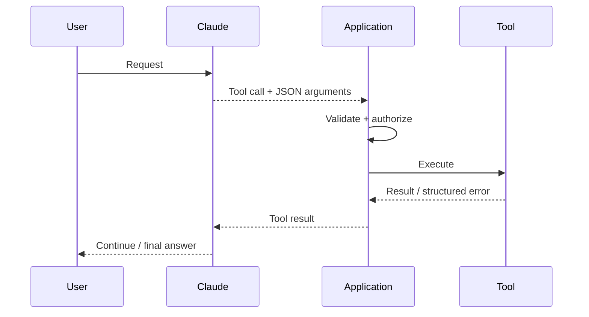
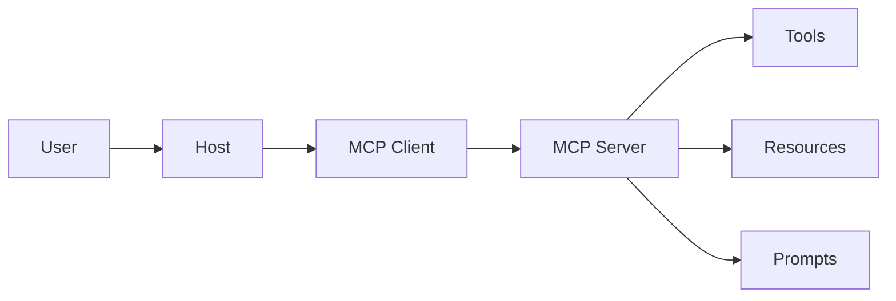
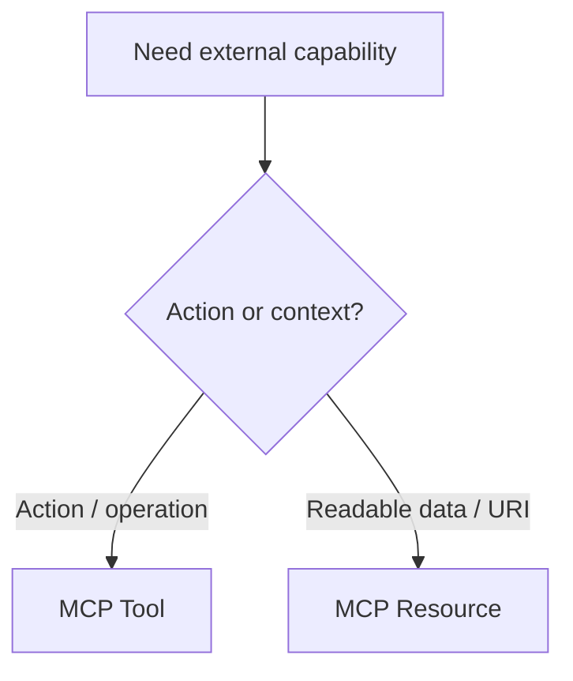
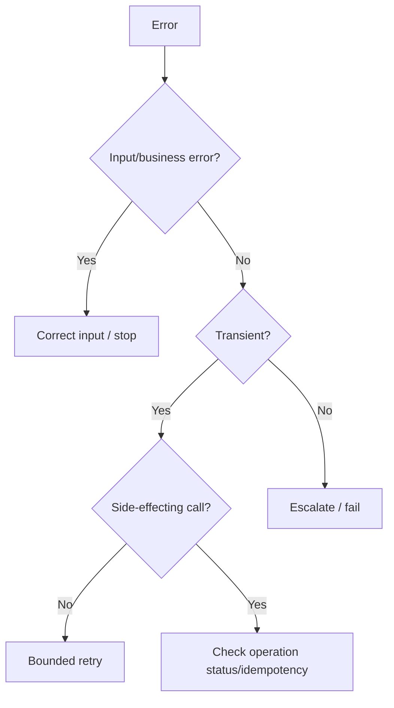
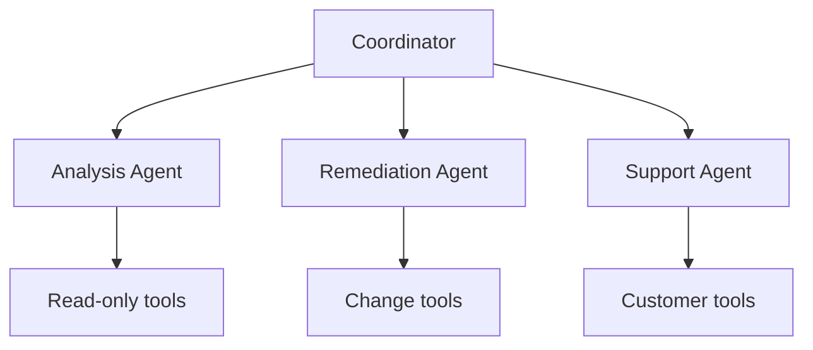
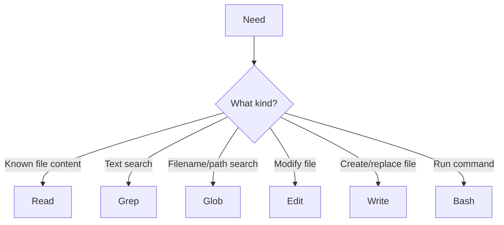
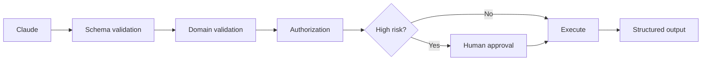
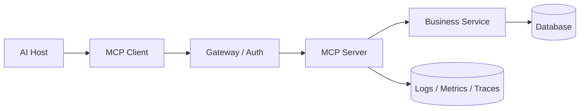

# Domain 2 — MCP & Tool Design Diagrams

# 1. End-to-end tool loop

# 2. MCP architecture

# 3. Tool vs resource

# 4. Retry decision

# 5. Tool distribution

# 6. Built-in selection

# 7. Secure write tool

# 8. MCP production service

