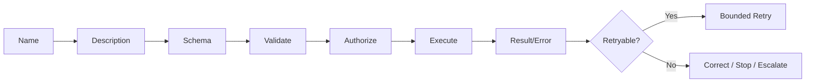

# Domain 2 — Quick Revision Cheat Sheet

## One-line definitions

- **Tool:** Callable capability that performs an operation.
- **Tool schema:** Machine-readable contract for tool inputs.
- **Tool description:** Explains what the tool does and when to use it.
- **Structured tool error:** Actionable machine-readable failure information.
- **Retryable failure:** Temporary failure where bounded retry may succeed.
- **Non-retryable failure:** Invalid input, permission/business rule, or permanent condition that unchanged retry won't fix.
- **MCP host:** AI application environment.
- **MCP client:** Communicates with MCP server.
- **MCP server:** Exposes tools/resources/prompts.
- **MCP tool:** Callable operation exposed through MCP.
- **MCP resource:** Readable context/data exposed through MCP.
- **Grep:** Search text inside files.
- **Glob:** Match file paths/names.
- **Read:** Read known file.
- **Edit:** Modify existing file.
- **Write:** Create/replace file content.
- **Bash:** Execute shell command.

---

## Master diagram

---

## Exam keyword → answer

| Scenario wording | Think |
|---|---|
| Claude chooses wrong tool | Improve name/description/overlap |
| Missing argument | Required schema field |
| Fixed allowed values | Enum |
| Wrong JSON shape | Schema validation |
| Valid JSON but illegal business value | Domain validation |
| Caller has no permission | Authorization |
| Temporary 503/429 | Retryable |
| Invalid ID | Non-retryable/correct input |
| Write timed out | Idempotency/status check |
| Perform action | Tool |
| Read URI/context | Resource |
| Search inside files | Grep |
| Find `*.java` | Glob |
| Exact file content | Read |
| Change existing file | Edit |
| Execute command | Bash |
| Too many tools | Scope/distribute tools |

---

## Top traps

1. All failures are retryable — **wrong**
2. Timeout means failure — **wrong**
3. Schema replaces authorization — **wrong**
4. Tool = resource — **wrong**
5. More tools always help — **wrong**
6. Bash is always best — **wrong**
7. Grep finds filenames — **wrong**
8. Glob searches file contents — **wrong**
9. Tool description is unimportant — **wrong**
10. Every agent needs all tools — **wrong**

---

## Fast exam answer template

> I would give the capability a clear non-overlapping tool name and description, express required inputs precisely in the schema, validate both schema and business rules, authorize before side effects, return structured results/errors, and classify failures before retrying. For MCP, expose actions as tools and readable context as resources, while giving each agent only the capabilities it needs.

---

## Final memory formula

**N-D-S-V-A-E-R-R**

- **N**ame
- **D**escription
- **S**chema
- **V**alidate
- **A**uthorize
- **E**xecute
- **R**esult
- **R**etry decision
