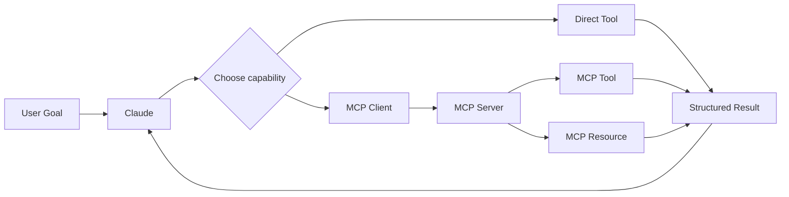

# Domain 2 — Tool Design & MCP Integration

> GitHub / Git Wiki study pack
> Focus: **tool schemas, descriptions, MCP tools/resources, structured errors, retryability, tool distribution, and built-in tools**

The supplied Domain 2 slide assigns **18%** to this domain.

## Files

- [01 — Full Domain Guide](./01-domain2-tool-design-mcp-integration.md)
- [02 — Exam Scenario Question Bank](./02-domain2-exam-scenario-question-bank.md)
- [03 — Production Scenarios](./03-domain2-production-scenarios.md)
- [04 — MCP Architecture & Diagrams](./04-domain2-mcp-diagrams.md)
- [05 — Quick Revision Cheat Sheet](./05-domain2-quick-revision-cheatsheet.md)
- [06 — Official Sources](./06-official-sources.md)

## Domain map



## Core exam formula

**Clear name → Clear description → Precise schema → Validate → Execute → Structured result/error → Retry only when appropriate**

## Most important distinction

```text
Tool     = perform an action / computation
Resource = expose/read context or data
Prompt   = reusable prompt/template capability
```

> Product details and MCP specifications evolve. This pack uses the supplied slide for the exam-topic scope and current public MCP/Anthropic documentation for technical cross-checking.
