# Domain 3 — Claude Code Configuration & Workflows

# 1. Why this domain matters

The supplied slide lists Domain 3 as **20%** of the exam and covers:

- `CLAUDE.md` file and instruction hierarchy
- Custom slash commands and skills
- Path-specific rules
- Plan Mode vs direct execution
- Iterative refinement
- CI/CD workflows

The exam is likely to test whether you can choose the **correct configuration mechanism and workflow for a real development scenario**.

The core question is:

> **Where should an instruction live, when should Claude plan instead of edit, and how should development work be automated safely and repeatably?**

---

# 2. Claude Code configuration mental model

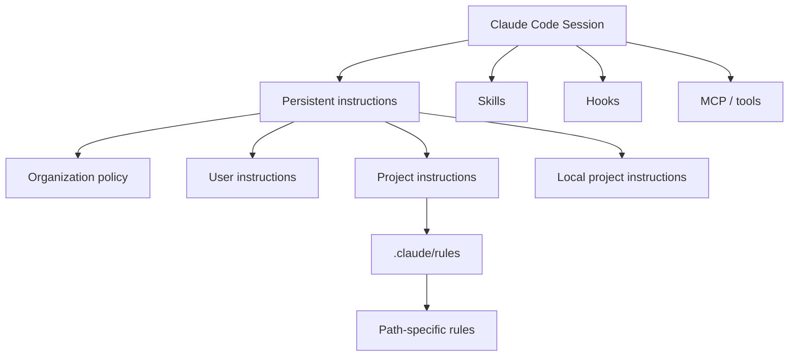

The key is **scope**.

Use the narrowest mechanism that correctly expresses the instruction.

---

# 3. CLAUDE.md

`CLAUDE.md` provides persistent instructions that Claude Code reads as project context.

Good things to put there:

- build commands
- test commands
- project architecture
- coding conventions
- naming conventions
- common repository workflows
- "always do X" project-wide guidance

Example:

```md
# Project Guidelines

## Build
- Run `npm ci` before the first build.
- Run `npm test` before proposing a PR.

## Architecture
- API handlers live under `src/api/handlers/`.
- Business logic belongs in `src/services/`.

## Coding
- Use TypeScript strict mode.
- Do not introduce `any` without justification.
```

## Exam rule

If a rule applies to **most or all work in the repository**, `CLAUDE.md` is a strong candidate.

---

# 4. CLAUDE.md is context, not a hard security boundary

This is extremely important.

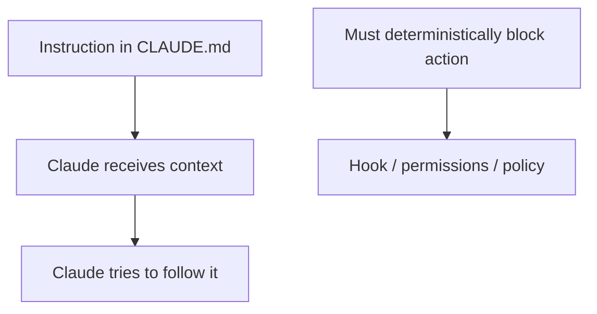

A project instruction like:

> "Never delete production data"

is guidance.

If deletion must be technically impossible, enforce it using deterministic controls such as permissions or a `PreToolUse` hook.

### Exam trap
**Persistent instruction ≠ guaranteed enforcement.**

---

# 5. CLAUDE.md locations and scope

Current Claude Code documentation describes multiple locations.

Conceptually:

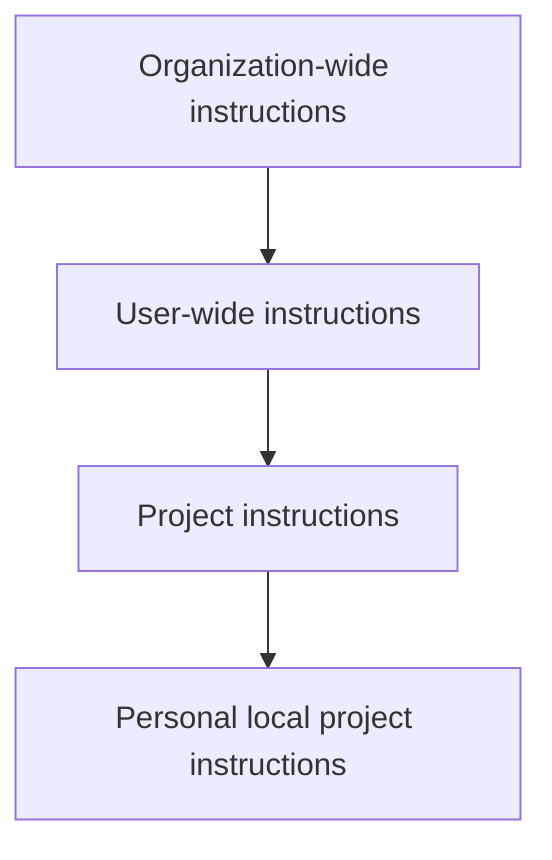

Common locations include:

```text
Managed organization policy
~/.claude/CLAUDE.md
./CLAUDE.md
./.claude/CLAUDE.md
./CLAUDE.local.md
```

## Practical interpretation

### Managed policy
Organization-wide standards controlled by administrators.

### User CLAUDE.md
Personal preferences that should apply across projects.

### Project CLAUDE.md
Shared repository instructions committed with the project.

### CLAUDE.local.md
Personal instructions for this repository that should normally stay out of source control.

---

# 6. Project vs user vs local instructions

Scenario:

> Your entire team must run `npm test` before opening a PR.

Best location:
**Project `CLAUDE.md`**

Scenario:

> You personally prefer Vim-style workflow hints across every project.

Best location:
**User-level `~/.claude/CLAUDE.md`**

Scenario:

> Your local test server is `http://localhost:9001` and teammates use different ports.

Best location:
**`CLAUDE.local.md`**

---

# 7. Instruction loading and hierarchy

Claude Code loads applicable instruction files into context.

Important conceptual point:

> Relevant instructions are **combined**, not simply treated as one file replacing another.

Therefore:

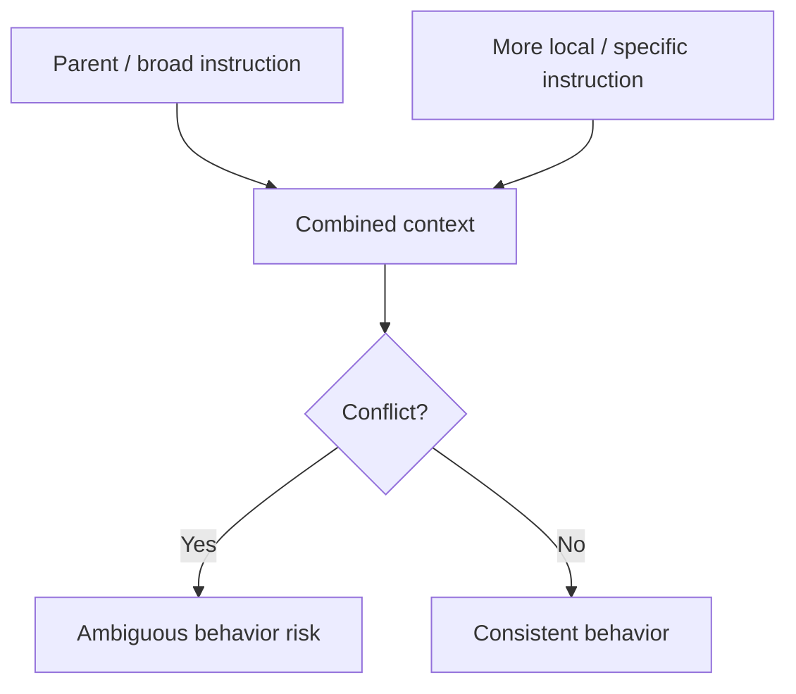

## Exam rule

Avoid contradictory instructions.

If:
- root says "use tabs"
- subdirectory says "use spaces"

you have created ambiguity unless the scope is deliberately designed.

---

# 8. What belongs where?

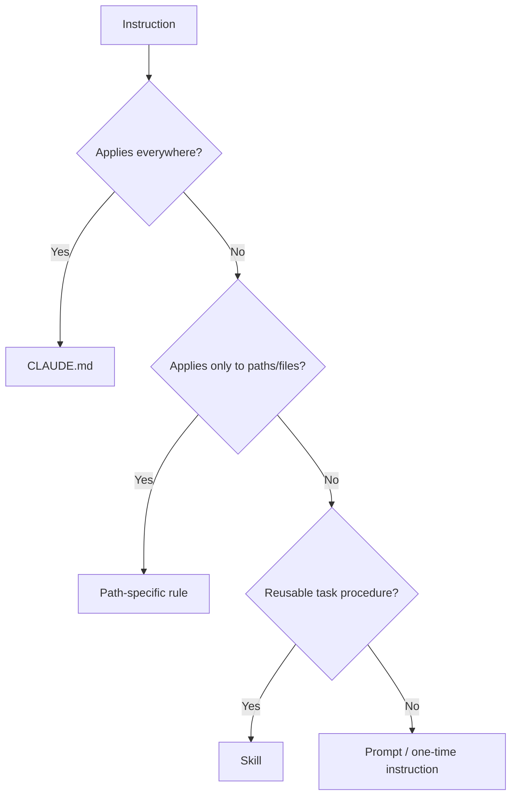

This diagram is highly exam-relevant.

---

# 9. `.claude/rules/`

For larger repositories, rules can be broken into topic-specific Markdown files.

Example:

```text
.claude/
├── CLAUDE.md
└── rules/
    ├── code-style.md
    ├── testing.md
    ├── security.md
    └── frontend/
        └── react.md
```

Benefits:
- modular
- easier maintenance
- fewer giant instruction files
- clearer ownership
- path-specific loading where applicable

---

# 10. Path-specific rules

Path-specific rules apply only when Claude works with matching files.

Example:

```md
---
paths:
  - "src/api/**/*.ts"
---

# API Rules

- Validate all request input.
- Return the standard API error model.
- Add OpenAPI documentation.
```

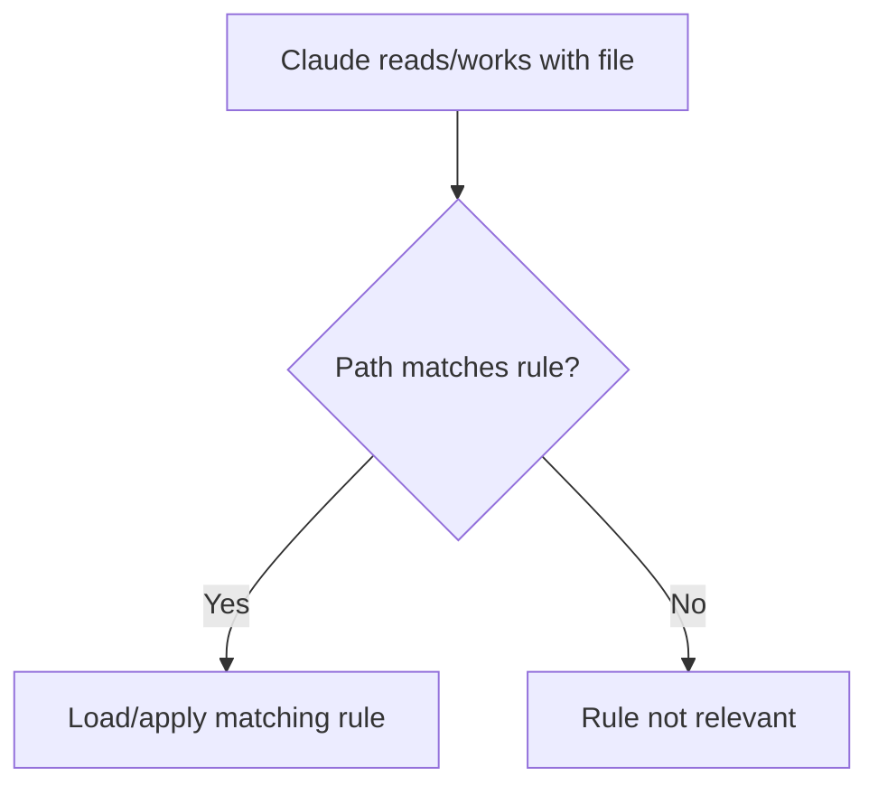

## When to use

- React rules only for `*.tsx`
- API rules only under `src/api/`
- database rules only for migrations
- test conventions only for tests

## Exam keyword

“Only when editing files under X” → **path-specific rule**

---

# 11. Why path-specific rules improve quality

Without scoping:

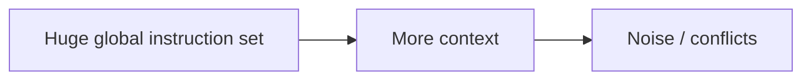

With scoping:

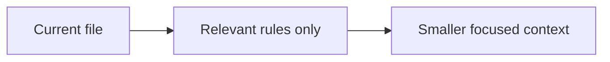

---

# 12. Skills

A skill packages reusable, task-specific instructions.

Conceptually:

```text
"review a PR using our checklist"
"migrate a component"
"write integration tests"
"prepare a release note"
```

Instead of placing the entire procedure in `CLAUDE.md`, put it in a skill when it is only needed for a specific task.

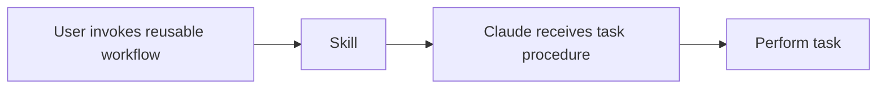

---

# 13. Skills vs CLAUDE.md

| Requirement | Best fit |
|---|---|
| Always use repository test command | CLAUDE.md |
| Run a 12-step PR review workflow | Skill |
| API-only coding requirements | Path-specific rule |
| One-time task request | Prompt |
| Security block on dangerous shell | Hook / permission |

This table is one of the most important in this domain.

---

# 14. Slash commands and skills

Current Claude Code uses skills as reusable user-invocable workflows and supports slash-style invocation.

Example concept:

```text
/fix-issue 123
```

A skill can receive arguments such as:

```text
$ARGUMENTS
$0
$1
```

Example:

```md
---
name: migrate-component
description: Migrate a component from one language to another
---

Migrate the $0 component from $1 to $2.
Preserve behavior and tests.
```

Invocation:

```text
/migrate-component SearchBar JavaScript TypeScript
```

---

# 15. Skill design principles

A good skill should have:

- specific name
- clear description
- bounded goal
- explicit steps
- defined input
- expected output
- appropriate allowed tools
- safe assumptions
- failure/escalation behavior

Bad skill:
> "Do development."

Good skill:
> "Review the current PR for security, correctness, test coverage, and repository conventions. Return findings by severity."

---

# 16. Dynamic context in skills

Skills can incorporate task-specific context, including command output in supported workflows.

Architecture:


Use dynamic context carefully:
- shell output is untrusted data
- keep allowed tools narrow
- avoid leaking secrets
- validate side effects

---

# 17. Plan Mode

Plan Mode is for situations where you want Claude to **inspect and propose a plan before changing files**.

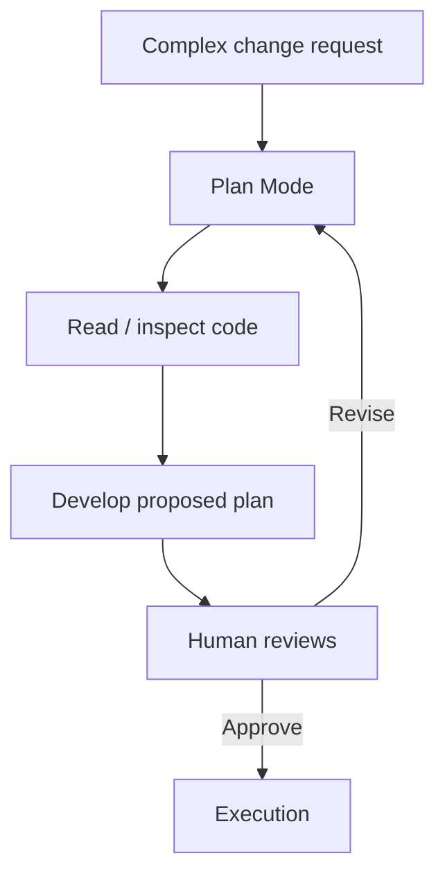

## Strong use cases

- unfamiliar codebase
- major refactor
- database migration
- security-sensitive change
- multi-file architectural change
- unclear requirements
- change where review is valuable before touching disk

---

# 18. Direct execution

Direct execution is appropriate when the task is well-understood and low-risk.

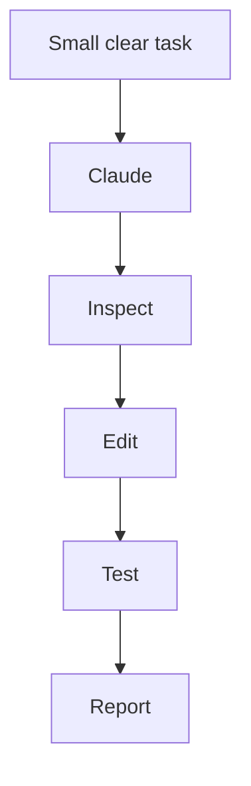

Examples:
- rename a local variable
- fix one obvious typo
- add a straightforward unit test
- change a known config value

---

# 19. Plan Mode vs Direct Execution decision

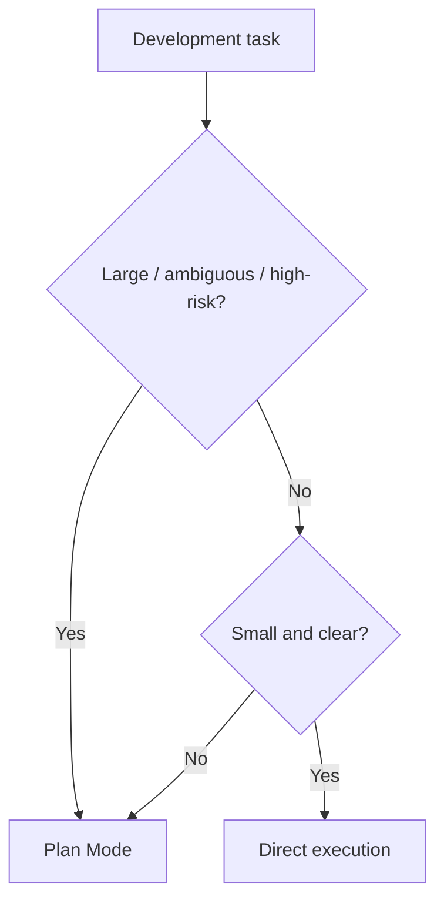

### Exam trap

Plan Mode is **not required for every task**.

Using it for every tiny change adds unnecessary friction.

---

# 20. Plan Mode does not mean "do nothing forever"

The intended workflow is:

```text
Inspect → Plan → Review → Approve → Execute → Test
```

Not:

```text
Plan → Final answer with no implementation
```

unless the user asked only for a plan.

---

# 21. Iterative refinement

Real coding work is usually iterative.

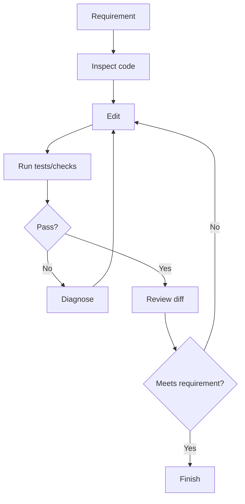

This is a core production workflow.

---

# 22. Why iterative refinement matters

One-shot code generation can miss:

- compile errors
- test failures
- integration problems
- style rules
- edge cases
- repository conventions

Correct workflow:

> **Inspect → change → verify → refine**

---

# 23. Test-driven refinement

Example:

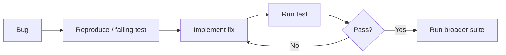

Exam keyword:
“prove the bug, fix it, verify regression” → iterative test workflow.

---

# 24. Review the diff

After editing:

- inspect changed files
- ensure scope is minimal
- check accidental edits
- run relevant tests
- ensure no secrets were added
- verify requirement

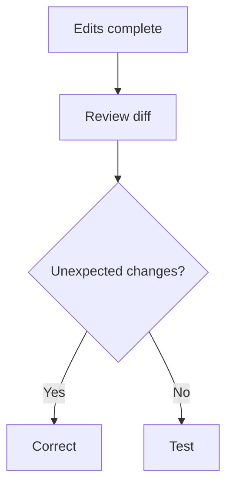

---

# 25. Large codebase navigation

For large repositories:

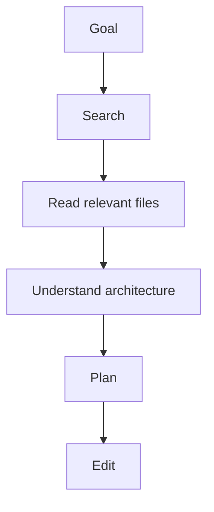

Avoid reading the entire repository unnecessarily.

Use:
- search
- path-specific context
- subagents for focused research
- relevant rules

---

# 26. CI/CD with Claude Code

Claude Code can run non-interactively or through repository automation.

Conceptually:

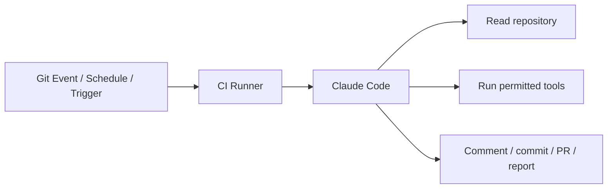

Typical uses:
- PR review
- issue-to-PR automation
- test failure analysis
- scheduled maintenance tasks
- code-quality checks
- documentation updates

---

# 27. GitHub Actions workflow

Current official docs describe `claude-code-action` running Claude Code inside GitHub workflows.

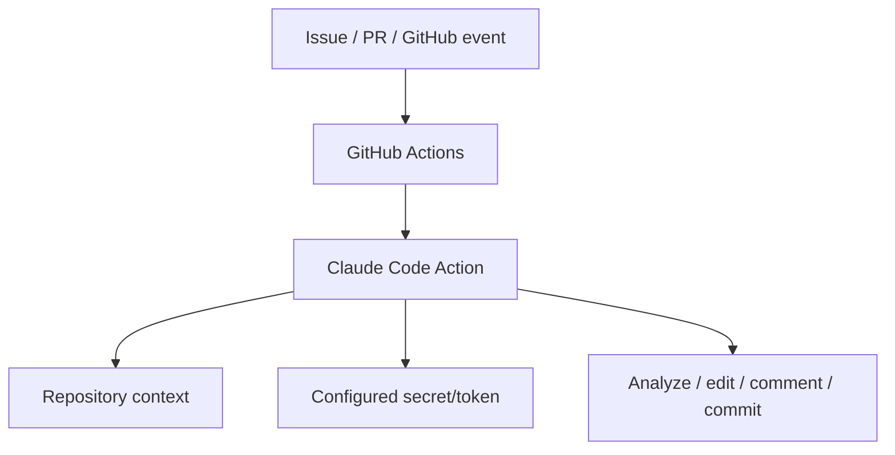

Important:
- repository permissions matter
- credentials must be protected
- trigger conditions matter
- workflow permissions should be least privilege

---

# 28. Interactive vs automated workflows

## Interactive

Human and Claude iterate in a terminal/IDE.

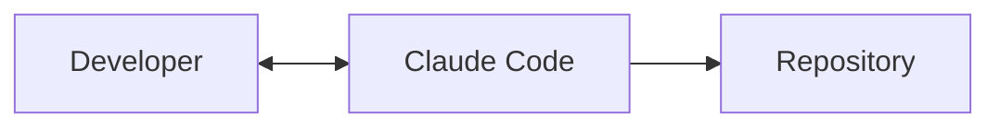

Good for:
- ambiguous work
- design discussions
- iterative development

## Automated

```mermaid
flowchart LR
    G[CI Trigger] --> C[Claude Code]
    C --> R[Repository]
    C --> O[Automated output]
```

Good for:
- repeatable tasks
- clear policies
- bounded permissions
- deterministic triggers

---

# 29. CI/CD safety

Never treat a CI agent as an unrestricted developer account.

Use:

- least-privilege token
- restricted repository permissions
- protected branches
- required reviews
- secret management
- approval gates
- controlled tools
- audit logs

```mermaid
flowchart TD
    C[CI Claude] --> P[Permission boundary]
    P --> B[Branch / PR]
    B --> R[Required review/checks]
    R --> M[Merge]
```

---

# 30. Secrets in CI

Bad:

```yaml
prompt: "Use API key abc123..."
```

Better:

```mermaid
flowchart LR
    CI[CI Runner] --> S[Secret Store]
    S --> A[Action / trusted runtime]
    A --> C[Claude workflow]
```

Do not unnecessarily put raw credentials into prompts or repository files.

---

# 31. CI trigger design

Potential triggers:

- PR opened/updated
- issue comment
- push to branch
- scheduled job
- manual dispatch

Choose the trigger that matches the workflow.

### Exam scenario

> Run Claude review automatically on every PR.

Use:
**PR-triggered CI/review workflow**

Not:
a personal local `CLAUDE.md` alone.

---

# 32. Project standards in CI

CI and interactive Claude should ideally use the same repository conventions.

```mermaid
flowchart TD
    C[CLAUDE.md] --> L[Local Claude Code]
    C --> G[CI Claude Code]
```

This creates consistency.

But remember:
`CLAUDE.md` is contextual guidance, while actual enforcement should also exist in:
- linters
- tests
- branch protection
- policy hooks
- CI checks

---

# 33. Configuration anti-pattern: huge CLAUDE.md

A giant project file can reduce clarity.

```mermaid
flowchart LR
    H[Huge CLAUDE.md] --> C[Context consumption]
    C --> N[Noise]
    N --> A[Lower adherence]
```

Better:
- concise project-wide instructions
- modular rules
- path-specific rules
- skills for task procedures

---

# 34. Configuration anti-pattern: procedure in global context

Bad:
A 100-line production-release checklist loaded every session.

Better:
A `release` skill invoked only when releasing.

```mermaid
flowchart LR
    A[Task-specific procedure] --> S[Skill]
    B[Always-needed rule] --> C[CLAUDE.md]
```

---

# 35. Configuration anti-pattern: path rule without scope

If React rules are globally loaded, backend tasks may receive irrelevant frontend instructions.

Fix:
Use `paths` frontmatter.

---

# 36. Configuration anti-pattern: contradictory rules

Example:

Root:
> Use JUnit 5.

Nested rule:
> Use JUnit 4.

Result:
Claude receives conflicting guidance.

Fix:
- delete stale rules
- scope intentionally
- maintain one source of truth

---

# 37. Production Scenario — Java/Spring Boot project

Repository:

```text
project/
├── CLAUDE.md
├── .claude/
│   ├── rules/
│   │   ├── java.md
│   │   ├── tests.md
│   │   └── api.md
│   └── skills/
│       ├── review-pr/
│       └── fix-vulnerability/
├── src/
└── .github/workflows/
```

`CLAUDE.md`:

```md
# Project
- Java 21
- Spring Boot
- Run `./mvnw test` before completion.
- Never change public API contracts without calling it out.
```

`api.md`:

```md
---
paths:
  - "src/main/java/**/controller/**/*.java"
---

- Validate input.
- Follow the standard API error model.
- Keep controllers thin.
```

Skill:
`/fix-vulnerability`

Workflow:
1. inspect scanner finding
2. identify vulnerable path
3. propose minimal fix
4. update code
5. run targeted tests
6. run security check
7. summarize residual risk

---

# 38. Production Scenario — React frontend

Path-specific rule:

```md
---
paths:
  - "src/**/*.tsx"
  - "src/**/*.ts"
---

- Use functional components.
- Follow existing state-management pattern.
- Add tests for behavior changes.
- Preserve accessibility attributes.
```

Why path-specific?
Because these rules are irrelevant to Java backend changes.

---

# 39. Production Scenario — PR review skill

```mermaid
flowchart TD
    P[PR] --> S[/review-pr skill]
    S --> D[Read diff]
    D --> R[Check requirements]
    R --> T[Check tests]
    T --> SEC[Check security]
    SEC --> O[Structured findings]
```

Output:
- Critical
- High
- Medium
- Low
- Suggested improvements

---

# 40. Production Scenario — Plan before refactor

Request:
> Split one 5,000-line service into smaller services.

Correct workflow:

```mermaid
flowchart TD
    U[Refactor request] --> P[Plan Mode]
    P --> A[Map responsibilities]
    A --> D[Dependency analysis]
    D --> PL[Proposed decomposition]
    PL --> H[Developer review]
    H --> E[Execute incrementally]
    E --> T[Test after each stage]
```

This is safer than immediately rewriting all files.

---

# 41. Production Scenario — Tiny bug fix

Request:
> Fix typo in error message.

Preferred:
Direct execution + quick verification.

Why?
Plan Mode would add unnecessary overhead.

---

# 42. CI/CD Scenario — Issue to PR

```mermaid
flowchart TD
    I[GitHub Issue] --> T[Trigger]
    T --> C[Claude Code Action]
    C --> B[Create working branch]
    B --> E[Implement]
    E --> X[Run tests]
    X --> P[Open PR]
    P --> H[Human review]
```

Key principle:
Automation can create work, while protected-branch rules preserve human governance.

---

# 43. CI/CD Scenario — PR review

```mermaid
flowchart LR
    PR[Pull Request] --> CI[CI]
    CI --> C[Claude review]
    C --> F[Findings]
    F --> PR
```

Claude review should not replace deterministic checks.

Use alongside:
- compiler
- unit tests
- SAST
- dependency scanning
- linting
- policy checks

---

# 44. Worktrees and parallel development

Current Claude Code workflows support isolated parallel sessions using worktrees.

Conceptually:

```mermaid
flowchart TD
    R[Git Repository] --> W1[Worktree A / branch A]
    R --> W2[Worktree B / branch B]
    W1 --> C1[Claude Session 1]
    W2 --> C2[Claude Session 2]
```

Benefit:
Parallel tasks do not edit the same working tree.

Exam relevance:
If concurrent changes risk collisions, isolation is better than having multiple agents edit the same files simultaneously.

---

# 45. Non-interactive mode

Claude Code can be used in scripts/automation.

Typical use:

```text
input/trigger → claude non-interactive → structured/result output
```

Use when:
- prompt is repeatable
- human dialogue is unnecessary
- CI or batch processing is intended

---

# 46. Decision tree for configuration

```mermaid
flowchart TD
    I[Need to tell Claude something] --> A{Always relevant?}
    A -- Yes --> C[CLAUDE.md]
    A -- No --> B{Only certain paths?}
    B -- Yes --> R[Path-specific rule]
    B -- No --> D{Reusable procedure?}
    D -- Yes --> S[Skill]
    D -- No --> P[Prompt]
    C --> E{Must be enforced?}
    R --> E
    S --> E
    P --> E
    E -- Yes --> H[Hook / CI / permission / policy]
    E -- No --> F[Context instruction is enough]
```

---

# 47. Decision tree for execution mode

```mermaid
flowchart TD
    T[Task] --> R{Risk / ambiguity / breadth high?}
    R -- Yes --> P[Plan Mode]
    R -- No --> S{Simple & well-defined?}
    S -- Yes --> D[Direct execution]
    S -- No --> P
```

---

# 48. Decision tree for development completion

```mermaid
flowchart TD
    E[Edit complete] --> T[Test]
    T --> P{Pass?}
    P -- No --> F[Fix]
    F --> T
    P -- Yes --> D[Review diff]
    D --> R{Requirement met?}
    R -- No --> F
    R -- Yes --> C[Complete / PR]
```

---

# 49. Common exam traps

## Trap 1 — Put everything in CLAUDE.md
Wrong. Use path rules and skills where appropriate.

## Trap 2 — CLAUDE.md guarantees security
Wrong. It is context, not deterministic enforcement.

## Trap 3 — Use Plan Mode for every typo
Wrong. Match workflow overhead to task complexity.

## Trap 4 — Directly edit during a major ambiguous refactor
Risky. Plan first.

## Trap 5 — Path-specific rule without `paths`
Then it becomes effectively global rather than conditional.

## Trap 6 — Skill for a rule that must apply every session
Wrong mechanism. Use persistent instructions.

## Trap 7 — Local personal data in team-shared CLAUDE.md
Use local/personal scope instead.

## Trap 8 — CI token with excessive permissions
Violates least privilege.

## Trap 9 — Claude review replaces unit tests/security scanners
Wrong. LLM review complements deterministic checks.

## Trap 10 — Retry code edits without tests
Iterative refinement requires verification.

---

# 50. Final exam formula

Memorize:

> **SCOPE → CONFIGURE → PLAN → EXECUTE → TEST → REFINE → REVIEW → AUTOMATE**

And the configuration choice:

> **Always = CLAUDE.md**  
> **Path-only = `.claude/rules/`**  
> **Reusable procedure = Skill**  
> **One-time request = Prompt**  
> **Hard enforcement = Hook / CI / permissions**
