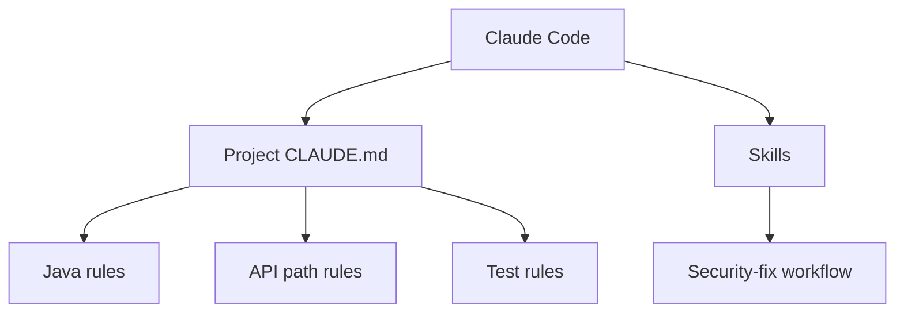
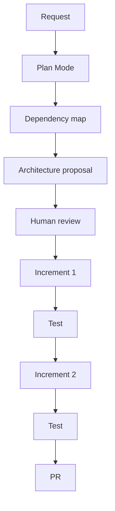
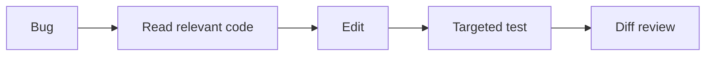
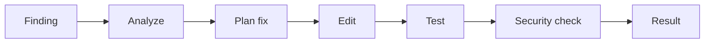
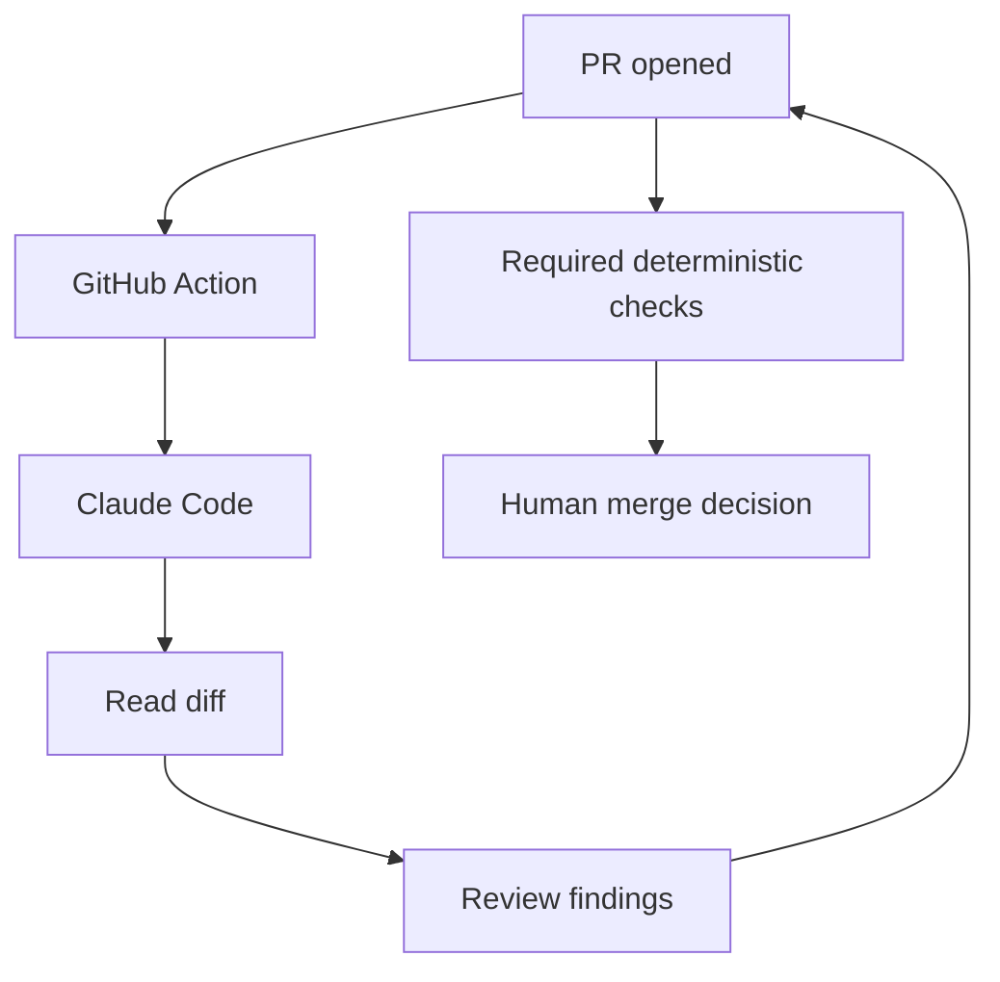
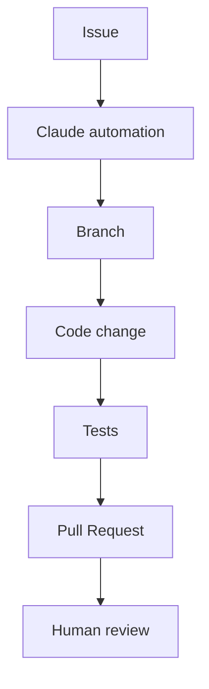
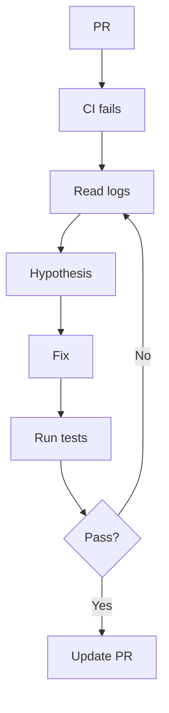
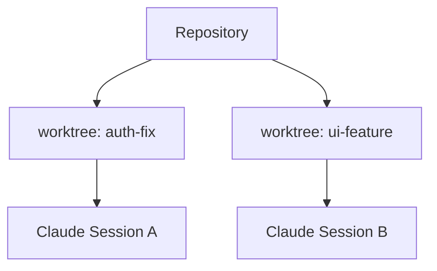
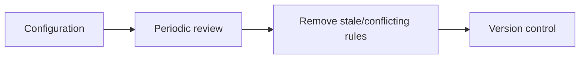

# Domain 3 — Production Scenarios

# Scenario 1 — Enterprise Spring Boot repository

## Goal
Make Claude Code consistently follow project architecture.



Recommended:
- project-wide commands in `CLAUDE.md`
- controller-specific standards in path rules
- long security-remediation procedure in a skill
- hard security blocks in hooks/CI

---

# Scenario 2 — Major microservice refactor

## Request
Split one service into three bounded services.



Why:
- broad
- architectural
- risky
- requires review before disk changes

---

# Scenario 3 — Small production bug

Request:
Fix one null check.



Use direct execution if the fix is clear and permissions allow.

---

# Scenario 4 — Path-specific rules in monorepo

```text
repo/
├── frontend/
├── backend/
├── infra/
└── .claude/rules/
```

Frontend:
```yaml
paths:
  - "frontend/**/*.{ts,tsx}"
```

Backend:
```yaml
paths:
  - "backend/**/*.java"
```

Infra:
```yaml
paths:
  - "infra/**/*.tf"
```

Benefit:
Each task gets relevant instructions instead of the entire monorepo's rules.

---

# Scenario 5 — PR review skill

```mermaid
flowchart TD
    P[PR Diff] --> S[/review-pr]
    S --> A[Architecture]
    S --> T[Tests]
    S --> SEC[Security]
    S --> Q[Quality]
    A --> O[Findings]
    T --> O
    SEC --> O
    Q --> O
```

Return:
- severity
- file/line
- issue
- rationale
- suggested correction

---

# Scenario 6 — Vulnerability remediation skill

Workflow:
1. read scanner result
2. identify vulnerable dependency/path
3. inspect exploitability
4. propose minimal fix
5. make change
6. run targeted tests
7. rerun scanner/check
8. summarize



---

# Scenario 7 — CI code review



Claude is one layer, not the only layer.

---

# Scenario 8 — CI issue-to-PR automation



Safety:
- no direct protected-branch write
- narrow token scope
- required tests
- review before merge

---

# Scenario 9 — Personal vs team configuration

Team:
- Java version
- build command
- architecture

→ project `CLAUDE.md`

Developer only:
- localhost port
- preferred test fixture

→ `CLAUDE.local.md`

Never:
- passwords
- tokens
- private keys

→ use secret storage

---

# Scenario 10 — Iterative refinement after CI failure



---

# Scenario 11 — Parallel work with worktrees



Reason:
Isolate working directories and branches so edits do not collide.

---

# Scenario 12 — Configuration governance

A large team should periodically review:

- root `CLAUDE.md`
- local/nested `CLAUDE.md` files
- `.claude/rules/`
- skills
- hooks
- CI workflows
- permissions
- stale instructions


