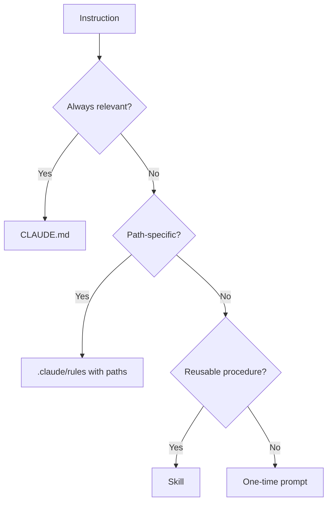
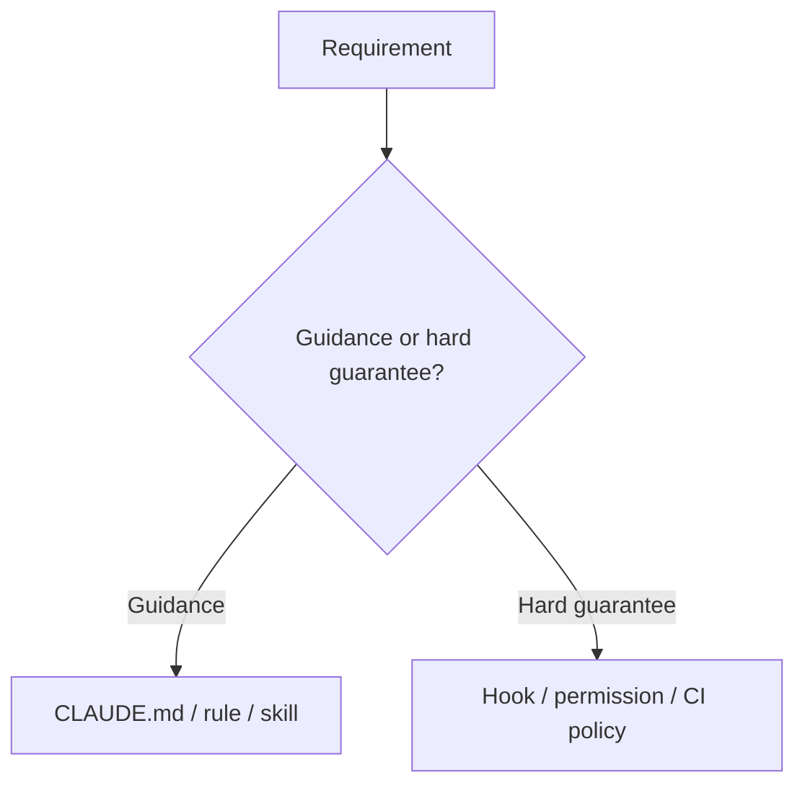
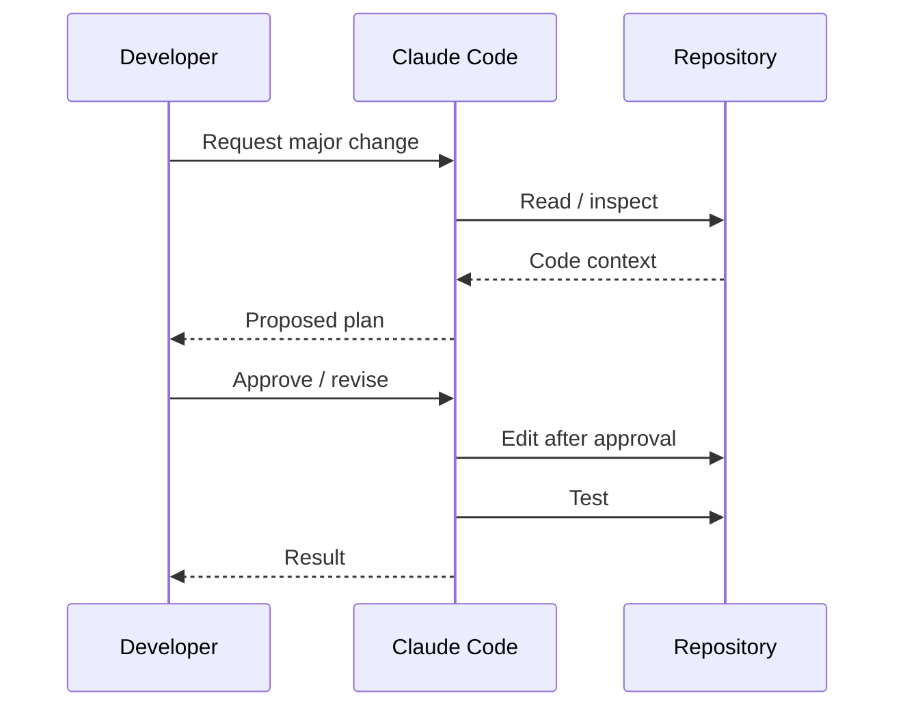
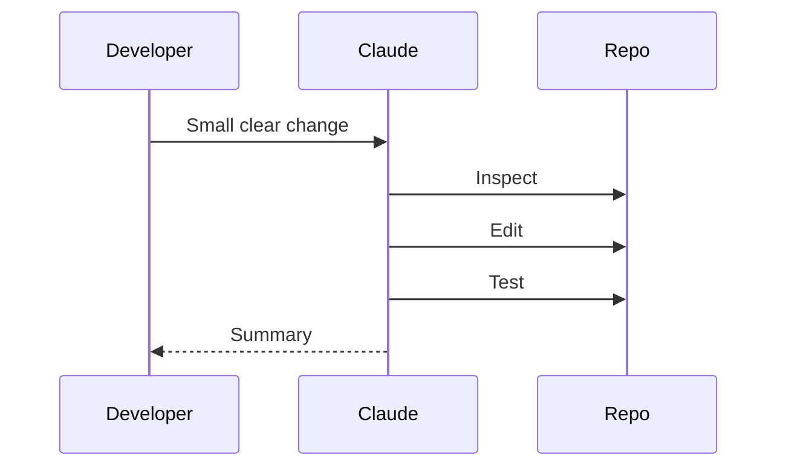
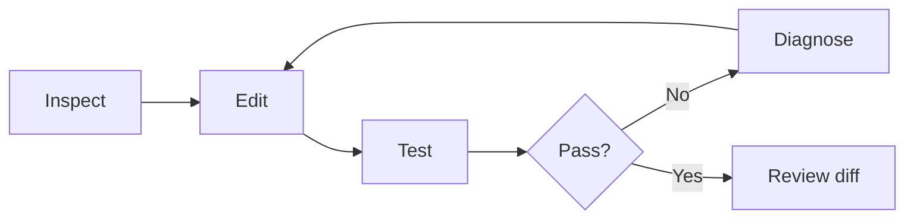
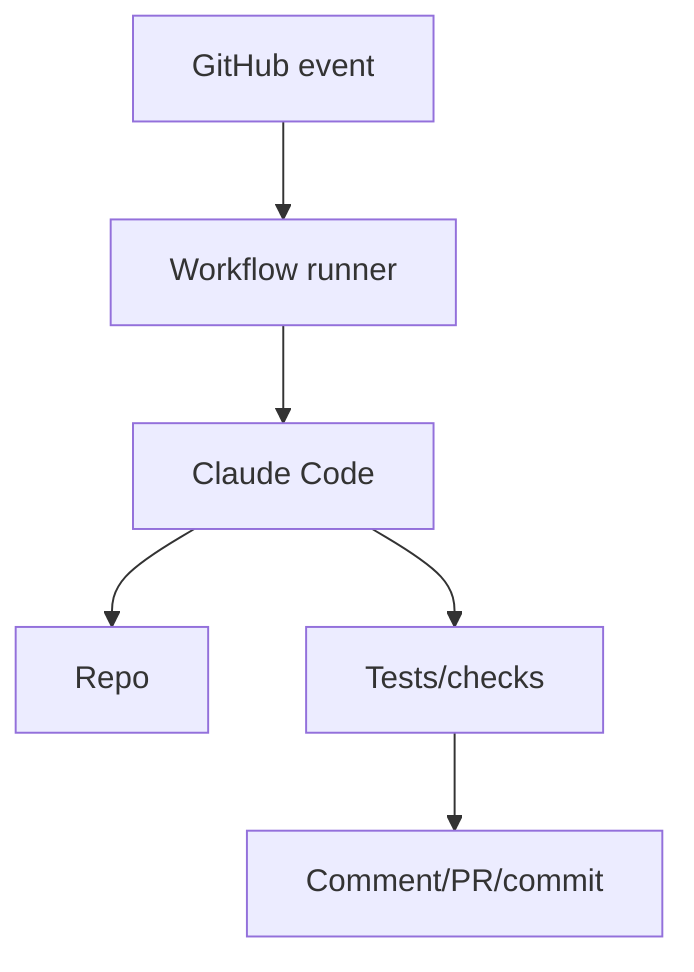
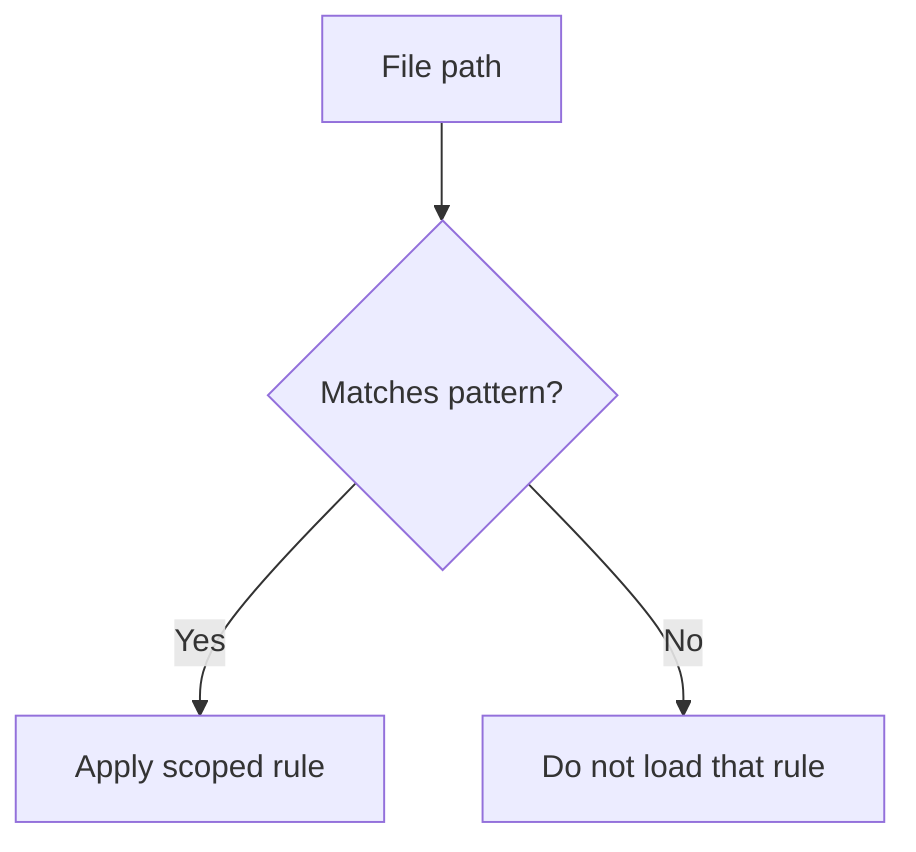
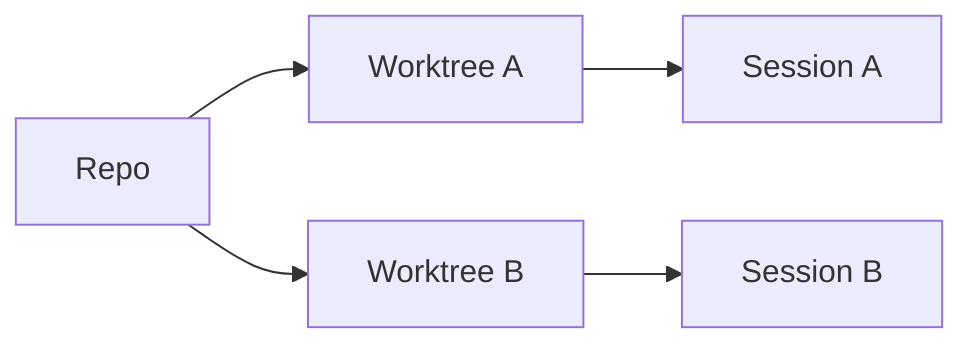

# Domain 3 — Diagram Pack

## 1. Configuration selection

## 2. Hard enforcement

## 3. Plan Mode

## 4. Direct execution

## 5. Iterative refinement

## 6. CI/CD

## 7. Path-specific rules

## 8. Worktrees

