# Claude Certified Architect – Foundations (CCAR-F)

## Domain 3 Complete Exam Guide: Claude Code Configuration & Workflows

> Version basis: Official exam guide v1.0, effective July 2026. Last checked: 23 September 2026.  
> Audience: A learner who wants simple English, diagrams, examples, and exam decision rules.  
> Important: No study guide can guarantee a 100% score. This guide covers every published Domain 3 objective, but the exam tests judgment in new scenarios.

---

## 1. What you must learn

Domain 3 is **20% of the exam**. The full exam has 60 questions, but Anthropic does not promise an exact number from each domain. Expect roughly one fifth of the scored questions to test Domain 3, often mixed with other domains.

There are **6 official topics**:

| Objective | Topic | What the exam asks you to decide |
|---|---|---|
| 3.1 | `CLAUDE.md` hierarchy and organization | Where an instruction belongs and why a teammate cannot see it |
| 3.2 | Custom commands and Agent Skills | Whether a reusable workflow belongs in a command, skill, or always-loaded memory |
| 3.3 | Path-specific rules | How to load conventions only for matching files |
| 3.4 | Plan mode vs direct execution | Whether Claude should investigate first or edit immediately |
| 3.5 | Iterative refinement | How examples, tests, interviews, and feedback improve results |
| 3.6 | Claude Code in CI/CD | How to run non-interactively and return reliable machine-readable output |

### Memory picture

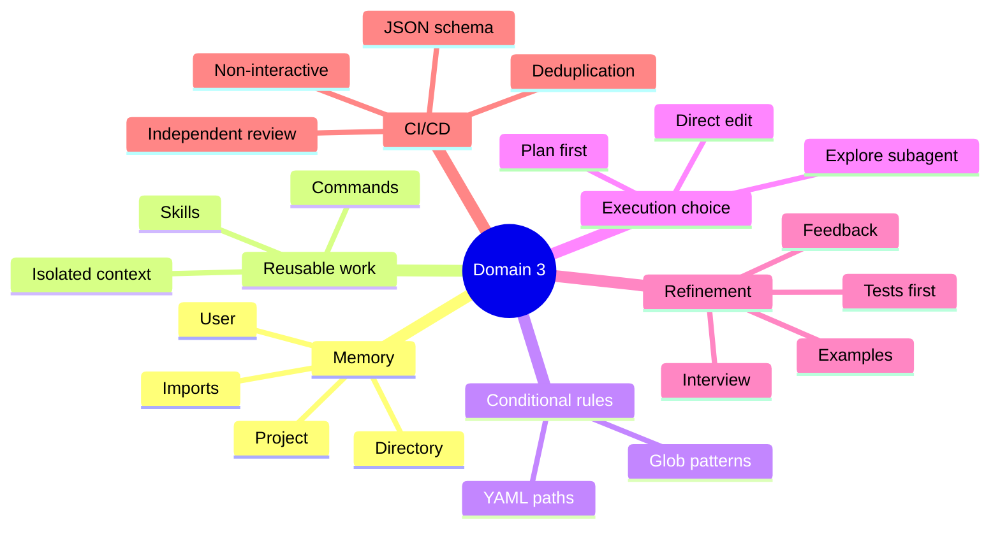

### Two published scenarios strongly connected to Domain 3

1. **Code generation with Claude Code**: generation, refactoring, debugging, documentation, commands, `CLAUDE.md`, and plan mode.
2. **Claude Code for CI/CD**: automated reviews, test generation, PR comments, actionable findings, and low false positives.

Domain 3 may also appear in the **developer productivity** scenario, where Claude explores unfamiliar codebases and uses built-in or MCP tools.

---

## 2. How to understand difficult exam questions

Most questions are not asking, “Which feature exists?” They ask, “Which option best fixes the root cause with the smallest safe change?”

### Translate common exam words

| Exam wording | Simple meaning |
|---|---|
| most effective | Best root-cause fix, not a workaround |
| most appropriate | Best fit for this exact situation |
| primarily | Main reason, even if other reasons also exist |
| minimize | Reduce as much as practical, not necessarily to zero |
| deterministic | Enforced by code/configuration, not merely requested in a prompt |
| shared across the team | Put it in the repository/version control |
| personal preference | Put it under the user’s home configuration |
| conditional | Load only when a condition such as file path matches |
| machine-parseable | Stable JSON that another program can validate/read |
| false positive | Claude reports a problem that is not really a problem |
| context pollution | Unneeded text consumes attention/tokens in the main conversation |
| independent review | A fresh Claude session reviews work without inheriting the authoring session’s bias |

### A five-step answering method

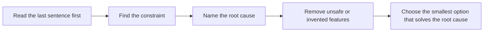

Ask yourself:

1. Is this instruction personal, team-wide, directory-specific, or path-specific?
2. Is the task complex/uncertain or small/well understood?
3. Is this interactive work or automation?
4. Does the output go to a human or to another program?
5. Does the answer reduce context, risk, duplicate work, and false positives?

---

# Objective 3.1 — `CLAUDE.md` hierarchy, scoping, and organization

## 3.1.1 The core idea

`CLAUDE.md` gives Claude durable instructions and project context. Put instructions at the level where they should apply.

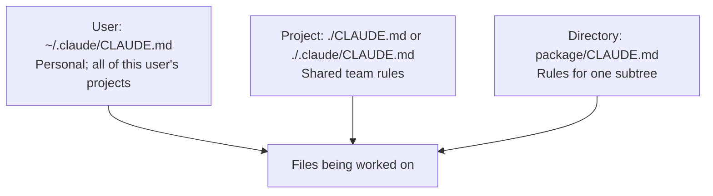

| Location | Scope | Commit to Git? | Good example |
|---|---|---:|---|
| `~/.claude/CLAUDE.md` | One user, across projects | No | “Prefer concise explanations” |
| `./CLAUDE.md` | Whole project/team | Yes | Build/test commands and architecture |
| `./.claude/CLAUDE.md` | Whole project/team | Yes | Same project-level purpose |
| `subdirectory/CLAUDE.md` | Files in that subtree | Usually yes | Frontend-only component conventions |

**Exam rule:** If a new teammate does not receive an instruction, and it exists only in `~/.claude/CLAUDE.md`, move it to project-level configuration and commit it.

## 3.1.2 Discovery behavior

- Claude searches upward from the working directory for applicable `CLAUDE.md` files.
- A nested `CLAUDE.md` below the working directory is loaded when Claude works with files in that subtree.
- Use `/memory` to inspect which memory files are loaded. This is the first diagnostic step for inconsistent instruction behavior.

## 3.1.3 Modular instructions with imports

Use `@path` imports to avoid copying standards into many files.

```markdown
# Project instructions

- Architecture overview: @docs/architecture.md
- Git workflow: @docs/git-workflow.md
- API standards: @standards/api.md
```

A package may import only what its maintainers know it needs:

```markdown
# packages/payments/CLAUDE.md

- Shared API rules: @../../standards/api.md
- Payment security rules: @../../standards/payments-security.md
```

## 3.1.4 Monolithic vs modular architecture

### Bad

```text
CLAUDE.md (1,500 lines)
├── React rules
├── Terraform rules
├── Database rules
├── Mobile rules
└── Deployment rules
```

Every task receives many irrelevant instructions. Rules are hard to own and update.

### Good

```text
repo/
├── CLAUDE.md                    # short, universal rules
├── .claude/
│   └── rules/
│       ├── testing.md
│       ├── api-conventions.md
│       └── terraform.md
└── packages/
    └── payments/
        └── CLAUDE.md            # payments-only context/imports
```

### Scenario

The security team updates one central standard. Five packages currently contain copied versions. The best fix is not to update five copies every time. Store the canonical standard once and import it where needed.

### Common wrong answers

- Put team standards in every developer’s home directory: not shared or version-controlled.
- Repeat all instructions in every directory: creates drift and duplication.
- Add every rule to the root file: wastes context and makes ownership unclear.
- Debug by restarting sessions repeatedly: `/memory` gives direct evidence.

---

# Objective 3.2 — Custom commands and Agent Skills

## 3.2.1 Choose the right mechanism

| Mechanism | Loaded/used when | Best for |
|---|---|---|
| `CLAUDE.md` | Always applicable | Universal project facts and rules |
| `.claude/rules/*.md` | Always or path-conditionally | Organized conventions |
| `.claude/commands/*.md` | User explicitly invokes command | Simple reusable team prompt/workflow |
| `.claude/skills/<name>/SKILL.md` | On demand when relevant/invoked | Rich task-specific workflow with metadata/resources |
| `~/.claude/commands/` or `~/.claude/skills/` | Only for that user | Personal workflows or experiments |

**Memory phrase:** Always true → `CLAUDE.md`. Repeated task → command/skill. File-specific → path rule.

## 3.2.2 Team vs personal scope

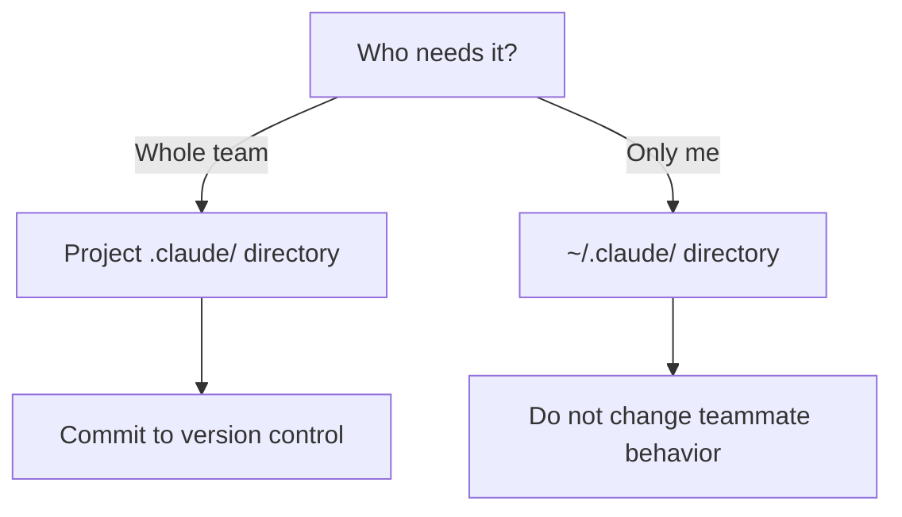

If you want a personal variation of a shared skill, give it a different name under `~/.claude/skills/`. Do not silently modify the shared version for everyone.

## 3.2.3 Skill frontmatter

The blueprint specifically expects these fields:

- `context: fork` — run in isolated subagent context.
- `allowed-tools` — restrict tools available during the skill.
- `argument-hint` — tell the user what argument to provide.

Example:

```markdown
---
name: analyze-module
description: Analyze one module and return a concise architecture summary.
context: fork
allowed-tools: Read, Grep, Glob
argument-hint: <module-path>
---

Analyze `$ARGUMENTS`.

Return:
1. Entry points
2. Dependencies
3. Data flow
4. Risks
5. A summary under 400 words
```

### Why `context: fork` matters

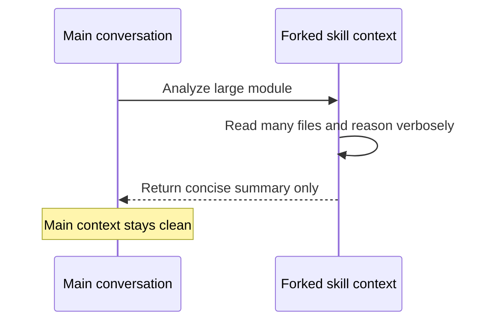

Use it for verbose exploration, codebase analysis, or brainstorming alternatives. Do not use it automatically when the workflow needs the full main conversation and must continue modifying its state.

### Least privilege

If a skill only analyzes code, allow `Read`, `Grep`, and `Glob`; do not allow `Write` or unrestricted `Bash`. Tool restriction reduces accidental changes.

### Good and bad architecture

**Bad:** Put a 200-line release workflow in `CLAUDE.md`. It consumes context in every session, even when nobody is releasing.

**Good:** Put universal release policy in project memory and the detailed release procedure in an on-demand project skill, with only necessary tools.

---

# Objective 3.3 — Path-specific rules

## 3.3.1 Why path rules exist

Rules for Terraform should not distract Claude while editing React. Path-scoped rule files load when matching files are involved, reducing irrelevant context and token use.

Example:

```markdown
---
paths:
  - "terraform/**/*"
  - "**/*.tf"
---

# Terraform rules

- Run `terraform fmt -check` before completion.
- Never hardcode cloud credentials.
- Require encryption for storage resources.
```

Test rule across many folders:

```markdown
---
paths:
  - "**/*.test.ts"
  - "**/*.test.tsx"
  - "**/__tests__/**/*"
---

# Test conventions

- Use Arrange, Act, Assert.
- Test behavior, not private implementation.
- Reuse fixtures from `test/fixtures`.
```

## 3.3.2 Path rule vs directory `CLAUDE.md`

| Situation | Best answer | Reason |
|---|---|---|
| Rules apply to everything under `packages/payments/` | Directory `CLAUDE.md` | Natural subtree boundary |
| Rules apply to `*.test.tsx` anywhere | Path-specific rule | Files are spread across directories |
| Rules apply to all work in the repo | Root/project `CLAUDE.md` | Universal |
| Workflow runs only when requested | Skill/command | Not a passive convention |

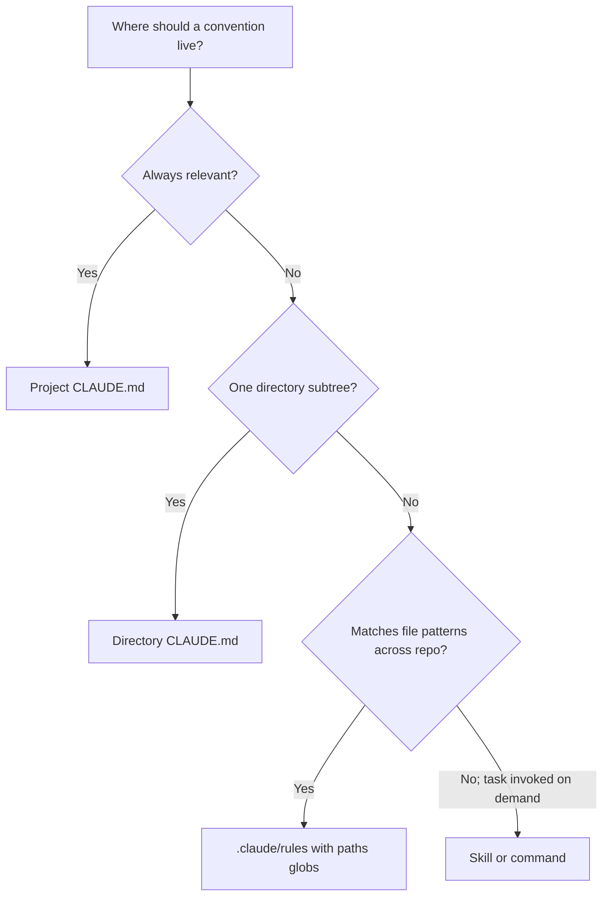

### Common traps

- Using plain prose such as “only apply this to Terraform” without path frontmatter is less reliable than actual conditional configuration.
- Copying one rule into every package creates maintenance drift.
- Loading all specialist conventions globally wastes context.

---

# Objective 3.4 — Plan mode vs direct execution

## 3.4.1 Decision table

| Use plan mode when… | Use direct execution when… |
|---|---|
| Scope is uncertain | Scope is clear |
| Many files/services change | One small area changes |
| Multiple valid approaches exist | Implementation is obvious |
| Architecture/infrastructure decisions exist | No architecture decision exists |
| Mistakes would cause expensive rework | Change is cheap and reversible |
| Example: migrate a library across 45 files | Example: add one date validation check |

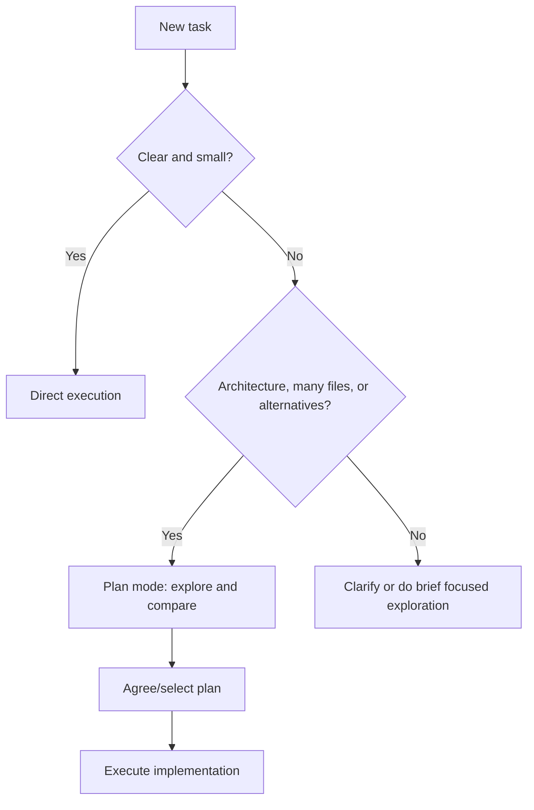

## 3.4.2 Plan mode does not mean “never implement”

A strong workflow is:

1. Enter plan mode.
2. Inspect the codebase without changing it.
3. Identify dependencies, risks, and alternatives.
4. Choose the approach.
5. Switch to execution and implement.
6. Test and review.

## 3.4.3 Explore subagent

Use an Explore subagent when discovery will read many files and generate verbose intermediate details. It returns a focused summary, preserving the main context for decisions and implementation.

### Architecture comparison

**Bad:** “Migrate our authentication system” → immediately edit the first file found → discover 30 dependents → undo and restart.

**Good:** Plan mode → map auth entry points and dependents → compare migration choices → select plan → direct execution against that plan → tests.

**Also bad:** Use plan mode for changing one error message in one known file. This adds overhead without reducing meaningful risk.

### Exam shortcut

More ambiguity + larger blast radius = plan.  
Less ambiguity + smaller blast radius = direct execution.

---

# Objective 3.5 — Iterative refinement

## 3.5.1 The refinement loop

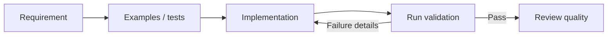

Do not repeatedly say “make it better.” Give evidence: failing input, actual output, expected output, test failure, constraint, or performance target.

## 3.5.2 Concrete input/output examples

When prose is interpreted inconsistently, provide 2–3 examples.

```text
Requirement: Normalize customer names.

Input:  "  maria  da silva "
Output: "Maria da Silva"

Input:  null
Output: null

Input:  "ACME LLC"
Output: "ACME LLC"   # preserve known all-uppercase organization suffixes
```

Examples communicate edge-case judgment better than vague instructions like “clean the names correctly.”

## 3.5.3 Test-driven iteration

1. Write tests for expected behavior, edge cases, and relevant performance requirements.
2. Ask Claude to implement.
3. Run tests.
4. Give Claude the exact failure output.
5. Make the smallest correction.
6. Repeat until the suite passes; then review for overfitting.

Example test:

```python
import pytest

from normalize import normalize_name


@pytest.mark.parametrize(
    ("raw", "expected"),
    [
        ("  maria  da silva ", "Maria da Silva"),
        (None, None),
        ("ACME LLC", "ACME LLC"),
    ],
)
def test_normalize_name(raw, expected):
    assert normalize_name(raw) == expected
```

## 3.5.4 Interview pattern

For an unfamiliar design, ask Claude to interview you before implementation.

```text
Before designing this cache, ask me one focused question at a time about:
- freshness requirements,
- invalidation events,
- failure behavior,
- traffic and latency,
- consistency needs,
- observability.

After my answers, summarize assumptions and propose two options with tradeoffs.
Do not edit code until I choose an option.
```

This surfaces missing decisions the developer may not know to mention.

## 3.5.5 One message or sequential fixes?

- Give **interacting issues together** because one fix may affect the others.
- Fix **independent issues sequentially** so each result is easy to validate.

Example: a database schema rename, API field rename, and serializer update interact; describe them together. A typo and an unrelated CSS spacing issue can be fixed separately.

### Bad vs good feedback

| Bad | Good |
|---|---|
| “It still fails. Try again.” | “For input `null`, actual output is `''`; expected `null`. Test: `test_null_is_preserved`.” |
| “Make tests comprehensive.” | “Add boundary tests for 0, 1, max allowed, max+1, and null.” |
| “Build a cache.” | Use interview pattern to define invalidation and failure behavior first. |

---

# Objective 3.6 — Claude Code in CI/CD

## 3.6.1 The minimum correct pipeline shape

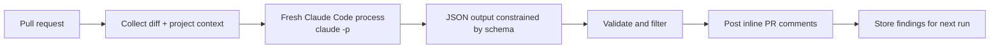

## 3.6.2 Required CLI concepts

- `-p` or `--print`: non-interactive mode; prints the response and exits.
- `--output-format json`: returns JSON output useful to programs.
- `--json-schema`: constrains the result to a defined machine-readable shape.
- `CLAUDE.md`: supplies project test standards, fixtures, review criteria, and architecture context.

If a CI job hangs because Claude waits for input, the correct fix is `-p`. Invented flags such as `--batch`, or redirecting stdin, do not replace the documented non-interactive mode.

Example command (line continuation shown for readability):

```bash
claude -p \
  --output-format json \
  --json-schema '{
    "type":"object",
    "properties":{
      "findings":{
        "type":"array",
        "items":{
          "type":"object",
          "properties":{
            "file":{"type":"string"},
            "line":{"type":"integer"},
            "severity":{"type":"string","enum":["high","medium","low"]},
            "issue":{"type":"string"},
            "fix":{"type":"string"}
          },
          "required":["file","line","severity","issue","fix"],
          "additionalProperties":false
        }
      }
    },
    "required":["findings"],
    "additionalProperties":false
  }' \
  "Review this PR using the criteria in CLAUDE.md. Report only provable bugs and security issues."
```

> Shell quoting varies by operating system. For production, storing a large schema in a carefully handled script/config can be easier than inline quoting. The exam concept is the combination of non-interactive execution and schema-constrained structured output.

## 3.6.3 Project context improves review quality

Example project memory:

```markdown
# CI review policy

## Report
- Reproducible correctness bugs
- Security vulnerabilities with a concrete attack path
- Breaking API changes not covered by migration logic

## Do not report
- Formatting handled by the linter
- Personal style preferences
- Existing issues outside the changed lines unless the PR makes them worse

## Tests
- Framework: pytest
- Shared fixtures: tests/fixtures/
- Do not generate a test already covered by an existing test file
```

This is better than “review carefully” because it defines categories and exclusions.

## 3.6.4 Independent review sessions

Do not use the same session that generated code to judge its own work. A fresh reviewer does not inherit the authoring conversation’s assumptions and is more likely to notice mistakes.

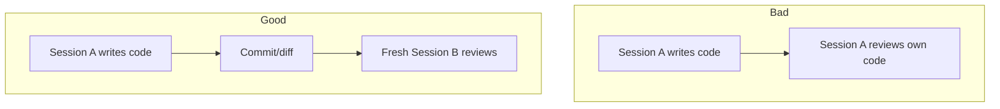

## 3.6.5 Avoid duplicate comments after new commits

On a rerun, supply prior findings and instruct Claude to return only:

- new findings, and
- earlier findings that remain unresolved.

Do not repost fixed findings. Stable finding IDs such as `file:line:category` plus semantic comparison can help the surrounding application deduplicate comments.

## 3.6.6 Avoid duplicate tests

Give Claude the existing relevant test files or a test inventory. Also document fixture conventions in `CLAUDE.md`. Otherwise it may propose tests that already exist or create unnecessary fixtures.

## 3.6.7 Large PR review architecture

When a 14-file PR receives uneven attention, a larger context window is not the root fix.

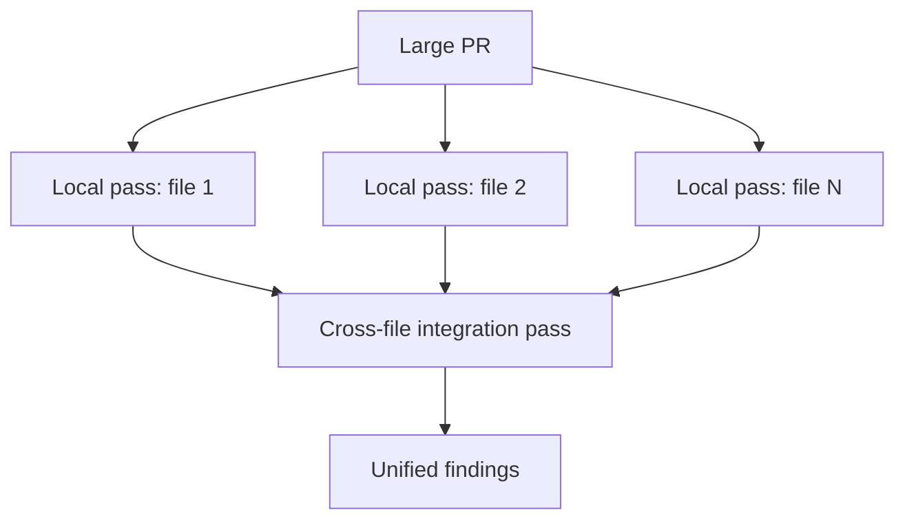

- Per-file passes find local bugs with consistent depth.
- The integration pass checks contracts, data flow, imports, and behavior across files.

### CI good vs bad

| Bad architecture | Why bad | Good architecture |
|---|---|---|
| Interactive `claude "review"` | Pipeline waits for input | `claude -p ...` |
| Free-form prose parsed with regex | Fragile and inconsistent | JSON output constrained by schema |
| Same session writes and reviews | Carries authoring assumptions | Fresh independent review session |
| Review all large-PR files in one pass | Attention becomes uneven | Per-file passes + integration pass |
| Rerun with no earlier findings | Duplicate comments | Include prior findings; report new/unresolved only |
| Generate tests without seeing existing tests | Duplicates coverage/fixtures | Supply tests and document standards |
| “Report anything suspicious” | Many false positives | Explicit report/skip criteria |

---

# 9. End-to-end architecture scenario

## Scenario: a team-wide PR reviewer

Requirements:

- Every developer receives the same review rules.
- TypeScript test rules apply across many packages.
- Developers can run an on-demand deep review locally.
- CI must never wait for input.
- CI posts structured findings and avoids duplicates.
- The reviewer must not edit code.

### Good architecture

```text
repo/
├── CLAUDE.md                         # shared architecture and review policy
├── .claude/
│   ├── rules/
│   │   └── typescript-tests.md       # paths: **/*.test.ts(x)
│   ├── commands/
│   │   └── quick-review.md           # shared simple command
│   └── skills/
│       └── deep-review/
│           └── SKILL.md              # context: fork; read-only tools
├── scripts/
│   └── review-pr.sh                  # claude -p + JSON/schema settings
└── tests/
    └── fixtures/                     # documented shared fixtures
```

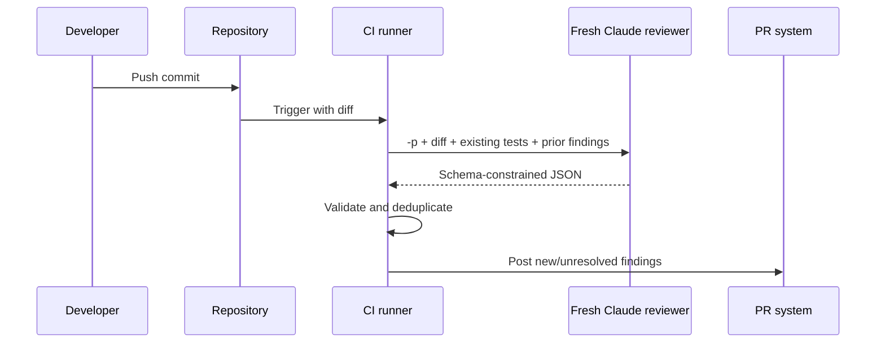

### Why each choice is correct

- Repository `CLAUDE.md`: team-wide and version-controlled.
- Path rule: test files exist across packages.
- Forked read-only skill: verbose deep analysis stays isolated and cannot modify files.
- `-p`: non-interactive CI.
- JSON schema: dependable program-to-program contract.
- Fresh session: independent review.
- Existing tests + prior findings: prevents duplicate tests and comments.

---

# 10. Original exam-style practice questions

> These are original study questions based on the published objectives. They are **not real, leaked, or recalled exam questions**.

## Question 1 — Select one

A new engineer does not receive the team’s testing instructions, while the original developer does. The instructions are in `~/.claude/CLAUDE.md`. What is the best correction?

A. Ask every engineer to copy the file manually.  
B. Move the team instructions to project `CLAUDE.md` and commit it.  
C. Add the instructions to every prompt.  
D. Restart Claude Code.

**Answer: B.** Home-level memory is personal. Project memory is shared through version control. A creates drift; C is repetitive; D does not change scope.

## Question 2 — Select one

Test files occur in ten packages and all end in `.test.tsx`. Where should their common rules live?

A. Ten copied directory files  
B. User-level memory  
C. A `.claude/rules/` file scoped with `**/*.test.tsx`  
D. A release skill

**Answer: C.** A glob-scoped rule applies across directory boundaries and loads only when relevant.

## Question 3 — Select two

A codebase-analysis skill reads hundreds of files but should not edit anything or fill the main context with details. Which two settings best address this?

A. `context: fork`  
B. `allowed-tools: Read, Grep, Glob`  
C. Put it in root `CLAUDE.md`  
D. Allow unrestricted Bash and Write

**Answers: A and B.** Forking isolates verbose work; read-only tools apply least privilege.

## Question 4 — Select one

The team must migrate a framework across 48 files, and two approaches have different infrastructure requirements. What should it do first?

A. Directly replace imports in all files  
B. Use plan mode to explore dependencies and compare approaches  
C. Add a longer prompt and execute immediately  
D. Put migration steps in user memory

**Answer: B.** High ambiguity, architectural tradeoffs, and a large blast radius justify planning before edits.

## Question 5 — Select one

A known function needs one additional `date <= today` validation, and the stack trace identifies the file. What is most appropriate?

A. Direct execution  
B. A multi-agent research pipeline  
C. A forked architecture skill  
D. A full migration plan

**Answer: A.** The change is small, localized, and well understood.

## Question 6 — Select one

Claude inconsistently normalizes unusual customer names despite a long prose description. What is the best next step?

A. Repeat the same prompt in uppercase  
B. Provide 2–3 representative input/output examples including edge cases  
C. Increase the context with unrelated names  
D. Ask only for higher confidence

**Answer: B.** Concrete examples clarify the exact transformation and edge-case judgment.

## Question 7 — Select one

Claude implemented an almost-correct parser. One null case fails. Which feedback is best?

A. “Try harder.”  
B. “The code is wrong.”  
C. Provide the failing input, actual output, expected output, and test failure.  
D. Start a different large refactor.

**Answer: C.** Evidence-driven feedback enables a focused iteration.

## Question 8 — Select one

A CI job runs `claude "Review this PR"` and waits indefinitely. What is the direct fix?

A. Add `-p` / `--print`.  
B. Add an invented `--batch` switch.  
C. Reuse the developer’s interactive session.  
D. Increase the timeout.

**Answer: A.** Print mode is the documented non-interactive execution mode. A longer timeout preserves the underlying problem.

## Question 9 — Select two

CI must post findings automatically as inline comments. Which two choices are most important?

A. `--output-format json`  
B. `--json-schema` with fields such as file, line, issue, and severity  
C. Ask for attractive Markdown  
D. Parse natural-language paragraphs with regular expressions

**Answers: A and B.** Programs need stable structured output; prose parsing is brittle.

## Question 10 — Select one

The same session generated a patch and then approved it, missing an obvious bug. What is the best architectural change?

A. Ask the same session twice.  
B. Use a fresh, independent Claude instance for review.  
C. Remove automated review.  
D. Put “be unbiased” in personal memory.

**Answer: B.** Independent review reduces inherited assumptions from the generation context.

## Question 11 — Select one

After every new commit, the bot reposts all old PR comments. What should the next review receive?

A. Only the newest filename  
B. Prior findings plus an instruction to report only new or unresolved issues  
C. The authoring session’s full hidden reasoning  
D. No prior state

**Answer: B.** Previous findings enable deduplication and resolution tracking.

## Question 12 — Select one

A 16-file review gives deep feedback on early files and shallow feedback on later files. What is the best restructuring?

A. One even larger prompt  
B. Per-file local passes followed by a cross-file integration pass  
C. Report only issues found twice  
D. Ask developers to avoid large changes forever

**Answer: B.** Focused local passes prevent attention dilution; an integration pass preserves cross-file analysis.

## Question 13 — Select one

A 220-line deployment procedure is needed only during releases. Where should it go?

A. Always-loaded root memory  
B. An on-demand project skill or command  
C. Every developer’s user memory  
D. Every source file

**Answer: B.** It is a reusable task-specific workflow, not universal session context.

## Question 14 — Select one

Claude generates redundant tests and new fixtures that duplicate existing fixtures. What context is most useful?

A. Only the production source file  
B. Existing relevant tests plus documented fixture/testing conventions  
C. A request to be creative  
D. A larger output limit

**Answer: B.** Claude must see current coverage and project conventions to avoid duplication.

## Question 15 — Select one

You are designing a cache in a domain you do not understand well. Important invalidation requirements are unclear. Which technique is best before implementation?

A. Interview pattern  
B. Immediate direct execution  
C. Copy rules to every directory  
D. Parse prose with regex

**Answer: A.** Focused questions surface constraints and failure modes before costly implementation.

---

# 11. Rapid elimination rules

When two answers look correct, prefer the one that:

1. Uses the documented Claude Code feature, not an invented flag or workaround.
2. Fixes the configuration scope rather than copying instructions manually.
3. Loads only relevant context rather than loading everything everywhere.
4. Uses plan mode in high-ambiguity/high-blast-radius work.
5. Uses direct execution for small, obvious changes.
6. Gives concrete examples or test evidence instead of vague encouragement.
7. Uses `-p` for automation.
8. Uses schema-constrained JSON for downstream programs.
9. Uses an independent reviewer rather than self-review in the authoring session.
10. Preserves earlier findings/tests to avoid duplicates.
11. Splits large review into local passes plus a cross-file pass.
12. Applies least privilege to skill tools.

---

# 12. One-page cheat sheet

```text
SCOPE
Personal across projects     -> ~/.claude/CLAUDE.md
Shared whole project         -> ./CLAUDE.md or ./.claude/CLAUDE.md
One directory subtree        -> nested CLAUDE.md
File pattern across repo     -> .claude/rules/*.md + YAML paths/globs
Reusable requested workflow  -> command or skill
Verbose isolated workflow    -> skill with context: fork
Check loaded memories        -> /memory
Reuse standard documents     -> @import

EXECUTION
Complex / uncertain / many files / architecture -> plan mode
Small / clear / one localized change             -> direct execution
Verbose discovery                                -> Explore subagent
Strong workflow                                  -> plan, then execute, then test

REFINEMENT
Inconsistent transformation -> 2-3 input/output examples
Implementation quality       -> tests first + exact failures
Unknown requirements         -> interview pattern
Interacting defects          -> explain together
Independent defects          -> fix sequentially

CI/CD
Non-interactive              -> claude -p
Machine-readable             -> --output-format json
Stable result contract       -> --json-schema
Team review standards        -> project CLAUDE.md
Avoid author bias            -> fresh reviewer session
Avoid repeated comments      -> include prior findings; new/unresolved only
Avoid duplicate tests        -> include existing tests + fixture standards
Large PR                     -> per-file passes + cross-file integration pass
```

---

# 13. Seven-day study plan

| Day | Study | Hands-on proof |
|---:|---|---|
| 1 | Objective 3.1 | Create user, project, and nested memory; inspect with `/memory` |
| 2 | Objectives 3.2–3.3 | Build one read-only forked skill and two path-scoped rules |
| 3 | Objective 3.4 | Take five tasks and justify plan vs direct execution |
| 4 | Objective 3.5 | Implement a small function using examples, tests, and failure feedback |
| 5 | Objective 3.6 | Run `claude -p` and produce schema-constrained JSON |
| 6 | Scenarios | Design the end-to-end PR reviewer above from memory |
| 7 | Exam simulation | Answer all questions, explain why every wrong choice is wrong, then review weak areas |

### Readiness checklist

You are ready when you can answer “yes” without notes:

- [ ] Can I place personal, project, directory, and path-specific instructions correctly?
- [ ] Can I explain `@import` and `/memory`?
- [ ] Can I choose command vs skill vs `CLAUDE.md`?
- [ ] Can I explain `context: fork`, `allowed-tools`, and `argument-hint`?
- [ ] Can I write YAML path frontmatter with a useful glob?
- [ ] Can I justify plan mode vs direct execution from risk and ambiguity?
- [ ] Can I use examples, test failures, and the interview pattern appropriately?
- [ ] Can I explain why CI needs `-p`?
- [ ] Can I distinguish JSON output from schema-constrained JSON?
- [ ] Can I design an independent, deduplicated PR review workflow?
- [ ] Can I explain per-file plus integration review passes?
- [ ] Can I reject each common anti-pattern in one sentence?

---

# 14. Sources and accuracy notes

Primary references:

- [Official Claude Certified Architect – Foundations page](https://anthropic-partners.skilljar.com/claude-certified-architect-foundations-certification)
- [Official exam guide mirror (v1.0, effective July 2026)](https://amey-thakur.github.io/CLAUDE-CERTIFICATIONS/architect-foundations/exam-guide.pdf) — the official Academy page may require authentication; this mirror preserves the published guide.
- [Claude Code CLI reference](https://docs.anthropic.com/en/docs/claude-code/cli-usage)
- [Claude Code memory documentation](https://docs.anthropic.com/en/docs/claude-code/memory)
- [Claude Code documentation](https://docs.anthropic.com/en/docs/claude-code/overview)

Accuracy notes:

- The official guide is authoritative if this study guide ever differs from it.
- Product syntax can change after the exam guide is published. Study the blueprint’s tested behavior, and check the current official documentation before using examples in production.
- Exam questions are multiple-choice and multiple-response; each question tells you how many responses to select.
- The overall passing score is 720 on a scaled 100–1,000 scale. It is not a promise that 72% raw answers will pass, and there is no published separate Domain 3 pass mark.
- The practice questions here are original and intentionally teach principles, not memorized exam wording.

