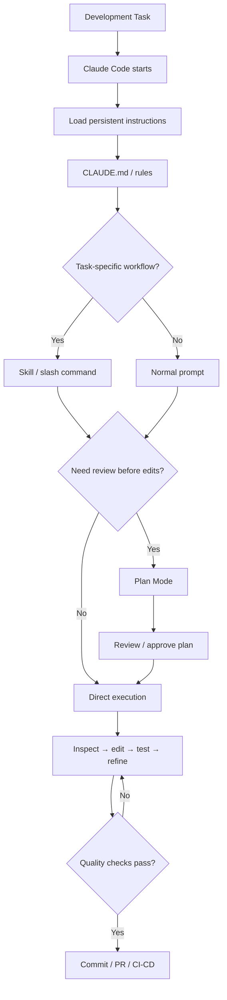

# Domain 3 — Claude Code Configuration & Workflows

> GitHub / Git Wiki study pack  
> Supplied slide weight: **20%**  
> Focus: **CLAUDE.md, instruction hierarchy, skills/slash commands, path-specific rules, Plan Mode, iterative refinement, and CI/CD workflows**

## Files

- [01 — Full Domain 3 Guide](./01-domain3-claude-code-configuration-workflows.md)
- [02 — Exam Scenario Question Bank](./02-domain3-exam-scenario-question-bank.md)
- [03 — Production Scenarios](./03-domain3-production-scenarios.md)
- [04 — Configuration & Workflow Diagrams](./04-domain3-diagrams.md)
- [05 — CLAUDE.md / Rules / Skills Examples](./05-domain3-configuration-examples.md)
- [06 — Quick Revision Cheat Sheet](./06-domain3-quick-revision-cheatsheet.md)
- [07 — Official Sources](./07-official-sources.md)

## Master domain map



## Core exam formula

**Instructions → Scope → Workflow → Plan/Execute → Inspect → Edit → Test → Refine → CI/CD**

## Critical distinctions to memorize

```text
CLAUDE.md          = persistent project/team instructions
CLAUDE.local.md    = personal project-local instructions
.claude/rules/     = modular rules, optionally path-scoped
Skill              = reusable task-specific workflow
Plan Mode          = inspect and propose before changing files
Direct Execution   = Claude can perform approved edits/actions immediately
CI/CD              = non-interactive/repository automation with controlled permissions
```

> This pack uses the supplied Domain 3 slide as the exam-topic outline and current official Claude Code documentation for product details.
