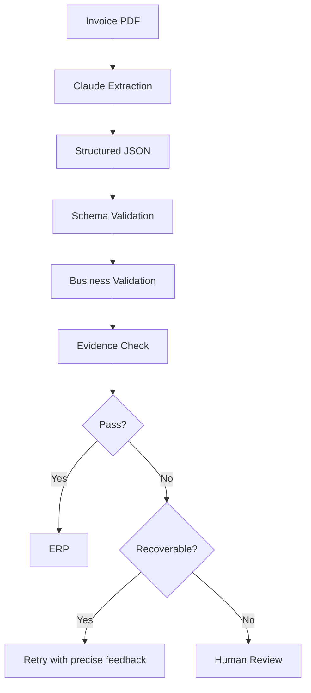
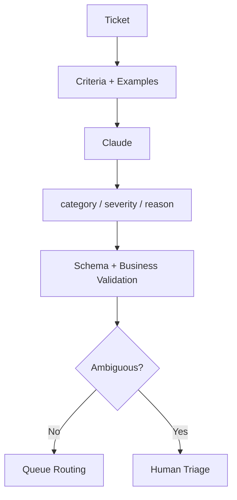
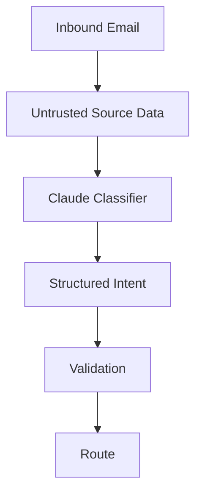
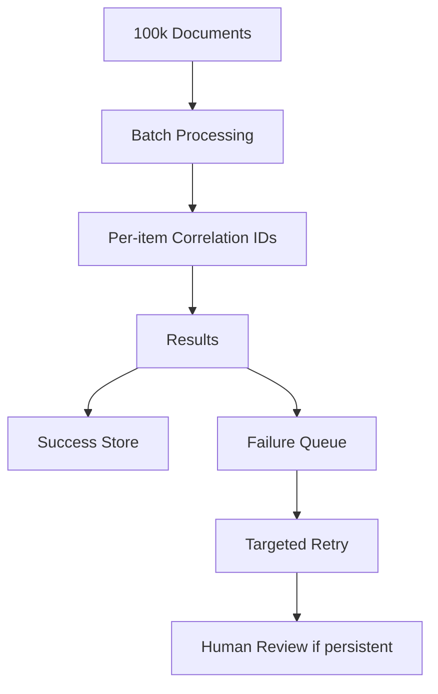
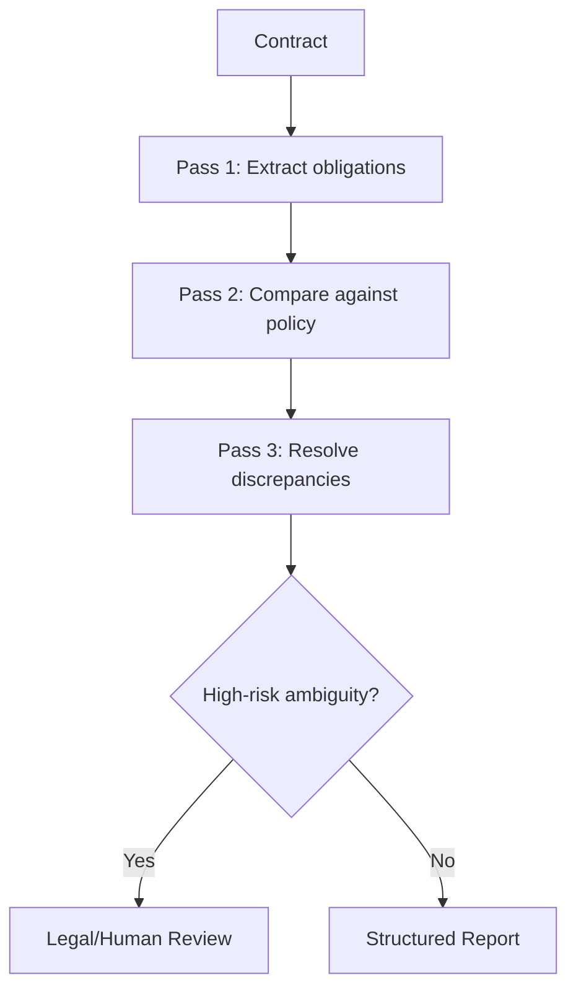
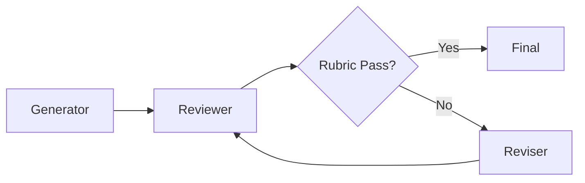
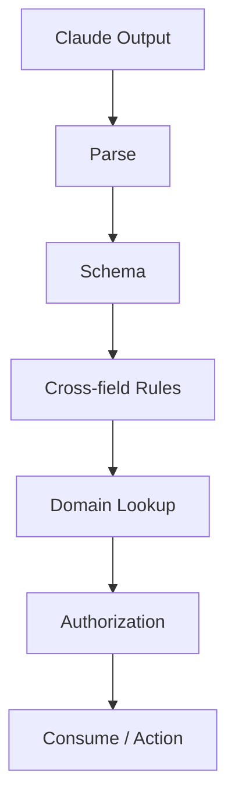

# Domain 4 — Production Scenarios

# Scenario 1 — Invoice Extraction



Rules:
- null for absent fields
- normalize only when unambiguous
- verify arithmetic
- preserve evidence
- never invent IDs

---

# Scenario 2 — Support Ticket Triage

Use explicit severity criteria and representative examples.



Exam lesson: if HIGH vs MEDIUM is inconsistent, fix the decision rubric before changing infrastructure.

---

# Scenario 3 — Return Form Extraction

Fields:
- order_id
- return_reason
- requested_resolution
- comment

Use enums for finite categories. Validate:
- order exists
- return window
- item eligibility
- authorization before any refund action

---

# Scenario 4 — Email Intent Classification



An embedded instruction such as “ignore prior rules” remains source content, not an instruction to the application.

---

# Scenario 5 — Batch 100k Documents



Why batch:
- independent inputs
- offline processing
- no interactive latency requirement

---

# Scenario 6 — Multi-Pass Contract Review



---

# Scenario 7 — Generator / Reviewer / Reviser



Controls:
- explicit rubric
- maximum iterations
- preserve original evidence
- escalation after unresolved disagreements

---

# Scenario 8 — Extraction with Evidence

Example:

```json
{
  "invoice_number": {
    "value": "INV-1009",
    "evidence": "Invoice No: INV-1009"
  },
  "total": {
    "value": 4500.00,
    "evidence": "Total Due: $4,500.00"
  }
}
```

Benefit: reviewers can verify the exact source support.

---

# Scenario 9 — Validation Stack



Critical lesson: structured output does **not** bypass domain validation or authorization.

---

# Scenario 10 — Failed Field Repair

If only `invoice_number` fails, do not automatically regenerate every field. A targeted retry can be cheaper and reduce regressions.

Retry feedback:

```text
The invoice_number field failed validation.
The source contains "Invoice # INV-882".
Re-check that field and return the complete object.
Do not modify valid fields unless the source proves they are incorrect.
```

---

# Production Checklist

1. Are success criteria explicit?
2. Are examples representative and diverse?
3. Is schema narrow and versioned?
4. Are missing fields handled explicitly?
5. Are business rules validated?
6. Is evidence preserved where needed?
7. Are retries bounded?
8. Is ambiguity escalated instead of guessed?
9. Does each batch item have a correlation ID?
10. Are failed batch items retried independently?
11. Is multi-pass review justified by risk/accuracy?
12. Is source text treated as untrusted data?
13. Are prompt/schema versions logged?
14. Are evaluation cases maintained?
