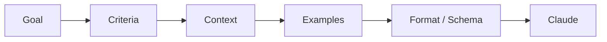
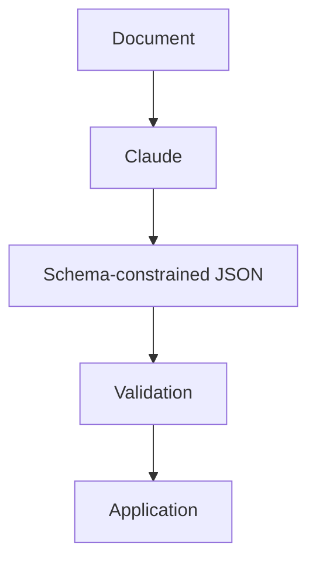
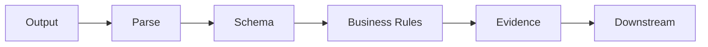
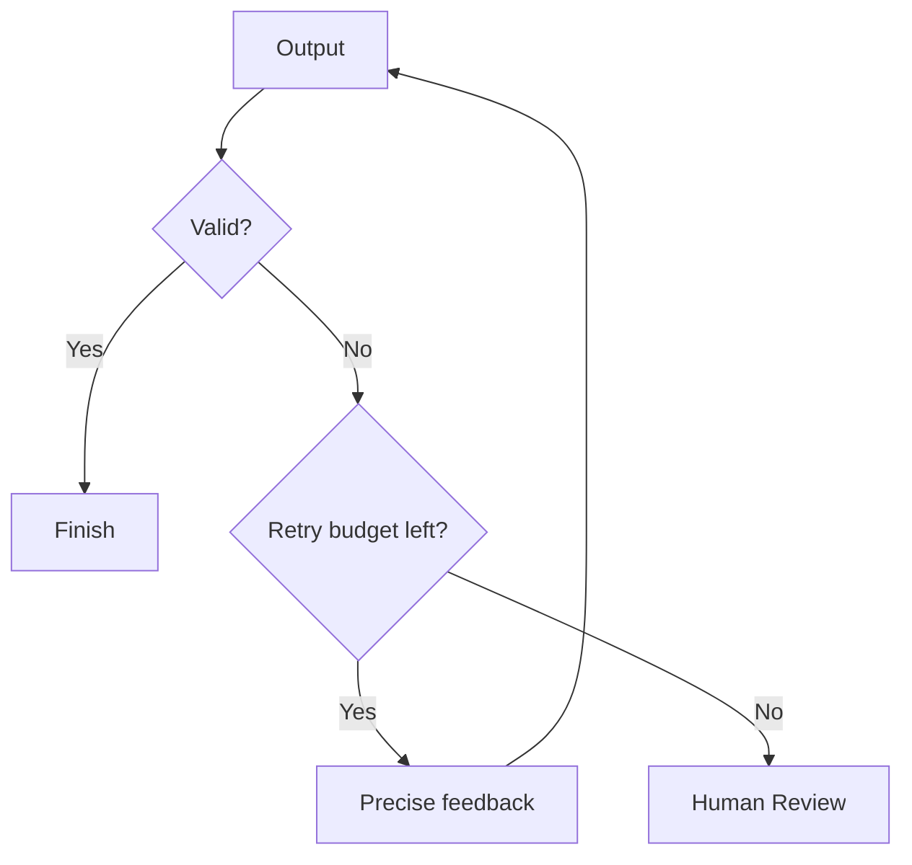
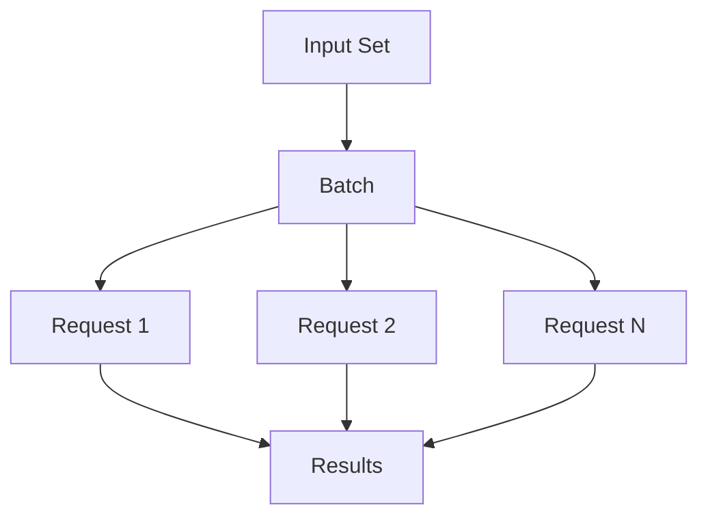
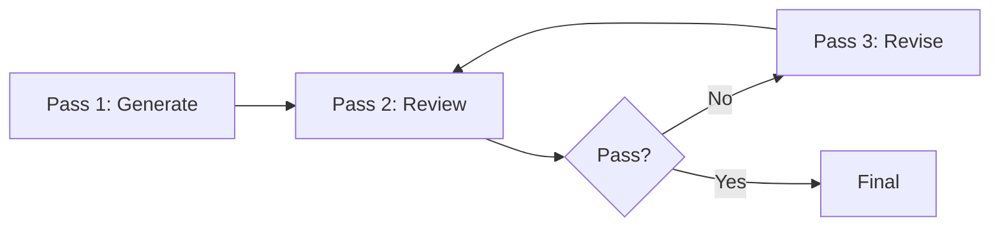
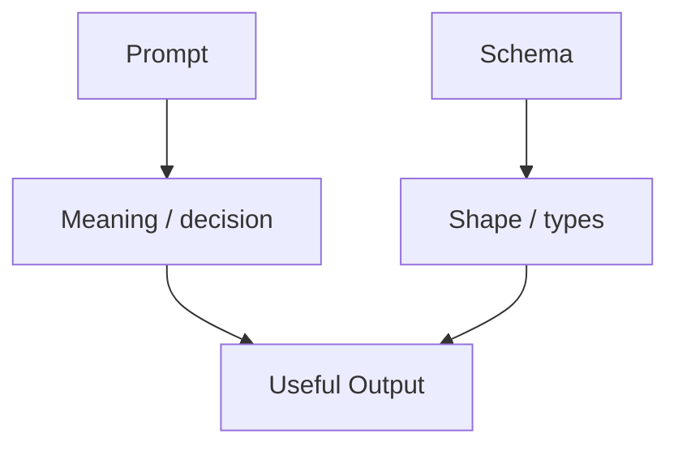

# Domain 4 — Diagram Pack

## Prompt Construction

```mermaid
flowchart LR
    G[Goal] --> C[Criteria]
    C --> X[Context]
    X --> E[Examples]
    E --> F[Format / Schema]
    F --> M[Claude]
```

## Structured Extraction

```mermaid
flowchart TD
    D[Document] --> C[Claude]
    C --> J[Schema-constrained JSON]
    J --> V[Validation]
    V --> A[Application]
```

## Validation Layers

```mermaid
flowchart LR
    O[Output] --> P[Parse]
    P --> S[Schema]
    S --> B[Business Rules]
    B --> E[Evidence]
    E --> D[Downstream]
```

## Retry Loop

```mermaid
flowchart TD
    O[Output] --> V{Valid?}
    V -- Yes --> F[Finish]
    V -- No --> C{Retry budget left?}
    C -- Yes --> R[Precise feedback]
    R --> O
    C -- No --> H[Human Review]
```

## Batch Processing

```mermaid
flowchart TD
    S[Input Set] --> B[Batch]
    B --> A1[Request 1]
    B --> A2[Request 2]
    B --> AN[Request N]
    A1 --> R[Results]
    A2 --> R
    AN --> R
```

## Multi-Pass Review

```mermaid
flowchart LR
    P1[Pass 1: Generate] --> P2[Pass 2: Review]
    P2 --> Q{Pass?}
    Q -- No --> P3[Pass 3: Revise]
    P3 --> P2
    Q -- Yes --> F[Final]
```

## Prompt vs Schema

```mermaid
flowchart TD
    P[Prompt] --> M[Meaning / decision]
    S[Schema] --> H[Shape / types]
    M --> O[Useful Output]
    H --> O
```
