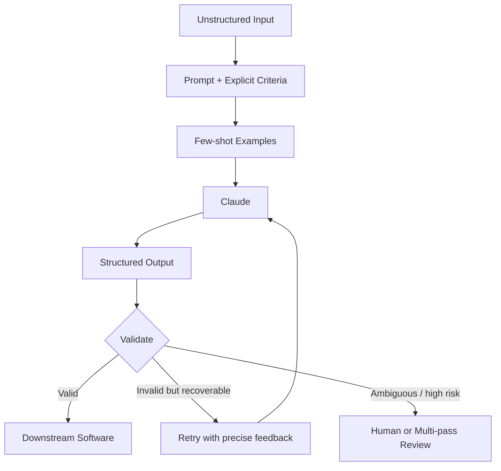

# Domain 4 — Prompt Engineering & Structured Output

> GitHub / Git Wiki study pack  
> Supplied slide weight: **20%**

## Coverage

- Explicit criteria and few-shot examples
- JSON Schema and structured outputs
- Validation and retry loops
- Extraction workflows
- Batch processing
- Multi-pass review

## Files

- `01-domain4-full-guide.md`
- `02-domain4-exam-questions.md`
- `03-domain4-production-scenarios.md`
- `04-domain4-diagrams.md`
- `05-domain4-cheatsheet.md`
- `06-official-sources.md`

## Master architecture

## Memory formula

**Criteria → Examples → Schema → Generate → Validate → Retry → Review → Consume**
